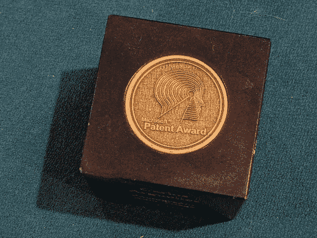
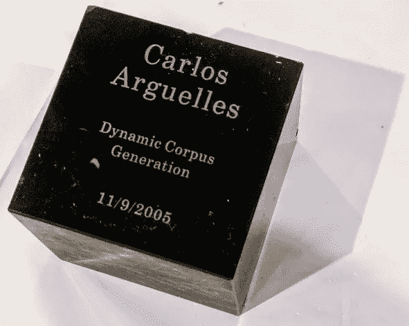

# 兔子和蜜蜂

> 原文：<https://medium.com/geekculture/1999-bunnies-and-bees-patenting-at-microsoft-193e3c30fd06?source=collection_archive---------14----------------------->

## 微软的知识产权

Microsoft gave you a patent cube when your patent was filed

在我从事软件行业的二十年里，[我申请了大约 45 项专利](https://patents.justia.com/inventor/carlos-alejandro-arguelles)；有些与微软合作，有些与亚马逊合作，有些与谷歌合作。谈到知识产权，我一直是多产的，但我最喜欢的两项专利是我的前两项。让我如此喜欢它们的是，在 2021 年的今天，它们如此明显，以至于你可能会感到困惑，它们怎么可能被美国专利局接受？但是，二十年前，这些并不那么明显和清晰。

Amazon gave you a puzzle piece when your patent was filed

我也认为这个博客会让你有趣地了解二十年前的软件工程…我们已经走了很长的路了！最后，除非你是一个受虐狂，否则专利读起来很枯燥；但这是对一个事实的一点了解，在专利的背后，总有一个人的故事。

> “如果你理解正确，在一项惊人的发明出现几年后，这种新事物就变得正常了。人们打哈欠。而那个哈欠是一个发明家能收到的最大的赞美。”杰夫·贝索斯在宣布他将于 2021 年卸任亚马逊 CEO 时说道。

我的第一个职业家，微软的自然语言小组是一个很小的产品小组，刚刚从微软研究院分离出来。我看着它从 1997 年的 30 人增长到 2005 年的 500 人，我和它一起成长。1999 年，我是办公室所有拼写和语法检查人员的功能测试负责人，负责大约 40 种不同的语言。你在微软 Word 中看到的那些绿色和红色的曲线？我的宝贝们！这是一个有趣的工作，因为我们有一个计算语言学家和软件工程师的折衷组合，刚刚工作。

我不得不创造性地测试 40 种不同的人类语言，而不了解它们，也没有每种语言的大量语料库。我的一个想法是简单地运行每种语言的大量句子，看看什么崩溃了。这是粗糙的，蛮力，但令人惊讶的有效。通常有一些特定的句子会破坏某个地方的内存缓冲区(谢谢，C++)，我可以将 repro case 简化为一个句子，这个句子会神奇地使拼写或语法检查程序崩溃。这是特别严重的，因为 Microsoft Office 开发人员出于性能原因拒绝在 try/catch 中调用我们的语法检查器 DLL，所以当 DLL 崩溃时，Word 也随之崩溃，您会丢失所有未保存在文档中的内容。还有更棘手的情况，一句话会破坏记忆缓冲区，但不知何故，事情一直在蹒跚前行，直到数百或数千句话后，第二句话会恰到好处地击中记忆，然后呕吐。从调试的角度来说，这是令人恼火的，因为您确切地知道哪个句子崩溃了，但是当您试图单独用那个句子重现崩溃时，它不会崩溃。因此，这就变成了一个大型的二进制搜索问题，以确定哪种句子组合破坏了记忆，从而得到尽可能小的重现情况。否则，回归测试就是一场噩梦。

# 第一种动物是兔子

该计划最初呼吁人类(承包商)收集所有这些语言的文本。我很快意识到这对于我所需要的来说太慢了。我需要这 40 种语言中每一种语言的数十万，数百万个句子。我有一年的时间。按照目前(人类)的速度，这需要 10 年时间。

但后来我顿悟了。有一种叫做“万维网”的东西，它还处于起步阶段，但它似乎是一个无穷无尽的文本来源。这在 20 年后的今天是显而易见的，但让我们把它放在适当的历史背景下。谷歌是一家很小的初创公司，在斯坦福大学宿舍的两台电脑上运行。Altavista、Excite、Lycos 统治了“网络搜索”世界(也不是特别好)。所以使用网络来增加语料库的想法在 1999 年实际上是相当革命性的。回想起来，我认为那是我最被低估的发明之一。最终，我提交了一份关于这个的[专利](https://patents.justia.com/patent/20070106977)[显示的日期，2005 年，是美国专利局公开接受申请的时候；归档是几年前做的】。

The “Bunny” patent puzzle piece

这项发明是这样工作的(我只是按照公开提交的文件行事，我不会泄露任何公司机密！).当我开始的时候，每种语言都有 10000 个句子，由人类花费巨大的代价精心策划。我的程序会阅读所有的 10，000 个句子，把它们分解成单词，然后把所有的单词打乱。然后，它将无限循环运行，每次随机选取 3 个词，并进入搜索门户(可能是 MSN Search、Altavista、Google 等)，对这 3 个词进行网络搜索。搜索门户将返回一堆 URL，然后我的程序将获取它们并提取文本。瞧啊。我现在有了更多我想要的语言的文本。我会把这个文本添加到我原来的 10，000 条中，然后继续爬行。因为它能自我进食，所以可以永远持续下去。做了相当多的调整才刚刚好。我用了 3 个单词，因为 2 个返回了太多的垃圾(通常是错误的语言)，4 个返回了太少的点击量(那时网络还很年轻！).我跳过了所有短于 4 个字符的单词，因为从 HTML 中提取文本的工具仍然很初级，并且经常返回一些垃圾。此外，如果一个网页使用特定的语言，那么该文档的所有链接也很有可能使用该语言，所以我可以跟踪链接(为了简单起见，我选择只跟踪 1 级链接，也是为了获得更加异构的数据集)。最终我得到了微软索引的后门(当时是“MSN 搜索”，Bing 的前身)，所以我转向了它，因为在微软防火墙内使用谷歌或 Altavista 搜索网页而不是 MSN 搜索的光学效果不会特别好。当爬行器过于激进，似乎对随机站点发起拒绝服务攻击时，我们确实遇到了麻烦。随机的公司会在他们的日志中看到一个带有微软 IP 地址的爬虫正在抓取他们所有的内容，他们会联系微软法律部门，反过来会找到我并联系我的经理。我们不得不多次处理这个问题，并手动排除了一些网站(我的爬虫解析了 robots.txt，表现得像一个正常的机器人，但投诉者不会费心在他们的网站上放一个 robots.txt 文件)。最终，我让这个系统在几十台机器上运行，每台机器上有几百个线程，每小时可以读取几十万个句子。

“不断刷新”的数据集也很酷，因为它避免了人工智能中经典的过拟合问题。如果我有同样的一百万个句子来一遍又一遍地测试语法检查器，我最终会在这些特定的句子上训练自然语言解析引擎。但是我每周都会发送上百万个新句子，所以我总是能发现新的漏洞。而且，奇怪的是，我把这个工具命名为“ **Bunny** ”，这使得大多数人很难把我太当回事。那是一只兔子，因为它不停地从一个地方跳到另一个地方！我的好朋友 [Changsin](https://www.linkedin.com/in/changsin/) 和我花了很长时间完善算法，让它变得可扩展和可靠。

当我回想起我职业生涯中的一些发明时，我为这个感到非常自豪。如果没有这一点，我不认为微软能够像我们一样提供 40 多个高质量的拼写和语法检查工具。这也是大胆的:我接受了一项不可能的任务，并把它变成了可能。

# 第二种动物是蜜蜂

现在我们有了大量的数据，下一个问题是找到计算能力来运行它们，通过所有这些不同语言的拼写检查器和语法检查器。二十年后的今天，用云寻找计算能力是微不足道的；我可以用亚马逊 AWS、微软 Azure 或谷歌云在几分钟内抓取数千台机器。但我们现在谈论的是 1999 年。计算是一种商品。我说服我的老板让我买几台电脑，这样我就可以连续不断地对拼写和语法检查进行“容量测试”,有一段时间他们住在我的办公室里。噪音和高温最终让人无法忍受，所以我占用了一间空办公室，在里面放了 20 台机器。但这还不够。我和我的伙伴古斯塔沃顿悟了。这个团队大约有 150 人，每个人的办公室里都有两台机器，所以当人们回家时，有 300 台机器在半天时间里处于闲置状态。如果我们建立一个小守护进程，在他们不在的时候使用他们的机器呢？这并不是一个 100%新颖的概念，因为 SETI(搜寻外星智能)已经使用了这个概念。但是将它应用到这种环境中是很新颖的，在这里我们也获得了一项很酷的[专利](https://patents.justia.com/patent/7823138)。我们每周工作 60 小时来建造这个东西，但是当我们打开它时，突然之间我们的计算能力从 20 台机器变成了 150 台机器！现在我们处理了 8 倍多的数据，我们发现了更多的错误！我们把这个东西叫做“**蜜蜂**，因为每台机器都是一只蜜蜂，而控制器就是蜂巢。有点傻的名字，但兔子也是！

The “Bee” patent puzzle piece

具有讽刺意味的是，在兔子和蜜蜂之间，我们用 bug 淹没了开发人员(每一个 bug 都代表了微软 Office 的一次实际崩溃！).每天早上，我们不得不花几个小时来整理和归档兔子和蜜蜂在我们睡觉时发现的虫子。在大约一年的时间里，通过使用兔子的数据和蜜蜂的计算，我们已经从每天测试一种语言的 10，000 个句子变成了每天测试 40 种语言的 100 万个句子。

尽管名字很傻，兔子和蜜蜂确实是很酷的想法，并产生了巨大的影响。回顾我在微软的日子，我为那些想法感到非常自豪。我还认为他们反映了解决看似不可能的事情并实现它的勇气和雄心。