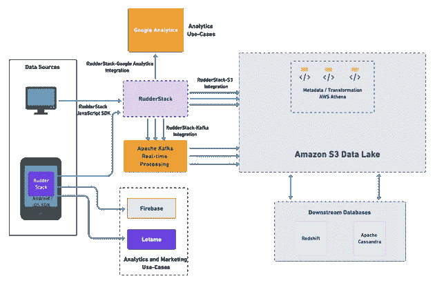

# 1mg 的数据堆栈解释:他们如何利用和激活无限的实时数据

> 原文：<https://medium.com/geekculture/1mgs-data-stack-explained-how-they-harness-and-activate-unlimited-real-time-data-c8b7b8f6dc69?source=collection_archive---------41----------------------->

# 概观

这篇文章打破和分解了 1mg 的数据堆栈，允许他们安全地利用无限的实时数据。我们还将了解他们使用哪些工具来激活这些数据，以用于下游分析和个性化用例。

# 1mg 是谁？

1mg 是一个在线平台，提供医疗诊断、咨询、实验室测试和一般医疗保健。每天，数百万用户访问 1mg 网站或使用他们的应用程序购买药品，安排与医生的时间，或找到有用的医疗信息。

# 1 毫克的数据堆栈

*   **数据收集和同步**
*   [方向舵栈](http://www.rudderstack.com/)SDK，自定义脚本
*   **数据转换和丰富**
*   SQL、方向舵堆栈转换、AWS Athena
*   **数据湖和下游数据库**
*   亚马逊 S3，亚马逊红移，阿帕奇卡珊德拉
*   **商务智能和云工具集**
*   谷歌分析，Lotame
*   **作业编排**
*   阿帕奇卡夫卡

# 1mg 面临的数据挑战

1mg 完全是数据驱动的。他们使用数据在业务的各个方面做出决策，包括供应链、营销和产品开发。凭借数百万的日常用户，1mg 收集了大量的数据。面对如此高的数据量和公司内如此多的不同数据需求，1mg 数据科学团队的高级工程师 Utkarsh Gupta 和他的数据工程团队必须管理一个复杂的、技术要求高的数据管道。

1mg 在整体数据基础设施方面面临两大挑战:

# 安全、实时地收集非结构化数据:

1mg 收集的大部分数据是非结构化的，比如医疗报告、电子邮件、客户聊天等。对于数据工程团队来说，在收集和存储这些数据时，不必担心数据量和价格，同时遵守数据安全法规是一项重大挑战。

# 有效的数据激活

1mg 希望建立一个数据工作流，利用非结构化数据获得对其客户旅程和其他产品个性化使用案例的关键见解。

让我们看看 1mg 的数据堆栈的数据工程团队是如何解决这些问题的。

# 1mg 的数据堆栈说明

概括地说，下面是 1mg 数据堆栈的流程:

*   事件收集和路由通过**ruder stack**Enterprise 进行，利用 JavaScript 和移动 SDK。请注意，RudderStack Enterprise 托管在 1mg 的 VPC，以实现最大的安全性和合规性，这是医疗保健公司的强制性要求。
*   1mg 将所有数据转储到他们的**亚马逊 S3** 数据湖中。流经 RudderStack 的事件以及来自其他来源的数据被路由到 S3 进行转换和编排。
*   **AWS Athena** 用于转换和丰富数据。这个标准化的数据随后也被批量发送到**红移**和**卡珊德拉**用于 1mg 的下游用例。
*   流经 RudderStack 的事件也被直接发送到 Firebase 和 Google Analytics，用于分析和商业智能，而 **Lotame** 用于营销激活。
*   实时事件也被发送到 **Apache Kafka** ，由 1mg 的数据科学团队用来优化他们的产品推荐引擎。

这是他们数据流的可视化:

**1 毫克数据流过舵栈**

在接下来的章节中，我们将更详细地探讨数据流的各个方面，从收集到丰富和分析。

# 数据收集和存储

对于数据收集，1mg 在他们自己的 VPC 部署了 RudderStack，允许他们:

*   请遵守关于医疗保健数据收集和存储的现有法规
*   克服数据收集的数量或类型的任何限制，而不必担心定价
*   通过他们的仓库基础设施将任何数据路由到任何团队，或者直接路由到他们下游用例的最终目的地

1mg 的大部分数据来自他们的客户行为，所以网站和手机 app 是他们的主要数据来源。

1mg 使用 RudderStack 的 [JavaScript SDK](https://docs.rudderstack.com/rudderstack-sdk-integration-guides/rudderstack-javascript-sdk) 从他们的网站收集实时客户活动数据。这个 SDK 跟踪各种用户行为，从页面浏览量到产品浏览量，点击量，结账流程等等。他们还利用 RudderStack 的 identify()方法来跟踪新客户和老客户，并驱动个性化用例。

对于他们的移动应用程序，1mg 使用 RudderStack 的 [iOS](https://docs.rudderstack.com/rudderstack-sdk-integration-guides/rudderstack-ios-sdk) 和 [Android](https://docs.rudderstack.com/rudderstack-sdk-integration-guides/rudderstack-android-sdk) 原生 SDK 来跟踪和收集应用程序事件，并将它们直接发送到 Firebase 和 Lotame，用于分析和营销用例。RudderStack 通过[设备模式](https://docs.rudderstack.com/get-started/rudderstack-connection-modes#device-mode)向这些目的地发送事件数据。换句话说，应用内的 RudderStack 原生 SDK 会自动直接调用目标 API。

1mg 还从各种其他来源收集数据。这些数据主要是事务性的，包括来自他们的 API 日志、微服务、CRM 系统等的数据。1mg 建立了一个专用的 ETL 管道，从所有这些数据源中提取数据，并将其推送到他们的亚马逊 S3 数据湖。

为了从 MongoDB、PostgreSQL 和 MySQL 等数据库中转移事务数据，1mg 使用 AWS 的数据迁移服务。他们的数据工程团队还编写了自定义脚本，每天从点击流源(如 Google BigQuery)中提取数据。此外，他们还构建了一个定制的数据管道，将来自各种微服务和 API 日志的数据推送到他们的 S3 数据湖。

# 数据转换、丰富和路由

下一步是将从各种来源提取的原始数据转换成可用的格式。对于这种转换，1mg 使用 AWS Athena——一种交互式的无服务器查询服务，允许他们将原始数据规范化为可用的优化数据表。

数据湖中所有主要的数据转换都发生在 Athena 中。这些包括将 JSON 中的数据转换成可读的表格格式，或者连接不同的数据湖表。1mg 还使用 Athena 来存储与数据湖中的表相关的所有元数据和模式信息。

# 面向下游用例的 1mg 工具集

在原始数据被规范化后，它再次被推入 S3 数据湖，并批处理到其他数据库，如用于 1mg 下游用例的**亚马逊红移**和**阿帕奇卡珊德拉**。

虽然与业务和产品分析用例相关的所有数据表都驻留在 Redshift 中，但 Cassandra 用于存储用户和产品个性化数据。1mg 将这些数据发送到第三方分析工具，如 Google Analytics，以获得实时见解和报告，其产品和营销团队可以据此做出有效的决策。

除了这些工具之外，1mg 还利用 Apache Kafka 的实时数据处理功能进行推荐用例。RudderStack 支持 Apache Kafka 作为目的地，从 1mg web 和移动应用程序向其发送实时事件。他们的数据科学团队利用这些数据来构建和优化 1mg 的产品推荐引擎，该引擎向其客户推荐相关的产品。

发送到 Lotame 的点击流数据允许 1mg 团队对其用户进行细分，并获得其客户产品和购买旅程的 360 度视图。他们可以 A/B 测试新产品功能，并利用这些见解改造他们的网站，推动更有效的客户获取计划。产品营销团队还使用这些数据来建立更有效的营销活动，从而提高整体客户参与度和保留率。

# 总结一下…

1mg 建立了一个现代化的客户数据堆栈，能够可靠地处理巨大规模的数据。他们的实时数据产品不仅创造了更好的客户体验，Utkarsh 的团队还通过让团队快速行动和优化公司的每个部分，帮助建立了显著的竞争优势。

# 免费注册并开始发送数据

测试我们的事件流、ELT 和反向 ETL 管道。使用我们的 HTTP 源在不到 5 分钟的时间内发送数据，或者在您的网站或应用程序中安装我们 12 个 SDK 中的一个。[入门](https://app.rudderlabs.com/signup?type=freetrial)。

**本博客原载于**[**https://rudder stack . com/blog/1 MGS-data-stack-explained-how-they-harness-and-activate-unlimited-real-time-data**](https://rudderstack.com/blog/1mgs-data-stack-explained-how-they-harness-and-activate-unlimited-real-time-data)**。**