# 2.5D 平台:增加生命显示和重生

> 原文：<https://medium.com/geekculture/2-5d-platformer-adding-lives-display-and-respawn-aa17d70d1fbf?source=collection_archive---------51----------------------->

今天，我将在游戏中添加一个生命显示，让玩家从平台上摔下时重生。

首先，我将在玩家脚本中为生命创建一个变量，并将其设置为 3。

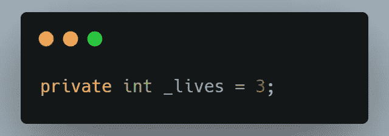

然后，我将在画布下复制硬币文本，并将名称更改为 Lives，并将文本框中的文本更改为“Lives:”

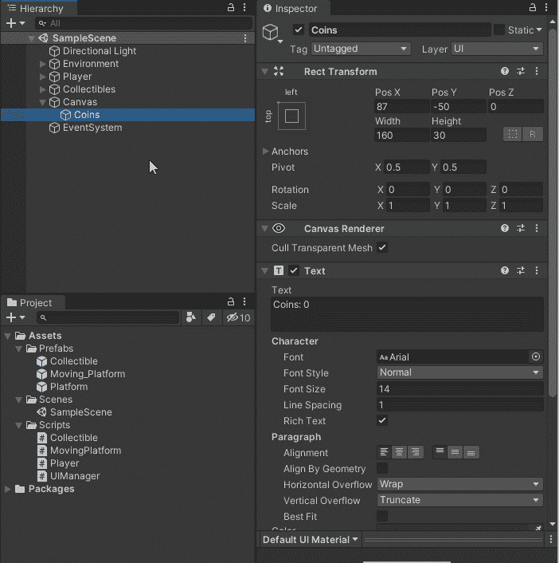

然后我可以把它移到 UI 窗口中硬币的上方。

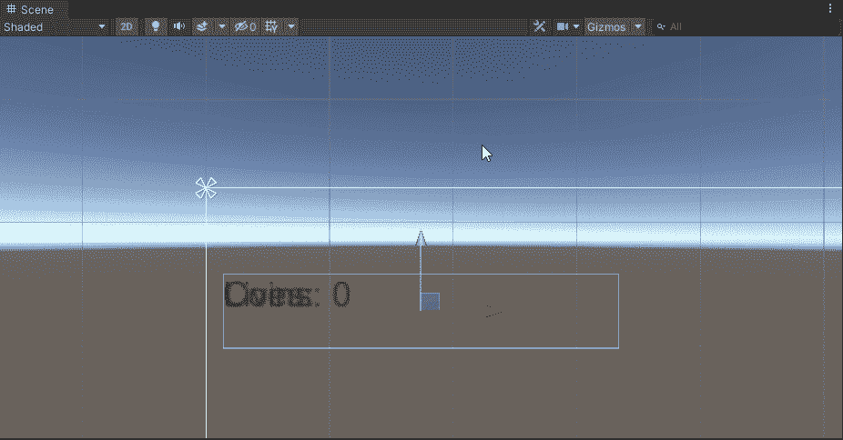

接下来，在 UIManager 脚本中，我将添加对 Lives 文本的引用，并创建一个方法来更新 Lives 显示。

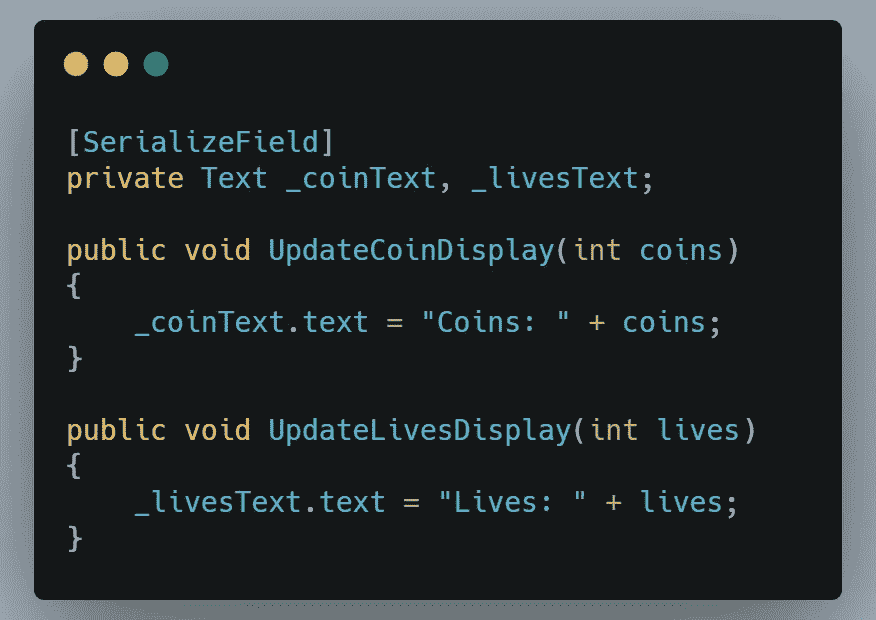

然后在播放器的 Start()方法中，在我空检查 UIManager 之后，我将调用 UpdateLivesDisplay()方法。

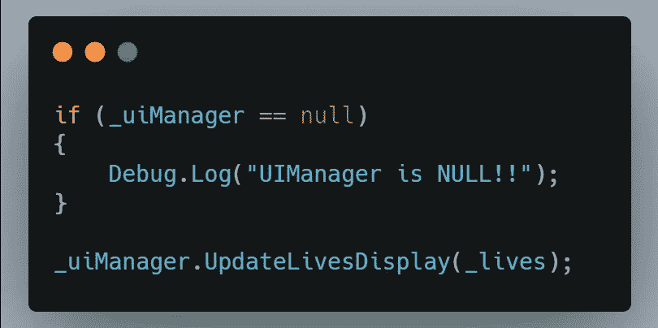

此外，我需要将 Lives 游戏对象拖动到检查器中 UIManager 的 Lives 文本中。

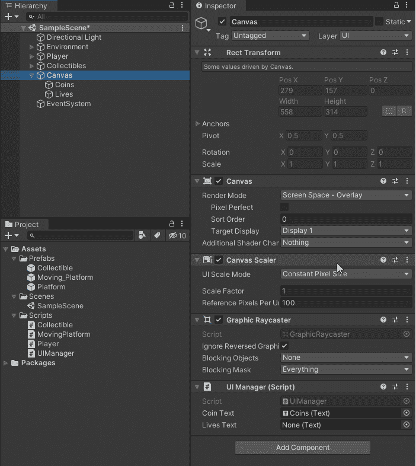

它为实时显示设置了 UI 元素。

接下来，我需要创建一种方法来检测玩家何时离开了比赛场地。为此，我创建了一个 3D 立方体，并在 X 轴上将其缩放到大约 10。然后我把它的名字改为 Dead_Zone，并把它设置为 Is Trigger。

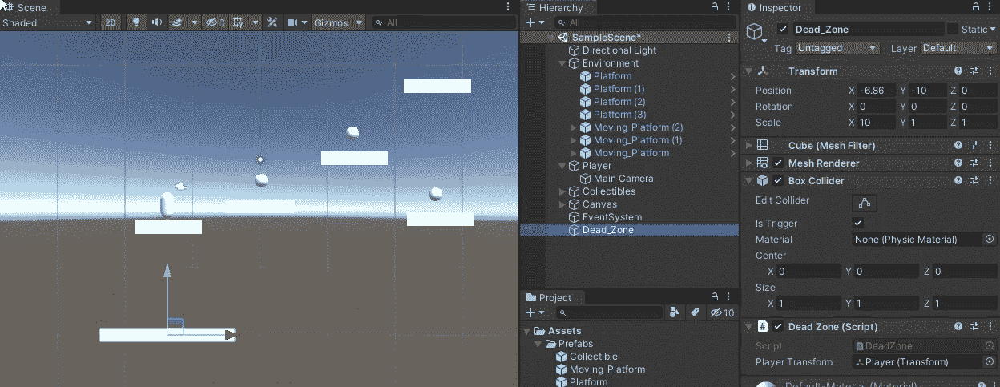

o 还创建了一个名为 DeadZone 的脚本来附加到 Dead_Zone 对象。因为我还没有决定我要让平台走多远，我想让 Dead_Zone 沿着 X 轴跟随玩家，这样我就可以沿着 X 轴的任意方向无限地建造关卡。

为此，我在死区脚本上创建了一个序列化的转换。

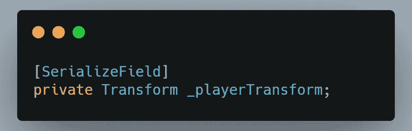

然后在 Update()方法中，我让 Dead_Zone 在 X 轴上跟随玩家，同时保持自己的 Y 和 z。

然后我只需要把玩家游戏对象拖到检查器中合适的地方。

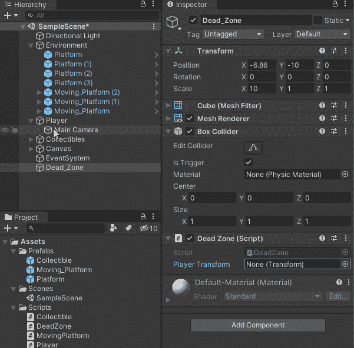

现在是让 Dead_Zone 检测玩家的时候了。我通过在 DeadZone 脚本中设置一个 OnTriggerEnter()事件并检查对象是否是播放器来实现这一点。如果是这样，我将在名为 PlayerDied()的播放器上调用一个方法。

现在，在 PlayerDied()方法中，我将减少玩家的生命，并调用 UIManager 上的方法来更新生命。然后我会检查玩家的生命值是否为零。如果有，我就重启关卡。否则，我会让玩家回到他们的繁殖点。

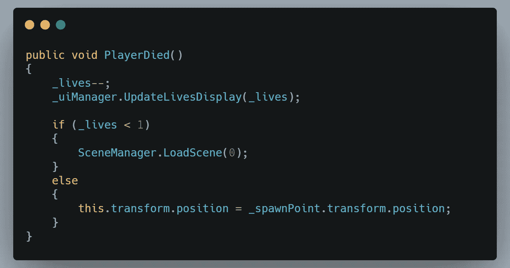

现在，这几乎完成重生柜台部分。但是有一个小问题。它会查看玩家是否移动太快，以至于摔倒时无法重置位置。因此，当调用 PlayerDied()方法时，我要做的第一件事就是关闭 CharacterController 组件。然后，我将创建一个协同例程，在再次启用角色控制器之前等待 0.1 秒。在玩家重新呼吸后，将立即调用协同例程。

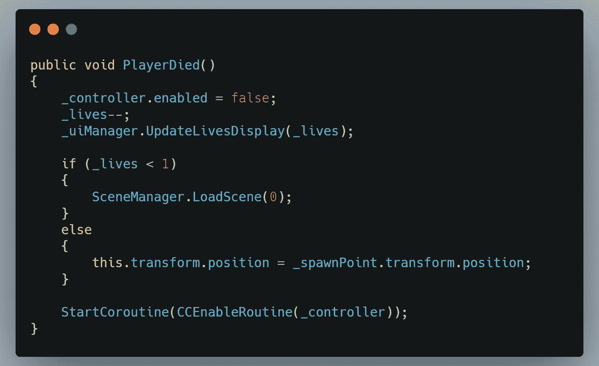

下面是将要调用的协同例程。

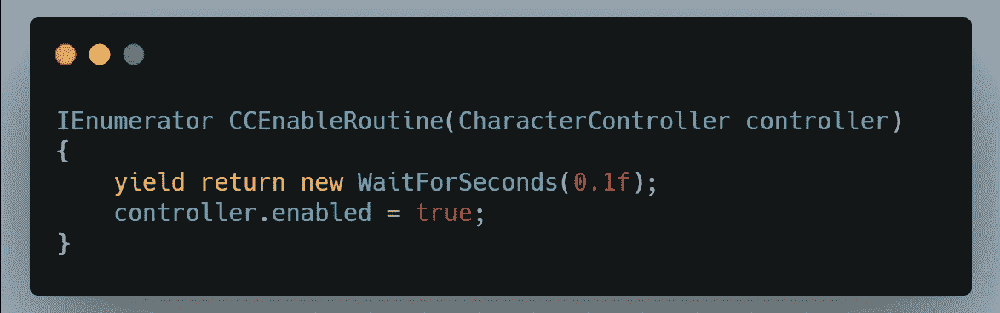

现在玩家死后会重生，游戏会在零生命时重新开始。

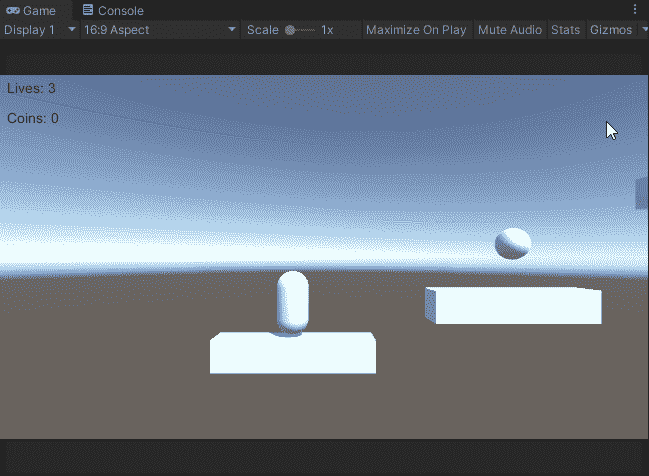

我希望你喜欢这篇文章，并确保检查下一个地方，我将开始为游戏设置一些难题元素。

和往常一样，我祝你在编码之旅中一切顺利。