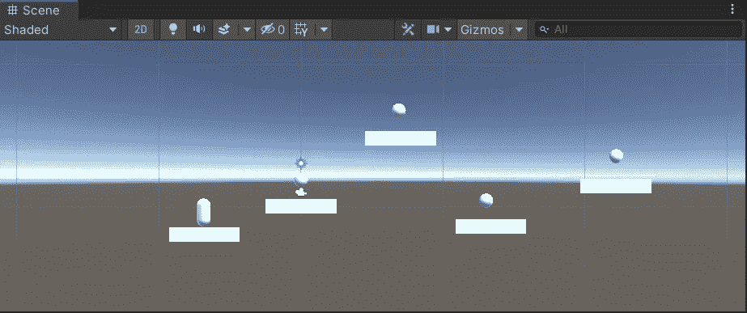
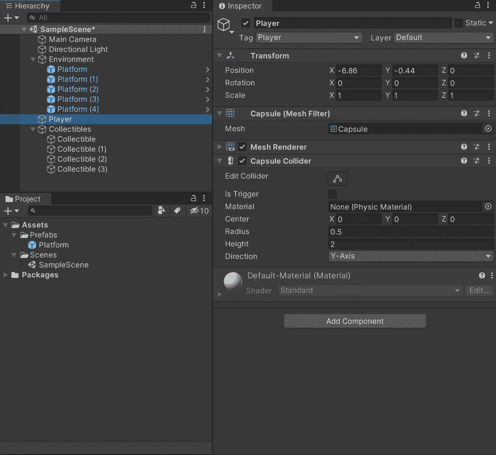
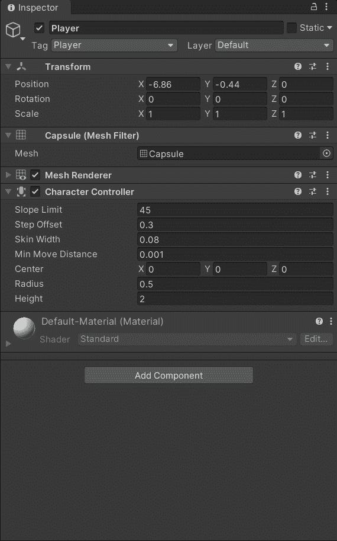
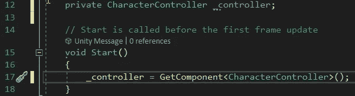
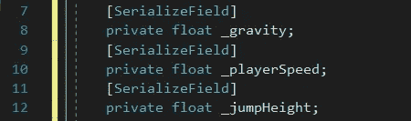
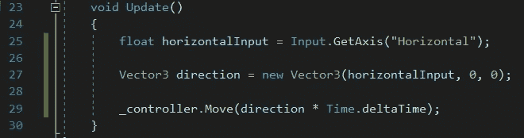
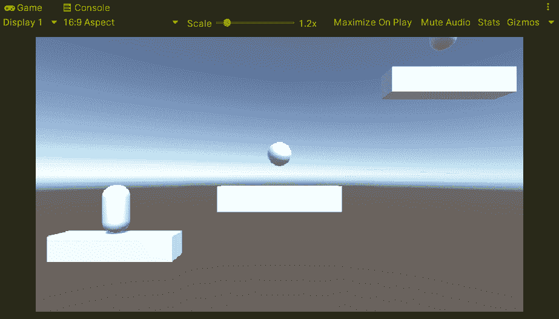
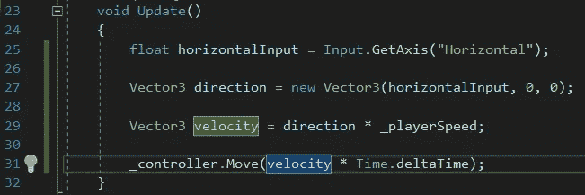

# 2.5D 平台:角色控制器，第 1 部分

> 原文：<https://medium.com/geekculture/2-5d-platformer-character-controller-part-1-c02ad0473337?source=collection_archive---------17----------------------->

在本文中，我将通过脚本为玩家设置一个基于物理的角色控制器。玩家将通过脚本进行水平移动、重力、跳跃和双跳。

首先，我用原语建立了一个非常基础的层次。我有几个平台，一些球体作为收藏品，还有一个给玩家的胶囊。

要设置播放器，首先，我要移除胶囊碰撞器，因为播放器不会使用它。然后我将添加一个角色控制器组件。

这将允许我完全控制玩家的移动，包括速度和重力。这将通过一个名为 Player 的脚本来完成，该脚本将附加到玩家游戏对象上。

现在是时候打开脚本并开始设置一些值了。首先，我需要获得播放器上角色控制器组件的一个句柄。然后我将句柄分配给 GetComponent <charactercontroller>()。</charactercontroller>

此外，因为我已经知道我将需要一个重力、跳跃高度和玩家速度的值，所以我也将继续设置它们。因此，这些将是很好的开始，我会根据需要添加更多。

现在我可以开始设置脚本来移动角色了。首先，我将使用 input 获得水平输入。然后，我将基于输入定义一个新的 Vector3 方向，最后，使用角色控制器 Move()方法，我将使用该方向移动。

这将给玩家一个很好的，尽管很慢的移动，如下所示。

现在我要给播放器增加一点速度。为此，我将 _playerSpeed 设置为 5.0f。然后，在 Update()方法中，在设置 Vector3 方向之后，我将设置一个名为 velocity 的新 Vector3，并将其设置为 direction * _playerSpeed。然后在 Move()方法中，我将使用新的速度而不是方向。

这给了玩家更好的移动速度，如下图所示。

这涵盖了为玩家设置角色控制器的第一部分。在下一篇文章中，我将添加重力、跳跃和双跳。所以一定要回来看看更多的编码乐趣。

并且，一如既往，我祝您在自己的编码之旅中一切顺利。