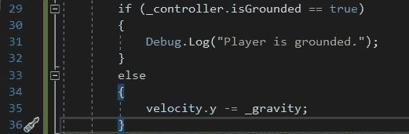
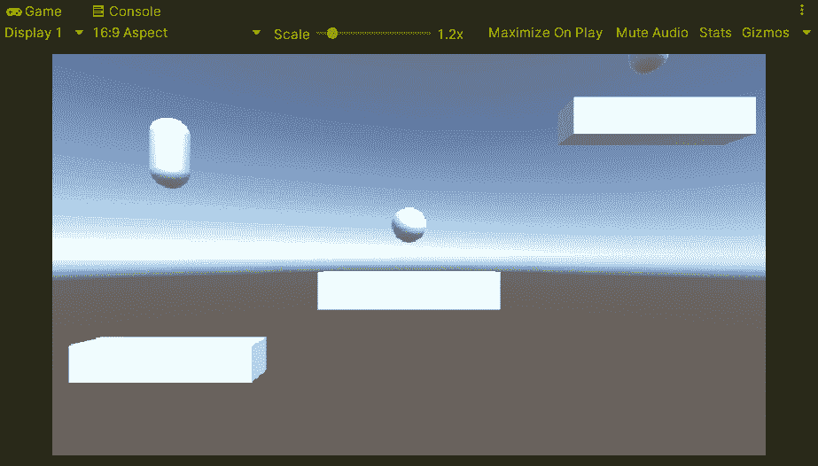
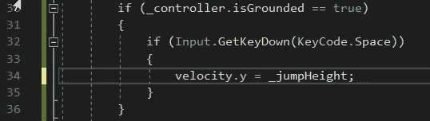
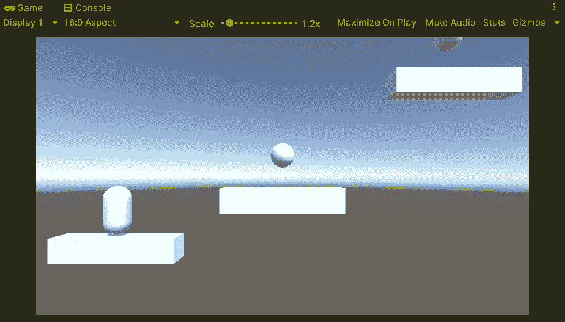
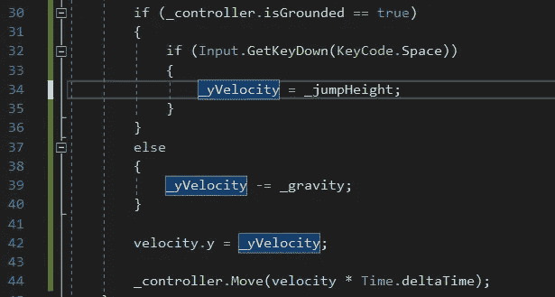
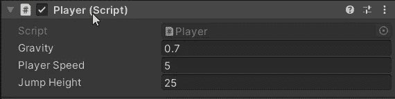
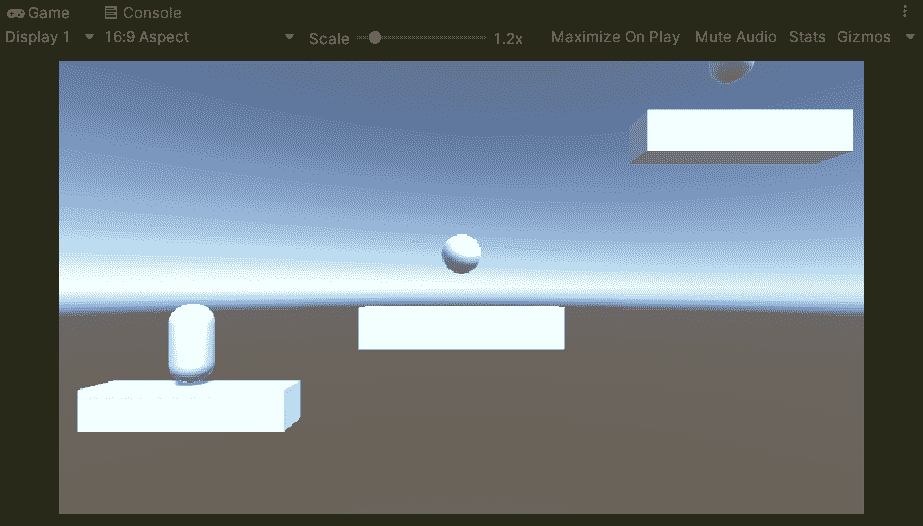
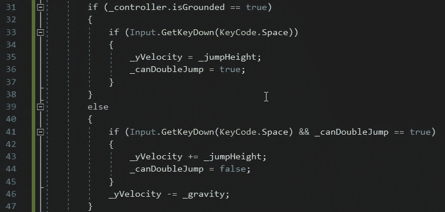

# 2.5D 平台:角色控制器，第 2 部分

> 原文：<https://medium.com/geekculture/2-5d-platformer-character-controller-part-2-445e0acd7ae6?source=collection_archive---------15----------------------->

在我关于为 2.5D 平台创建角色控制器的文章的第二部分中，我将为玩家设置重力、跳跃和双跳。

我已经为重力创建了一个变量，现在将它设置为 1.0f，如果需要的话，以后再调整。为了检查重力，我将使用角色控制器中一个名为 isGrounded 的方法来查看玩家是否站在什么东西上。如果这是真的，我暂时什么都不做，如果这是假的，我会施加重力。

这就提供了重力，使得玩家可以下落。

玩家正在缓慢下降，但我会在根据需要增加跳跃的同时对此进行调整。

现在是为玩家增加跳跃的时候了。我要用空格键启动玩家的跳跃。首先，我将检查是否在检查是否接地时按下了空格键。

正如你在下面看到的，这仍然是一个问题。

这位选手几乎没有跳起来。发生的情况是，对于每一帧，velocity.y 被重置为 0。为了缓解这个问题，我将创建一个名为 yVelocity 的 float 来缓存我想用于 y 的速度。

现在我已经有了代码，我将调整我的重力和跳跃高度的值，以使移动更加平滑。

这给了一个更好的跳跃，虽然我想我可以调整重力多一点，这样玩家就不会觉得他们被抓了下来。

现在我将研究双跳功能。首先，我将创建一个 bool 来确定玩家是否可以双击，我将它命名为 _canDoubleJump，将其初始值设置为 false。这是因为我只希望他们双跳一次，而且是在球员没有被禁足的情况下。所以当玩家第一次跳转时，_canDoubleJump 将被设置为 true。那么如果玩家再跳一次，就会被设置回 false。这方面的代码如下所示。

现在玩家可以跳跃和双跳了。

这就完成了 2.5D 平台游戏的角色控制器的设置。我希望您对此感兴趣，并一如既往地祝您在自己的编码之旅中一切顺利。