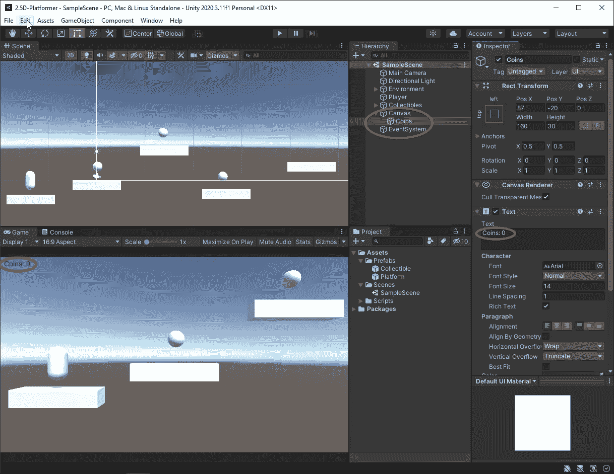
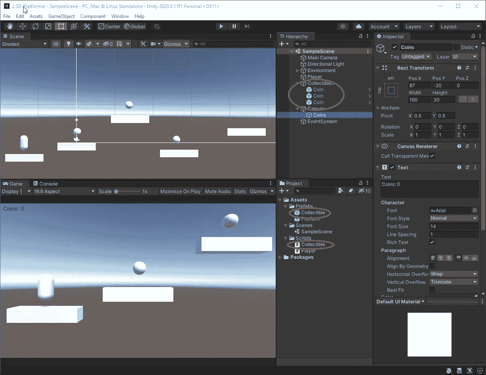
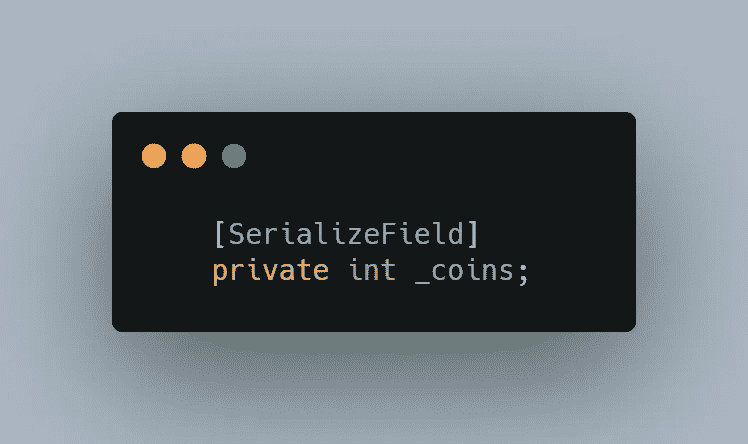
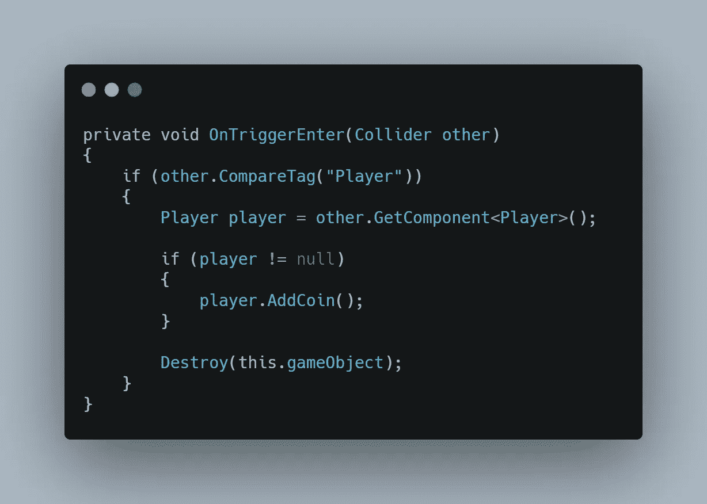
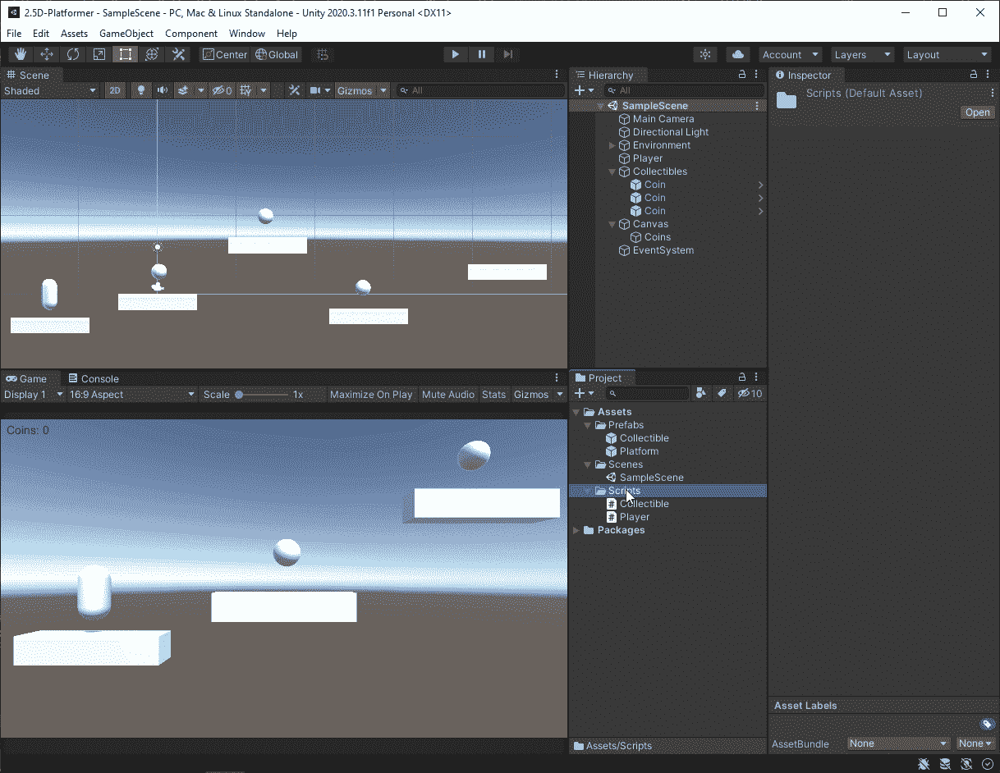
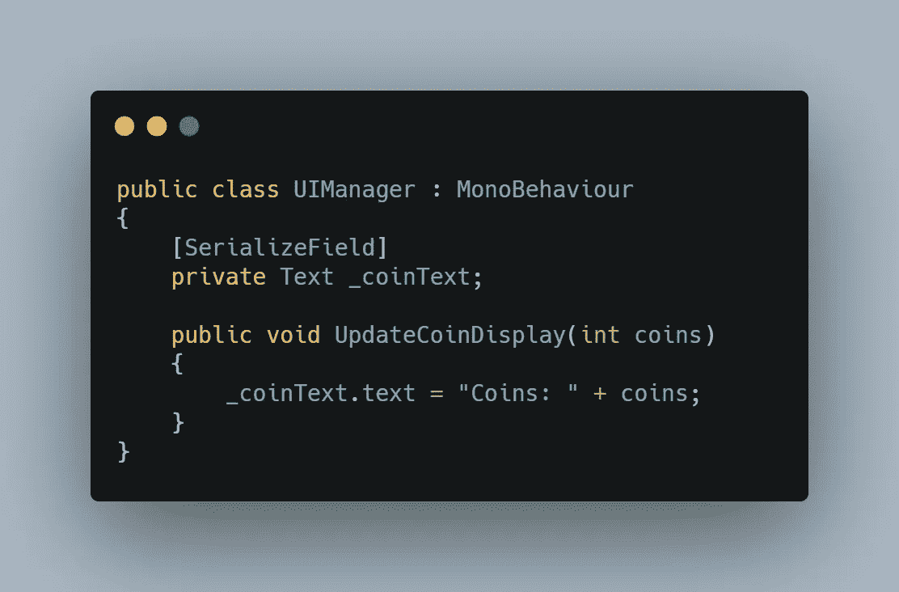
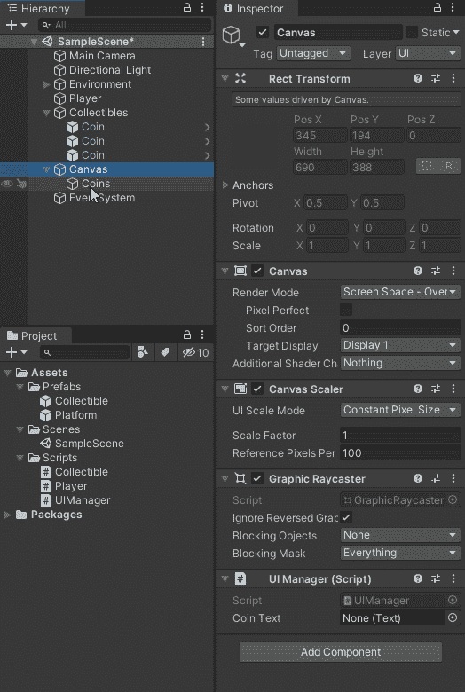
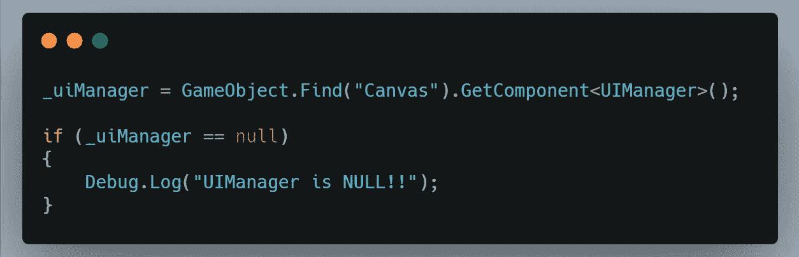
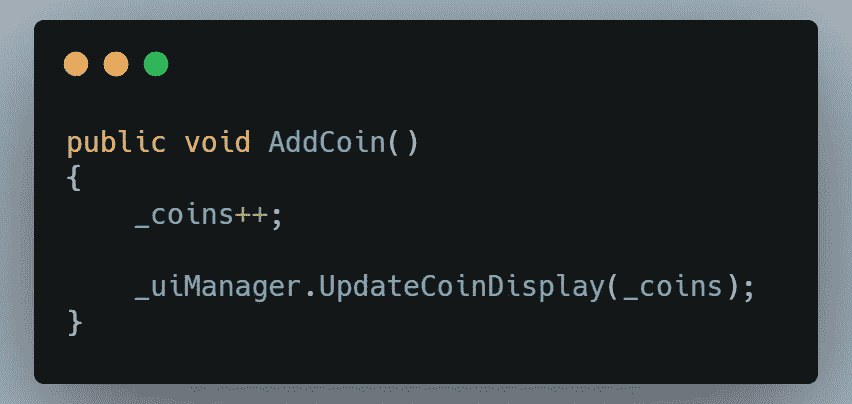
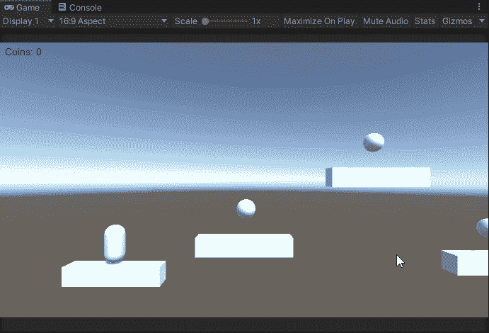

# 2.5D 平台:收藏品

> 原文：<https://medium.com/geekculture/2-5d-platformer-collectibles-6cbf47ab7d66?source=collection_archive---------22----------------------->

在这篇文章中，我将设置我们必须被玩家收集的球体，并设置一个 UI 显示来显示已经收集了多少。

我做的第一件事是创建一个名为 Coins 的 UI 文本对象。然后我把正文改为 Coins: 0，放在游戏屏幕的左上角。

接下来，我创建了一个名为 Collectible 的脚本，它将用于游戏中所有可收集的对象。我还将等级中的球体重命名为硬币，并使它们成为一个预置。

现在是时候开始为收藏品、文本对象和播放器编写行为脚本了。首先，我将从玩家脚本开始，通过添加一个变量来跟踪玩家拥有的硬币，并添加一个方法 AddCoin()，当玩家收集硬币时将调用该方法。

然后我会转到可收集的脚本。在那里我需要添加一个 OnTrigerEnter 事件，并检查碰撞是否与玩家有关。如果是这样的话，我得到一个玩家脚本的句柄，为了安全起见进行空检查，调用 AddCoin()方法，然后销毁 GameObject。

接下来，是时候在画布 GameObject 上设置 UIManager 脚本了。UIManager 将有一个公共方法来更新文本显示，并将接受一个 int 作为参数。最后，我将获得播放器上 UIManager 的句柄，并在播放器收集硬币时调用该方法。

在 UIManger 脚本中，我将为文本对象创建一个序列化字段，并创建更新硬币显示的方法。

保存并返回 Unity 后，我将文本对象拖到 UIManager 上的空白处，要求输入一个文本对象。

这就完成了 UIManager 的设置。现在我可以继续玩家脚本了。首先，我需要在播放器脚本中为 UIManager 创建一个变量。

接下来，我将使用这个变量来引用 canvas 对象上的 UIManager 脚本，并对其进行空检查以确保安全。

现在我有了对 UIManager 的引用，当玩家收集硬币时，我可以调用它的方法 UpdateCoinDisplay()。

现在一切都设置好了，硬币显示应该在收集到硬币时更新。

当玩家收集到第一个和第二个硬币时，你可以看到显示更新，就像它应该的那样。

这是为了给游戏设置收藏品。我希望你觉得这很有趣，也很有启发性。一如既往，直到下一次，我祝你在自己的编码之旅中一切顺利。