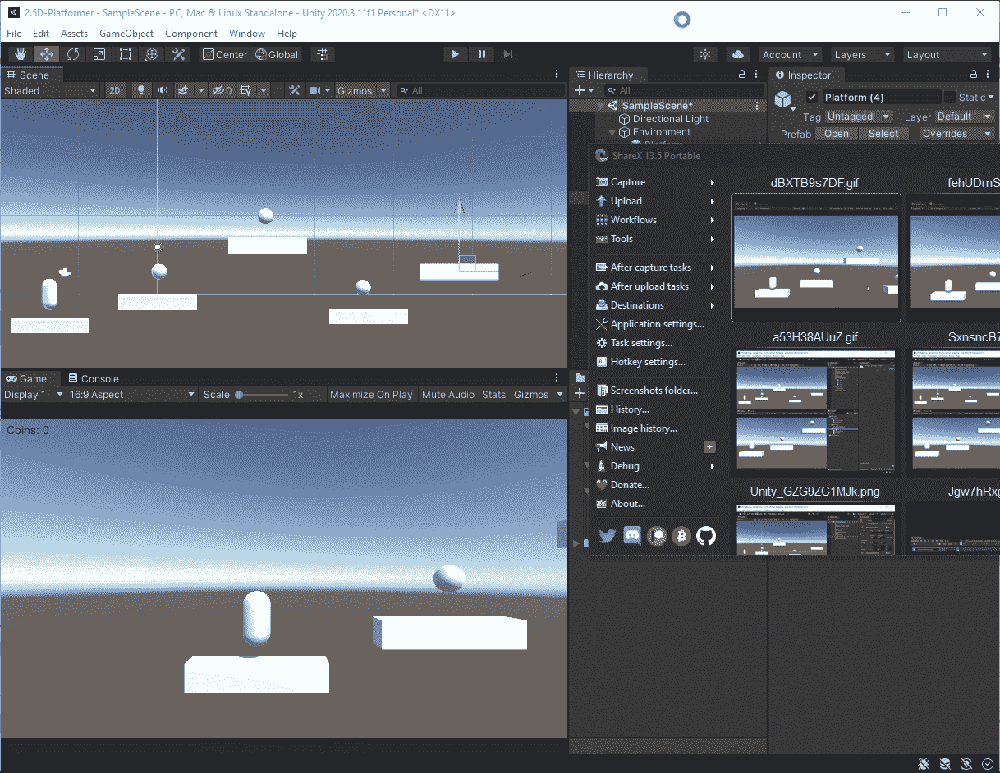
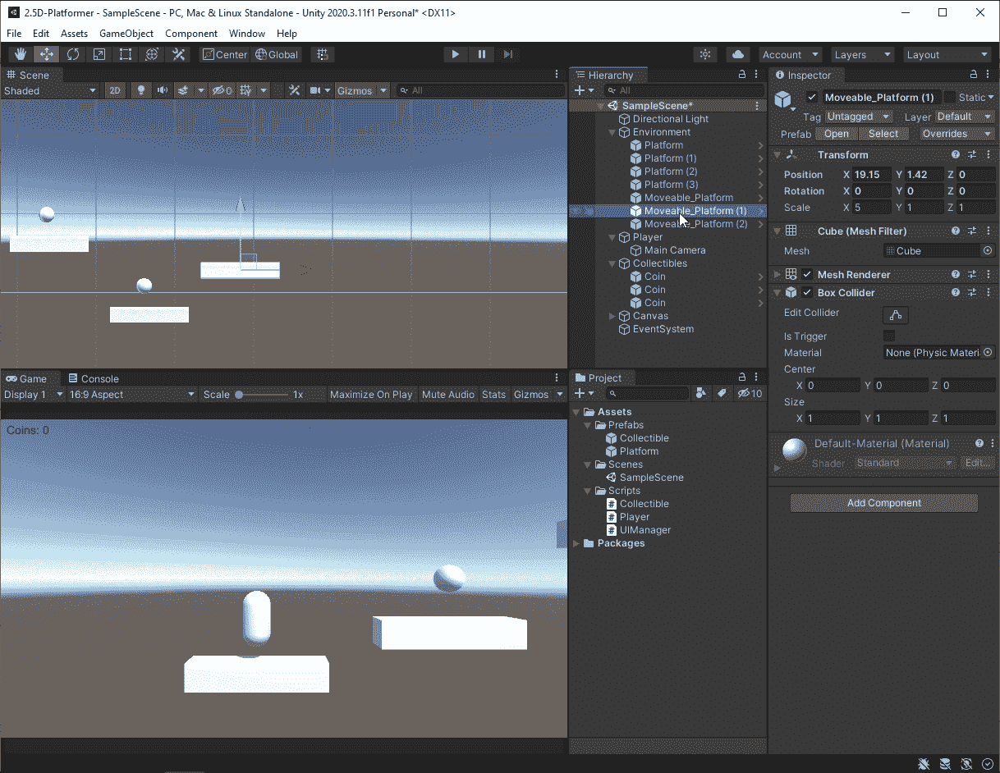
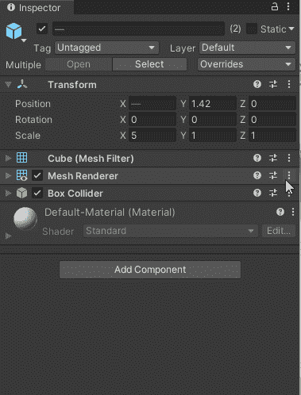
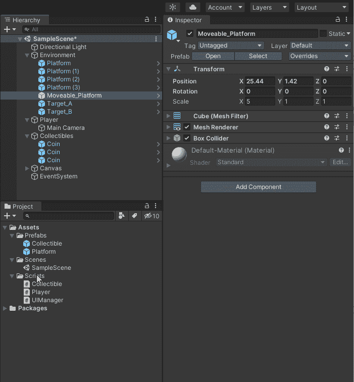
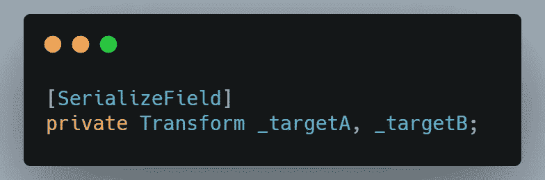
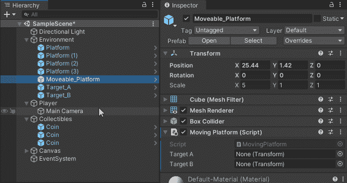
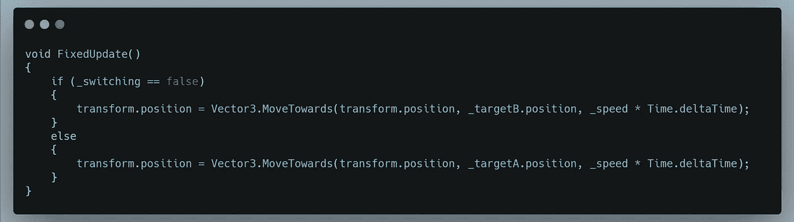
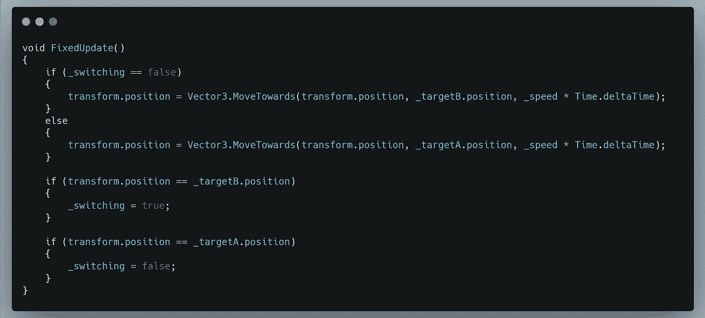
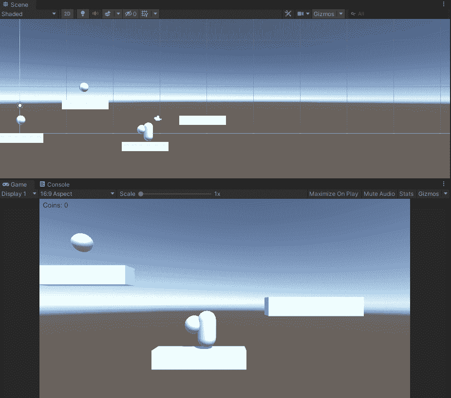

# 2.5D 平台:移动平台，第 1 部分

> 原文：<https://medium.com/geekculture/2-5d-platformer-moving-platforms-part-1-48458db4e8ed?source=collection_archive---------19----------------------->

在本文中，我将创建可移动的平台，为玩家提供额外的挑战。

我首先将其中一个平台重命名为 mobile _ Platform，并制作两个平台的副本。

接下来，我将把这两个副本重命名为 Target_A 和 Target_B。这两个副本将作为平台在其间移动的两点，因此我将把它们移动到我希望平台移动到的位置。

现在，我将选择 Target_A 和 target_B，并移除它们的网格过滤器、网格渲染器和长方体碰撞器，因为我只需要它们的变换组件。

接下来，我将创建一个脚本，并将其命名为 MovingPlatform。最后，我将把这个脚本附加到 mobile _ Platform 对象上。这个脚本将通过代码控制平台在 Target_A 和 Target_B 之间的移动。

为了让平台在 Target_A 和 target_B 之间移动，我需要获得对这两个点的引用。为此，我将为每个点创建一个转换变量并序列化它们，这样我就可以将它们拖到检查器中。

因为我正在处理物理运动，所以我将用 FixedUpdate()方法而不是 Update()方法进行计算和运动。这将为涉及物理的运动提供更精确和一致的计时。我还将使用一个名为 MoveTowards()的 unity 方法让平台移动到每个点。

我只想让平台在到达各自的点时转换方向。因此，我将创建一个名为 _switching 的私有 bool，并使用它来检查平台是否到达了某个点，如果是，我将把它发送到另一个方向，并更改 _switching 的状态。

所以首先，我根据 _switching 是真还是假来设置移动代码。

然后，当平台到达任一目标时，我添加条件来改变 _switching 的值。

这给了我们一个很好的一致的移动平台。

这就是关于移动平台的文章的第 1 部分。在第 2 部分中，我将处理玩家实际跳到移动平台上时的一个小问题。

我希望你觉得这很有趣，也很有启发性。直到下一次，我祝你在编码之旅中一切顺利。