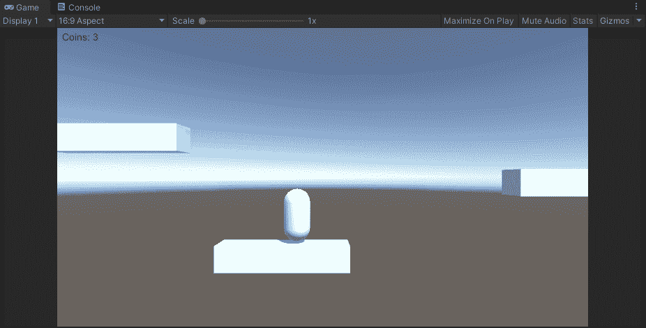
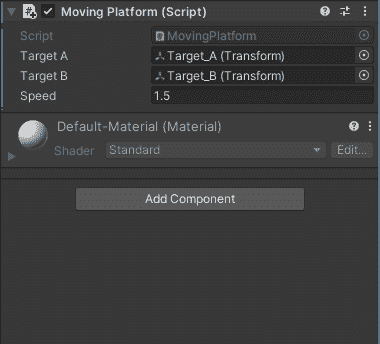
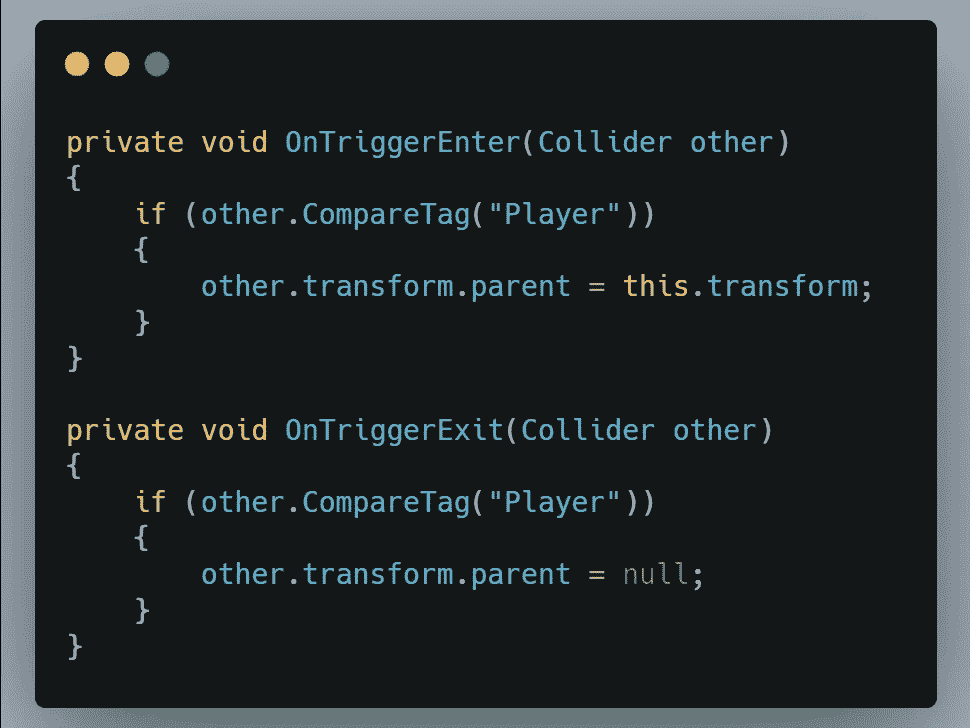
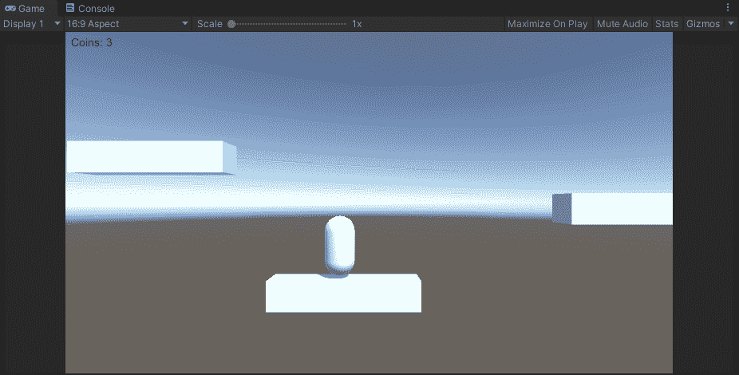
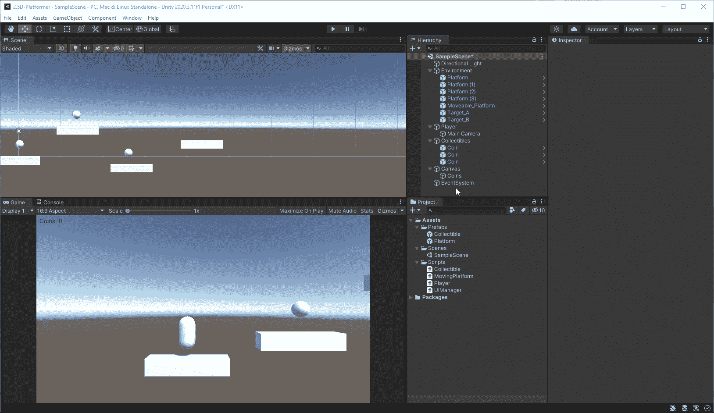
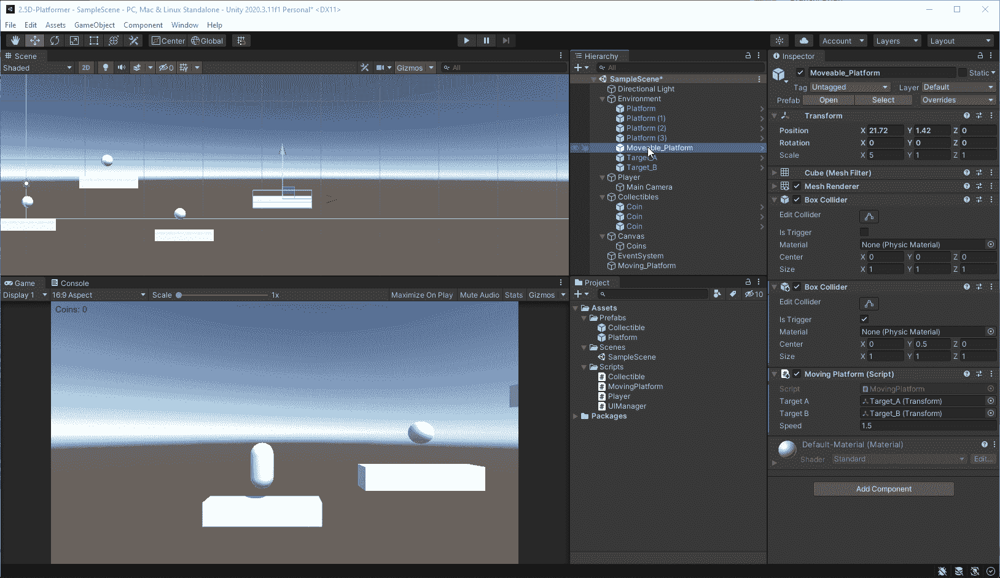
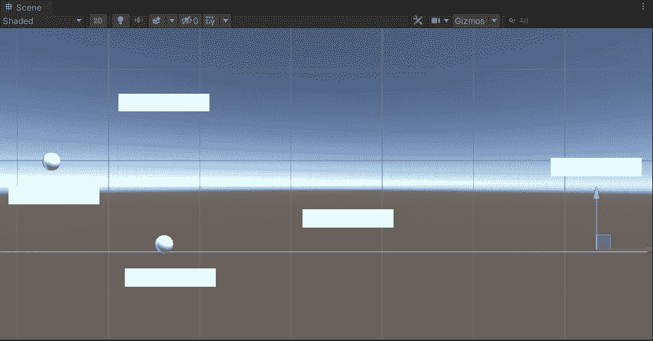

# 2.5D 平台:移动平台，第 2 部分

> 原文：<https://medium.com/geekculture/2-5d-platformer-moving-platforms-part-2-2bbe46c9da9e?source=collection_archive---------17----------------------->

在文章的这一部分，我将修复平台上播放器的一个小问题。

你可以看到播放器没有随着平台移动，如果我不移动播放器，它就会滑出平台。为了解决这个问题，当玩家在平台上时，我会将玩家设置为平台的子玩家，然后在跳下时解除配对。

首先，我将在 mobile _ Platform 中添加第二个盒子碰撞器，稍微调整一下，并将其设置为 Is Trigger。

现在，在 MovingPlatform 脚本中，我需要添加对 OnTriggerEnter()和 OnTriggerExit()的检查。在 OnTriggerEnter()上，我会检查碰撞是否与播放器有关。如果有，我就把玩家的父代设为平台。然后在 OnTriggerExit()中，我会检查离开的对象是否是玩家，如果是，我会把玩家的 parent 设置为 null。

现在玩家应该待在平台上，然后毫无问题地跳下来。

现在它正常工作了。作为文章这一部分的附加内容，我还将展示如何模块化移动平台，以便于重用。

首先，我将创建一个名为 Moving_Platform 的新的空对象，并将其转换重置为零。

然后，我将把可移动平台、目标 A 和目标 B 移动到空的移动平台中，并将它们的变换更改为零。

现在，我可以将 Moving _ Platform 拖到 Prefabs 文件夹中，然后我可以根据需要添加更多的平台。当我将它们添加到场景中时，设计师或我可以设置他们希望 Target_A 和 Target_B 放置的位置，平台将在它们之间移动。

你可以看到上面我知道有三个移动平台，都在不同的方向。

我希望你喜欢这些文章，并确保查看下一篇文章，在那里我将建立一个生命计数器，如果玩家从平台上摔下来会重生。

一如既往，我祝您在自己的编码之旅中好运。