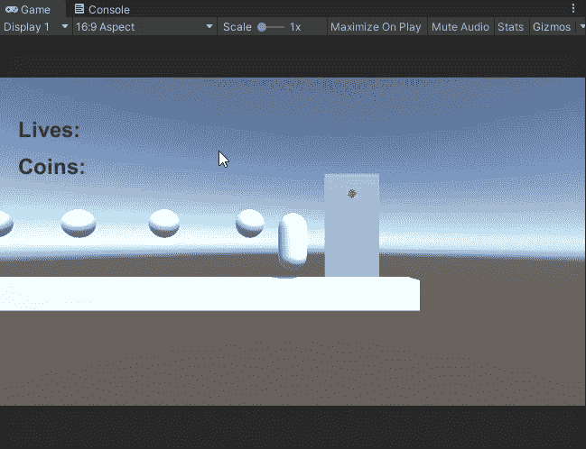
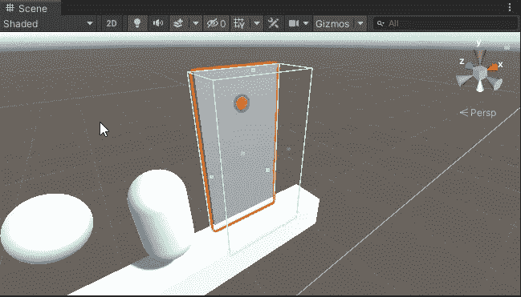
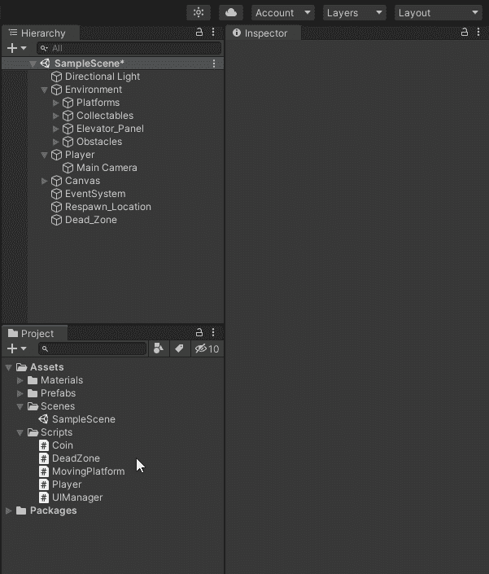
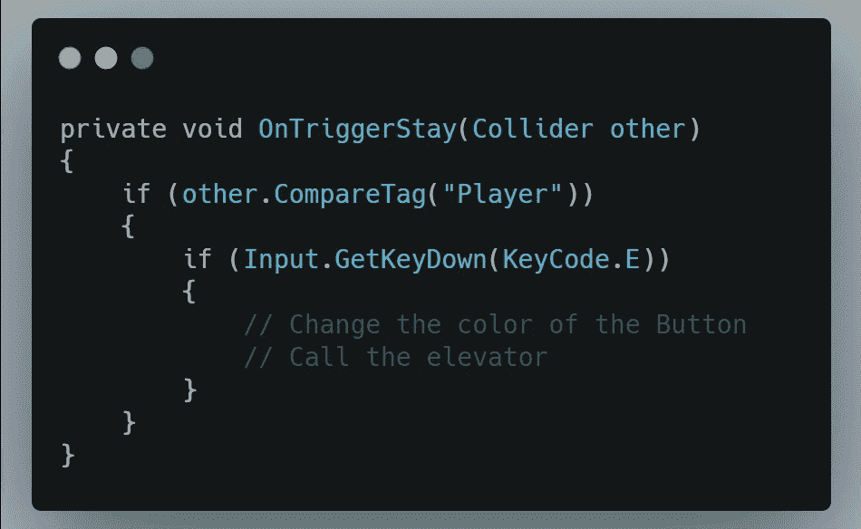
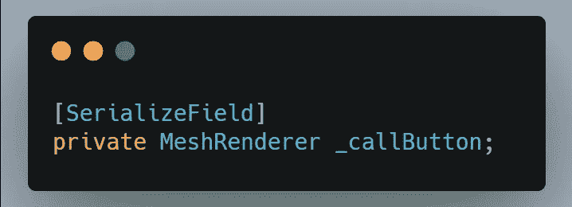
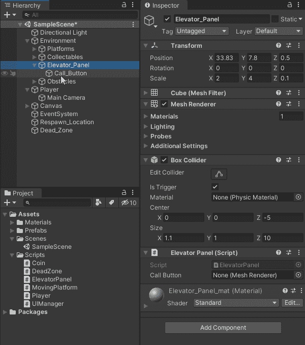
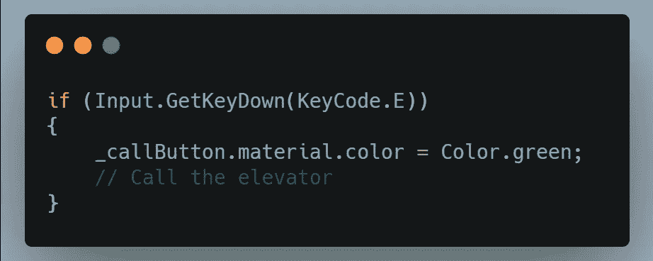
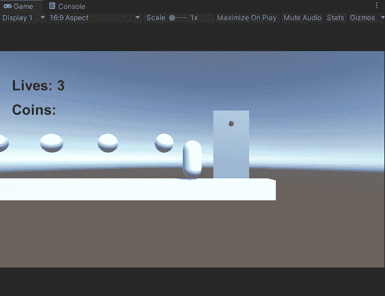

# 2.5D 平台:设置电梯，第 1 部分

> 原文：<https://medium.com/geekculture/2-5d-platformer-setting-up-the-elevator-part-1-31b6bb56f35d?source=collection_archive---------27----------------------->

在接下来的两篇文章中，我将设置一部电梯，玩家可以通过按电梯呼叫面板旁边的“E”键来呼叫这部电梯。

首先，我将设置面板的行为。例如，当玩家按下“E”键时，我希望按钮改变颜色，并且，如果玩家在电梯面板附近，我只希望“E”键工作。

为了检测玩家何时在面板前面，我将使用一个盒子碰撞器。然后，在我将添加到 Elevator_Panel 游戏对象的脚本中，我将使用 OnTriggerStay()事件来检查玩家是否在该区域内。

现在我有了 GameObject 上的脚本，我将创建一个 OnTriggerStay()事件，检查碰撞器是否被标记为玩家，并检查 E 键是否被按下。

接下来，要更改按钮的颜色，我需要创建一个变量来引用它，然后将对象拖动到检查器中。我将创建一个 Meshrenderer 类型的变量，这样我就可以直接访问材质和物体的颜色。

现在，我需要将 Call_Button 对象拖动到检查器中，以便在脚本中进一步访问它。

最后，要更改 Call_Button 的颜色，我需要进入脚本并添加一行代码，以便在按下 E 键时更改颜色。

当我走到电梯面板前并按下 E 键时，按钮会变成绿色。

这就是安装电梯的第一部分。下一篇文章，我会添加另一个要求，玩家必须收集 8 个硬币，电梯按钮才能工作。

所以，下次再见，我祝你在自己的编码之旅中一切顺利。