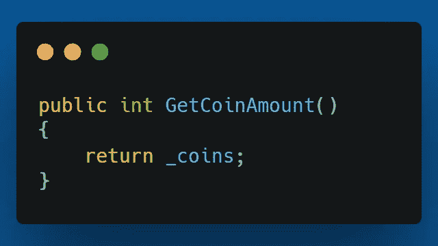
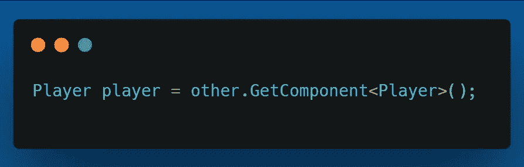
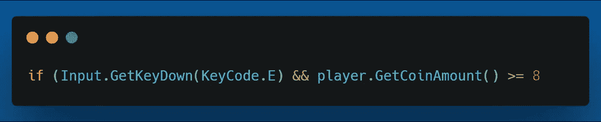

# 2.5D 平台:设置电梯，第 2 部分

> 原文：<https://medium.com/geekculture/2-5d-platformer-setting-up-the-elevator-part-2-ef59c46100fb?source=collection_archive---------31----------------------->

在本文中，我将继续在 2.5D 平台中设置电梯。在之前的[文章](/geekculture/2-5d-platformer-setting-up-the-elevator-part-1-31b6bb56f35d)中，我回顾了让玩家在他们进入范围时按下电梯按钮，并在按下时改变按钮。

这一次，我将添加一个额外的要求，玩家必须收集 8 个“硬币”按钮才能工作。

这实际上很容易实现。但是，首先，我需要玩家脚本上的一个方法，该方法将返回玩家有多少硬币。

在 ElevatorPanel 脚本中，我需要使用 GetComponent 获取对播放器脚本的引用。

然后，当我检查“E”键是否被按下时，我添加了一个额外的检查来查看调用上述方法的返回是否大于或等于 8。

现在玩家只有拥有至少 8 枚硬币才能按下电梯按钮。

这是一个非常短的。在下一篇文章中，我将实际设置调用电梯的功能，并让它向下移动到播放器。

在那之前，我祝你在自己的编码之旅中一切顺利。