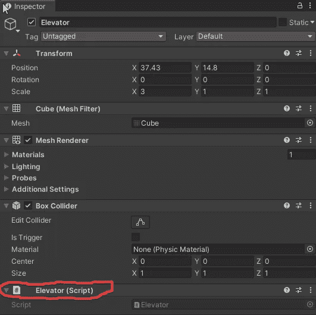
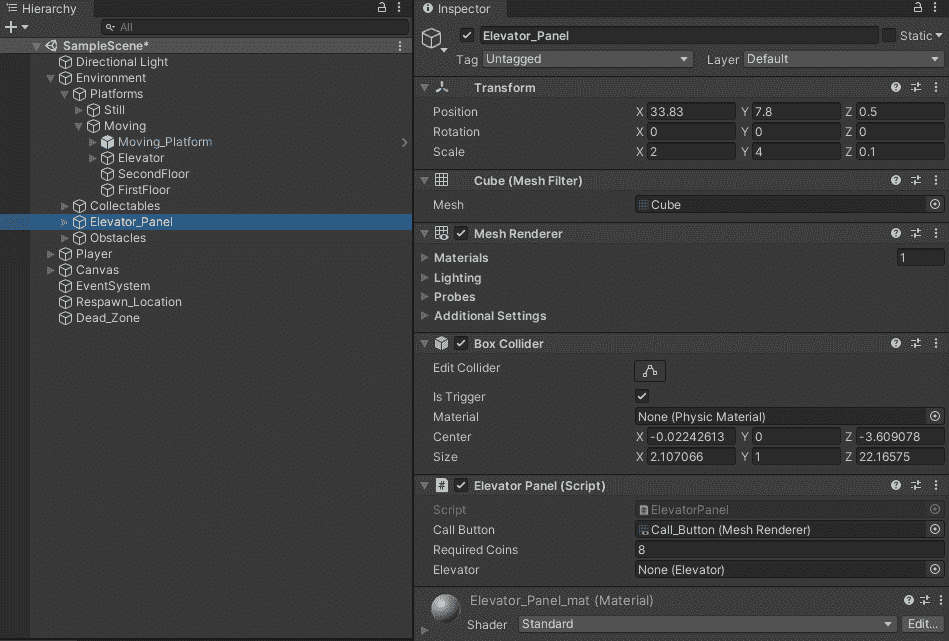
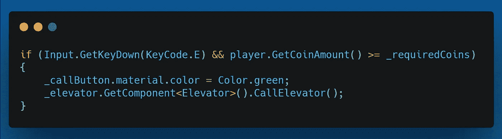
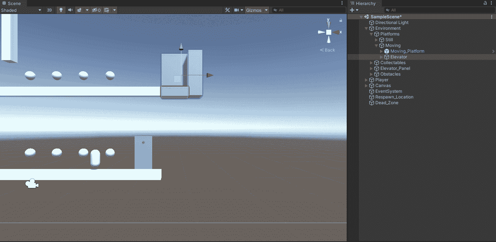
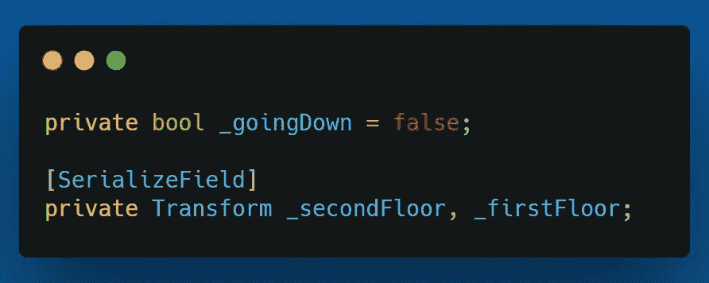
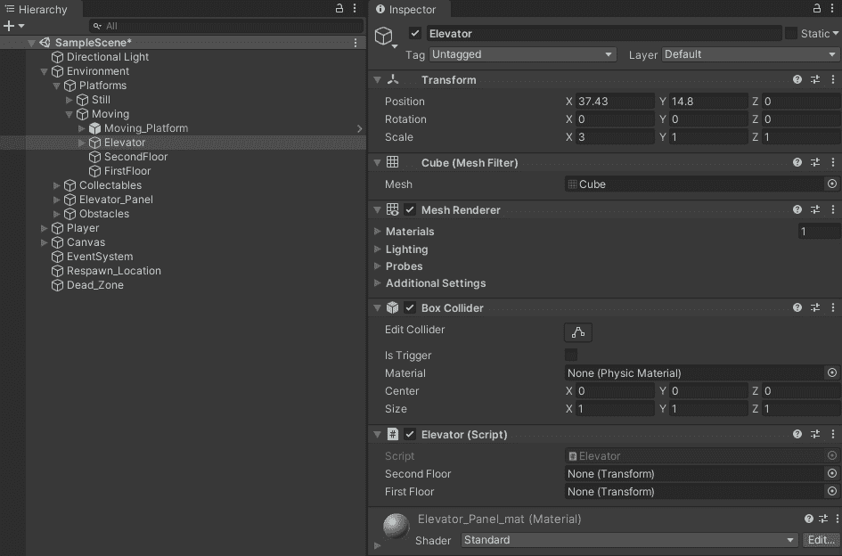
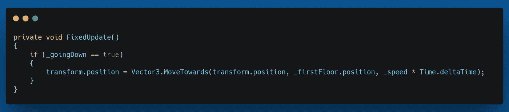
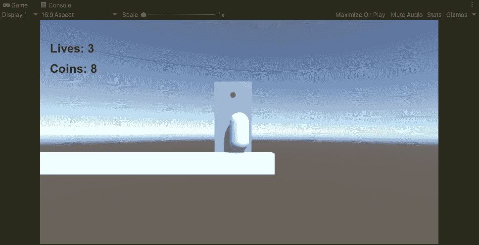

# 2.5D 平台:设置电梯，第 3 部分

> 原文：<https://medium.com/geekculture/2-5d-platformer-setting-up-the-elevator-part-3-f24072ae27dd?source=collection_archive---------31----------------------->

在本文中，当呼叫按钮被按下时，我将让电梯向下移动到玩家处。

我将首先创建一个名为电梯的脚本，并将其添加到电梯游戏对象中。

在电梯脚本中，我创建了一个用于调用电梯的方法，直观地说，该方法名为 CallElevator()。当电梯面板上的呼叫按钮被按下时，这个方法将被调用。

为此，我创建了一个名为 _ Elevator 的 Elevator 类型的序列化私有变量。

然后，我将电梯游戏对象拖到电梯面板游戏对象的检查器的适当位置。

现在，我可以添加一条语句，在按下“E”键时调用 CallElevator()方法。

剩下的就是将电梯运动编程到 CallElevator()方法中。

我将首先为电梯游戏对象创建两个副本，并将一个命名为 SecondFloor，另一个命名为 FirstFloor。然后，我会把二楼留在同样的位置，把一楼移到下面一层。然后，我将删除除转换之外的所有组件。

在电梯脚本中，我将创建一个名为 _goingDown 的布尔变量，默认为 false，以及两个名为 _secondFloor 和 _firstFloor 的序列化转换变量。

一旦我保存并返回到 Unity，我将把游戏对象一楼和二楼拖到检查器中正确的位置。

现在我将创建一个 FixedUpdate()方法，并使用 if 语句检查 _goingDown 的值，并使用 Vector3 适当地移动电梯。朝着()移动。我还将创建一个名为 _speed 的浮点数来控制电梯移动的速度。

当按下呼叫电梯按钮时，只要我们有足够的硬币，电梯就会向下移动。

在下一篇文章中，我将设置当玩家再次按下“E”键时电梯返回的行为。

在那之前，我会一如既往地祝你在游戏开发和编码之旅中一切顺利。