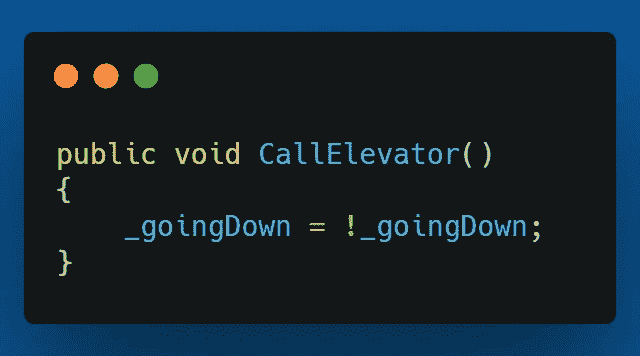
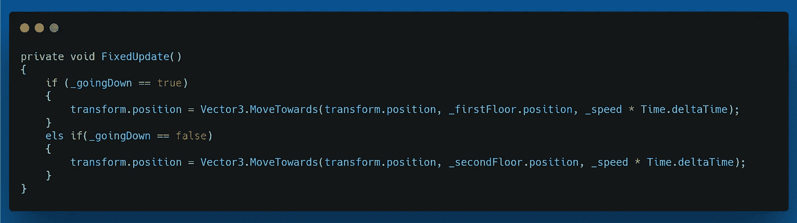
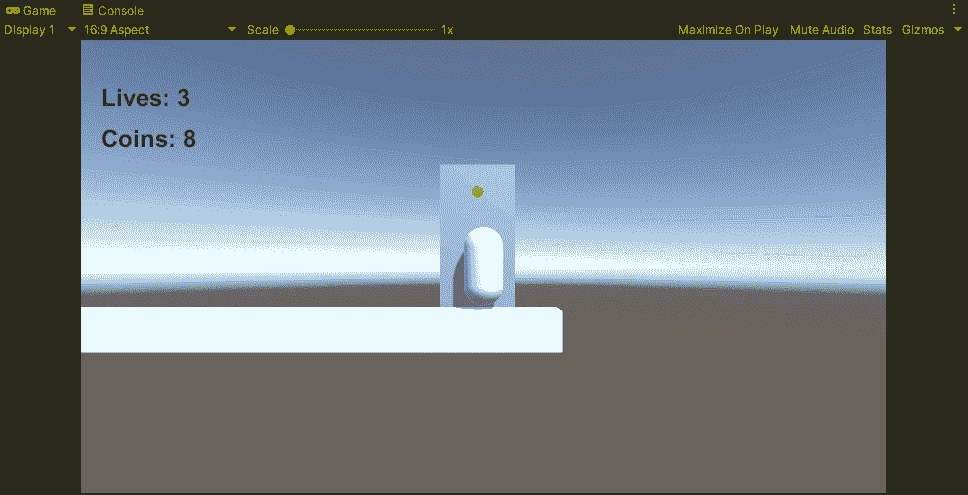

# 2.5D 平台:设置电梯，第 4 部分

> 原文：<https://medium.com/geekculture/2-5d-platformer-setting-up-the-elevator-part-4-8bb79d5871df?source=collection_archive---------21----------------------->

在设置电梯的最后一部分，我将让它在玩家登上电梯后第二次按下“E”键时返回。

我要做的第一件事是将 CallElevator()方法更改为 toggle，而不是将 _goingDown 值赋为 true。我可以通过设置它为 _goingDown =！_ 往下走。这将在调用该方法时在 true 和 false 之间切换。

接下来，在 FixedUpdate()方法中，如果 _goingDown 为 false，我需要设置电梯返回到二楼。我通过添加一个 else if 语句来实现这一点。

现在电梯将下降，并与玩家一起返回。

这就完成了设置电梯的第四个也是最后一个部分。接下来，我将设置跳墙，所以请务必查看下一篇文章。

直到下一次，我希望你在你的编码之旅中一切顺利。