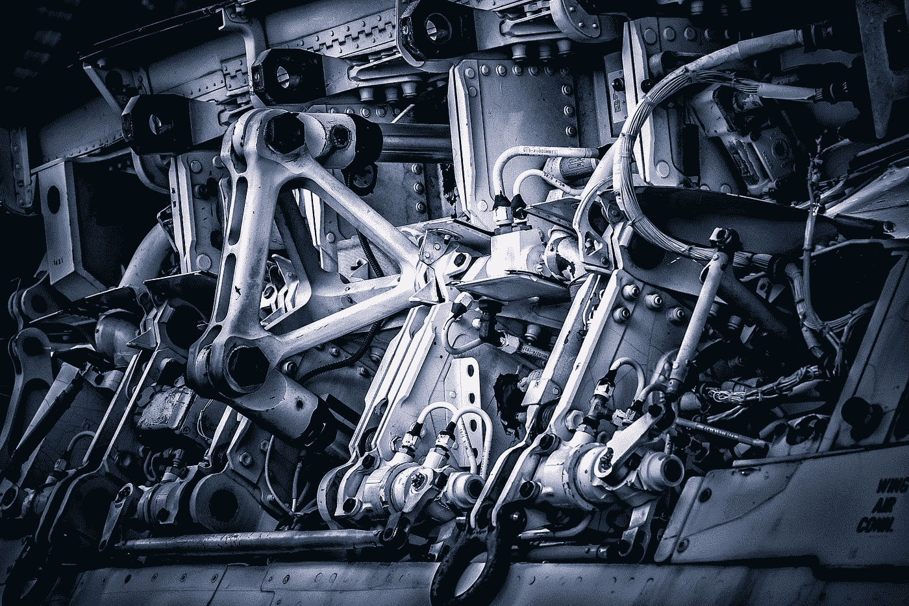

# 二冲程燃气发动机&开源的开始

> 原文：<https://medium.com/geekculture/2-cycle-gas-engine-the-start-of-open-source-cc4aa14a0e9a?source=collection_archive---------11----------------------->

许多人似乎没有意识到的一件事是，开源的想法并不仅仅始于计算机和软件程序。总之，开源技术的历史实际上始于汽车开发的早期。对于那些不了解内情的人来说，开源是基于这样一个理念，即某些程序的源代码可以免费提供给…