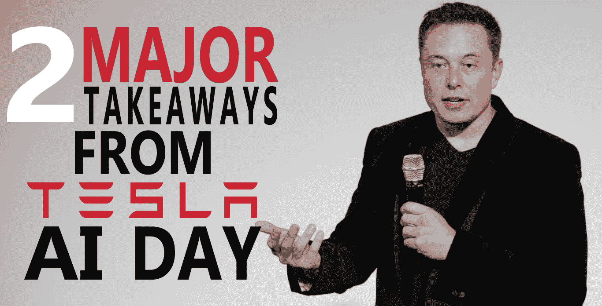
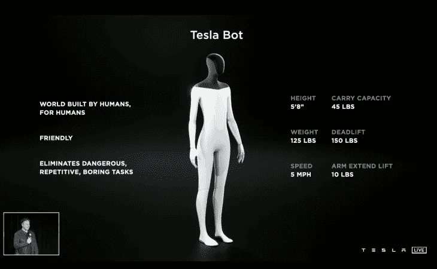
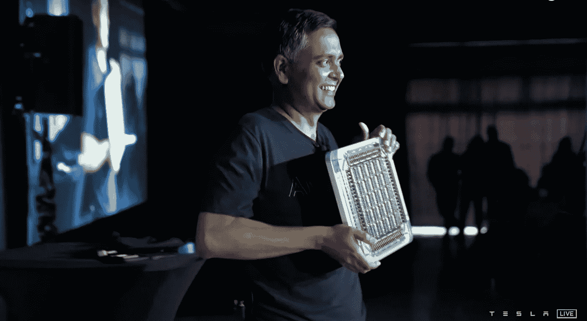
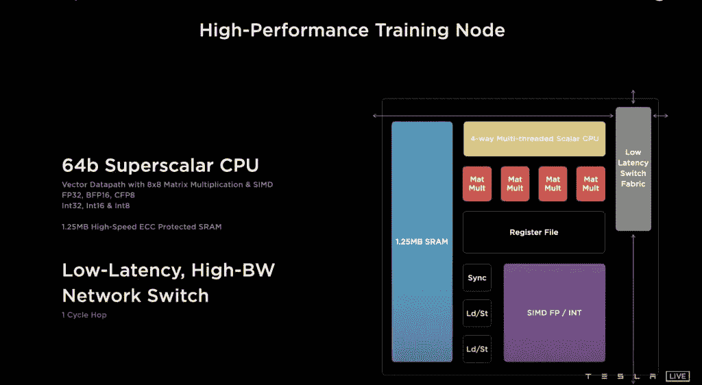
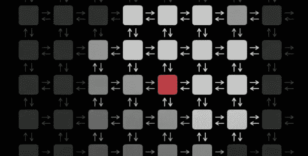
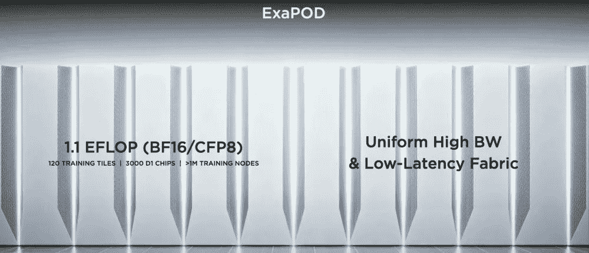

# 特斯拉人工智能日的两大收获

> 原文：<https://medium.com/geekculture/2-major-takeaways-from-963282f61962?source=collection_archive---------16----------------------->

8 月 19 日，特斯拉举办了“*人工智能日*”活动，首席执行官埃隆·马斯克(Elon Musk)在活动中介绍了特斯拉人工智能团队的一些重要进展，并展示了一些令人惊叹的项目。该活动在特斯拉的官方 YouTube 频道上进行直播。

如果你错过了广播，不要担心，这篇文章将涵盖整个流中最重要的 2 个亮点。

## **-特斯拉人形机器人**

Source: Tesla

是的，你没看错，在一次意外的事件中，埃隆公布了特斯拉的最新项目，特斯拉机器人。一个人形机器人，旨在执行所有人类能做的任务。当被问及对机器人的需求时，埃隆回答了他对未来的展望。

> “枯燥的体力工作将成为一种选择的未来”

特斯拉机器人旨在执行你的*无聊的*家务，如伊隆解释的“在你的特斯拉汽车上修理一个螺丝”。

像这样的声明肯定会遭到批评和关注，尤其是那些看过《终结者》的人😏。令人惊讶的是，特斯拉已经为此做好了准备。

Source: Tesla

正如上面的规格表所示，特斯拉机器人的移动速度非常慢，体力和人类差不多。我引用其中的原因，

> “所以你可以逃离它，很有可能压倒它”

特斯拉机器人仍在开发中，我们可能要到明年才能看到真正的演示。

## -DPU 道场项目

Tesla showcasing there D1 based DPU tiles

随着人工智能变得越来越重要，研究人员和制造商正在努力制造专门用于机器学习操作的处理芯片。谷歌的 TPU 就是一个很好的例子。

 [## 手机上的 TPU——谷歌的 Pixel 6。

### TPU 对机器学习的影响，以及它们将如何影响从谷歌的 Pixel 6 开始的手机行业。

medium.com](/codex/tpu-on-a-phone-the-pixel-6-by-google-803eac656b5b) 

现在我们看到特斯拉也加入了这一行列。

特斯拉公布了它自己设计的计算飞机，它的规格是疯狂的！！

他们首先解决了在其他处理单元上普遍存在的最常见问题，即内存带宽瓶颈和多个芯片之间的互连性。特斯拉声称，他们的高端设计克服了这两个问题，最终结果是一个人工智能训练兽。

从他们最小的计算元素开始，他们称之为“*训练节点”*，这是他们专门为机器学习操作构建的。

The architecture of the Tesla training node

上图显示了训练节点中的矩阵计算元素以及 1.25 MB 的 SRAM。总而言之，这种单个节点总共具有 1 TFLOPS(每秒浮点运算)的能力！！。

可以停在这里吗？不对。我们说的是特斯拉。他们简单地将 354 个这样的节点打包成一个网格格式的计算阵列，形成了总共 362 TFLOPS 的功率。

A mesh of Tesla training nodes

网格中的每个节点都使用低延迟结构与其他节点进行高带宽无缝连接。这些合在一起就是他们所谓的 D1 芯片。

它采用 7 纳米工艺制造，TDP 为 400 W。

特斯拉自己将这种芯片描述为:

> “GPU 级别的计算能力和 CPU 的灵活性&两倍于网络芯片的 I/O 带宽”

这是很大的计算能力，但显然对特斯拉来说还不够。下一步是以无缝的方式将 25 个 D1 芯片包装在一起，以创建他们的训练瓷砖。现在，我们在一个包中捆绑了 9 PFLOPS 的计算能力。

从训练瓷砖，他们形成了训练矩阵，然后训练柜，然后使用十个这样的柜，他们形成了他们所谓的**“ex apod”。**

**运算能力达到百万亿次的超级计算机**。

Source: Tesla

事件中提到的一切都是由特斯拉自己从头开始构建的，专门用于帮助人工智能训练的任务。

特斯拉还展示了他们的汽车如何使用多摄像头系统和神经网络模型来实现自动驾驶功能。总的来说，这次活动展示了人工智能领域正在进行的研究和发展，以及这些发展将如何塑造我们的未来。