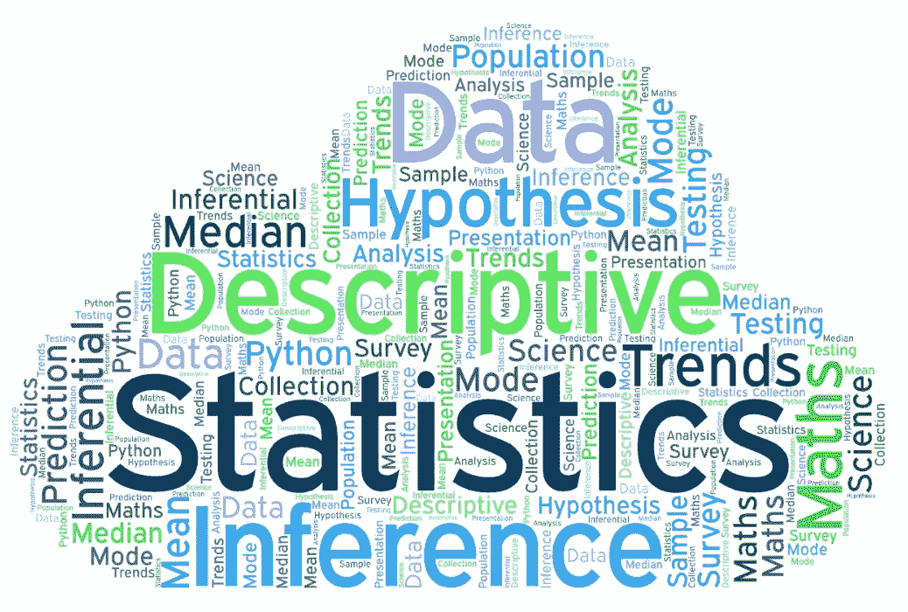

# 2 数据科学中流行的统计概念

> 原文：<https://medium.com/geekculture/2-most-popular-statistics-concepts-in-data-science-b2b166b779da?source=collection_archive---------17----------------------->

## 数据科学

## 描述性统计、人口、样本等等

Image Created by Author

哪里有**数据**，哪里就有**统计！**

在数据分析中，统计有助于发现隐藏在数据中的趋势和模式。它将数据转化为洞察力。🏆