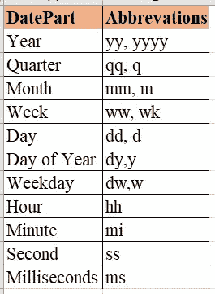
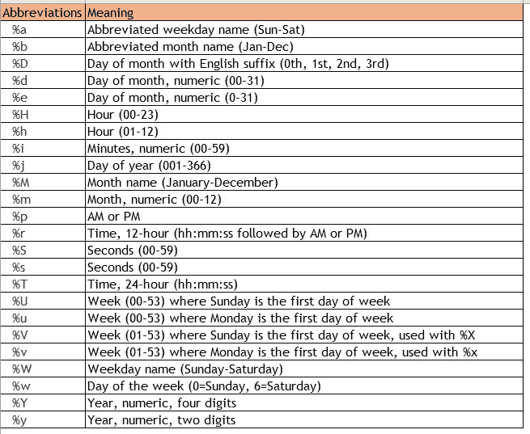

# 2.SQL 中的字符串和日期函数

> 原文：<https://medium.com/geekculture/2-string-date-functions-in-sql-4085ea9c6ffe?source=collection_archive---------13----------------------->

## SQL 中的文本数据、VARCHAR、日期、日期时间

## 了解 SQL 中内置字符串和日期函数的功能

Photo by [Carlos Muza](https://unsplash.com/@kmuza?utm_source=unsplash&utm_medium=referral&utm_content=creditCopyText) on [Unsplash](https://unsplash.com/s/photos/data-analytics?utm_source=unsplash&utm_medium=referral&utm_content=creditCopyText)

在日常工作中以这样或那样的方式处理数据的人知道将各种利益相关者收到的无格式、笨拙的数据转换成有用的见解& KPIs 的痛苦。收到的数据需要一些清理，改变数据类型和格式等。根据要求。当这些数据类型是字符/文本/日期格式时，这些内置函数(字符串函数和日期函数)就很方便了。因此，继第一篇关于 SQL 中的[比较和聚合函数的文章之后，在本文中，我们将研究最常用的字符串&日期函数，它使我们的生活(显然对所有数据分析师来说)变得更加容易。](/@sdeeksha07/1-comparison-aggregation-functions-in-sql-934d6ec76bff)

**字符串函数:**它通过接受一些输入并将其转换成字符串数据类型来简化字符串数据的操作。用于有效操作数据的各种内置字符串函数有:

1.  **STR(***string***):**返回一个字符串形式的数字。
2.  **LENGTH(***string***)/LEN(***string***):**用于查找字符串的长度。
3.  **CONCAT(**string 1，string2，…，string_n **):** 用于将两个或多个字符串连接在一起。也用于连接。
4.  **CONCAT_WS(** *分隔符，string1，string2，…，string_n* **):** 用分隔符将两个或多个字符串连接在一起。
5.  **LOWER(**string**):**用于将整个字符串转换成小写。
6.  **上(**串 **):** 用于制作整个上盒的串。
7.  **REPLACE(** *string，old_string，new_string* **):** 用于替换字符串中出现的子字符串，并用新字符串替换。
8.  **反转(**字符串 **):** 产生顺序相反的字符串。
9.  **SUBSTRING(***string*，*起始位置*，*长度***)/SUBSTR(***string*，*起始位置*，*长度* **):** 通过指定其位置，从整个字符串中提取一部分字符串。
10.  **LEFT(** *string，* **的字符数):**用于选择&从左侧提取给定大小的子串或字符数。
11.  **RIGHT(** *string，# of chars* **):** 用于选择&从右侧提取给定大小的子串或字符数。
12.  **TRIM(**string**):**用于删除字符串中的前导&尾随空格以及其他指定的字符串字符。
13.  **RTRIM(**string**):**仅删除字符串中的尾随空格。
14.  **LTRIM(**string**):**仅删除字符串中的前导空格。
15.  **REPEAT(** string，count **)/REPLICATE():** 返回按 count 指定的次数重复的字符串。
16.  **SPACE(** N **):** 返回 N 个指定长度的空字符串。
17.  **STRCMP(** string1，string2 **):** 该函数比较两个字符串，如果两者相等则返回 0，如果 string1 > string 2 则返回 1，如果 string1 < string2 则返回-1。

以上是一些最常用的数据操作字符串函数，可能还有更多，但我主要是在分析行业遇到这些函数，并发现它很有用。

现在，我们将探索最常用的函数之一，即 SQL 中使用的日期函数。

**日期函数:**这些函数有助于有效地操作日期和时间数据。下面是广泛使用的日期函数，但在此之前，我想提一下日期、时间&日期时间函数中的术语日期部分，它们对所有函数都是通用的。各种有效的日期部分包括:

为了按照要求的格式组织日期，在所有情况下都可以使用以下缩写:

1.  **当前日期:**得出系统的当前日期。
2.  **当前时间**:系统当前时间的结果。
3.  **CURRENT _ TIMESTAMP/GETDATE()/NOW():**返回系统的当前日期和时间，格式为*' yyyy-mm-DD hh:mm:ss . mmm '*。
4.  **DATEDIFF(***datepart，date1，date2* **):** 返回两个日期之间的差值。
5.  **DATEADD(** d *atepart，number，date* **):** 将日期/时间间隔加到 date &返回日期。datepart 这里是日期中要加上间隔的部分。*数字*表示要添加的区间 ***(正数表示查找未来日期，负数表示查找过去日期)。*** *日期*是需要修改的实际日期。
6.  **DATEPART(***DATEPART，date* **):** 以整数格式返回日期的特定部分(DATEPART)。对于 ex， **DATEPART(** year *，' 2019–10–02 '***)**结果 2019，数据类型为整数。
7.  **DATENAME(***datepart，date* **):** 以字符串值的形式返回日期的特定部分(datepart)。对于 ex， **DATEPART(** month *，‘2019–10–02’*)**)**结果为字符串格式的十月。
8.  **日(** *日***)/月(** *日***)/年(** *日* **):** 分别得出年/月/日的日期。
9.  **is date(***date***):**此函数检查并验证给定的表达式。如果它返回 1，意味着它是一个有效的日期，如果 0 意味着它不是一个有效的日期。
10.  **DATEFROMPARTS(** *年*，*月*，*日* **):** 返回上述部分的日期(年、月、日)。
11.  **EXTRACT(***datepart***FROM***date***):**用于提取日期和时间的特定部分(年、月、日、小时、分钟等)。).
12.  **将日期转换为字符串:**对于将日期转换为字符串数据类型，我们可以使用**CAST(***Date***AS***string***)**或者我们可以使用函数 **TO_CHAR(** *date，format* **)。**
13.  **将字符串转换为日期:TO_DATE( *string，format* )** 将字符串转换为指定格式的日期，如果字符串有日期值，并且可以转换为日期格式。**CAST(***string****AS****date***)**也可以将 string 转换成 date。

这就是最常用的字符串和日期函数。SQL 的美妙之处在于，即使知道了这些函数，我们也需要练习才能最大限度地利用它。所以要坚持练习！！

如果你是初学者，你可以联系我，了解数据分析行业的需求以及*推荐人*。我很乐意分享&的帮助。

本文结构中使用的参考资料:

 [## SQL 函数

### 本节为您提供了许多内置的 SQL 函数，包括聚合函数、日期函数、字符串…

www.sqltutorial.org](https://www.sqltutorial.org/sql-functions/)  [## 学习 SQL 教程-Java point

### SQL 教程提供了 SQL 的基本和高级概念。我们的 SQL 教程是为初学者和…

www.javatpoint.com](https://www.javatpoint.com/sql-tutorial)  [## SQL Server CURRENT_TIMESTAMP 函数

### CURRENT_TIMESTAMP 函数以“YYYY-MM-DD hh:mm:ss.mmm”格式返回当前日期和时间。提示:还要注意…

www.w3schools.com](https://www.w3schools.com/sql/func_sqlserver_current_timestamp.asp)  [## SQL |日期函数(Set-1) - GeeksforGeeks

### 在 SQL 中，日期对于新手来说很复杂，因为在使用数据库时，表中日期的格式…

www.geeksforgeeks.org](https://www.geeksforgeeks.org/sql-date-functions-set-1/?ref=lbp)