# 如何以编程方式自动布局

> 原文：<https://medium.com/geekculture/2-ways-how-to-auto-layout-programmatically-swift-2caf28935cb6?source=collection_archive---------2----------------------->

## 慢慢杀死 UIKit

Photo by [Kelly Sikkema](https://unsplash.com/@kellysikkema?utm_source=medium&utm_medium=referral) on [Unsplash](https://unsplash.com?utm_source=medium&utm_medium=referral)

# 介绍

SwiftUI 正在慢慢接管 iOS，但和 Objective-C 一样，不要期望这会很快发生。Swift 于 2014 年推出，目前仍有大量 Objective-C 代码。Objective-c 几乎从未用于新代码，仍然阅读它并能够修改它是一项非常重要的技能。在我看来，对 swift 来说更是如此。知道`UIKit`和 UI 创建选项真的很重要。有一种首选的方式来创建 UI 是很好的，在这种情况下你可以成为专家。但了解其他选择也很重要。

新开发者开始学习 iOS 的时候，UI 大多是由`storyboard`、`IBOutlets`和`IBActions`来完成的。由 **segue 过渡。** **自动布局**刚开始很容易。学习曲线真的很快。在`storyboard`中可视化地创建 UI 是有优势的。创建快速 PoC(概念验证)很容易。

但是太阳并不总是照耀。当您需要添加新元素或替换它们时，请断开`IBOutlets`和`IBActions`开始问题。接下来是由**接口生成器**添加的**约束**开始失效。然后，如果你没有分割`storyboard`，那么在添加了一串`ViewControllers`之后，它在 xcode 中开始打开得太慢了。更不用说如果多个开发人员开始在同一个`storyboard`上工作，合并冲突可能是一个日常问题，有时几乎不可能解决。

出于这个原因，我个人喜欢用程序创建 UI 的方法。也许我们需要更多的时间来学习基础知识，但是之后，轻松创建复杂的视图就容易多了。在这篇文章中，我将介绍我最常用的首选方法。而作为替代的**视觉格式语言**方式。

# 项目准备

如果你读过我的一些文章，那么你可能听说过 [**分层建筑**](https://betterprogramming.pub/how-to-organise-your-project-1e0c98825f77) 。我将在这个例子项目中应用它的基础知识。

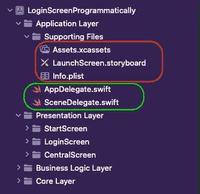

Layered Architecture

首先，我们将创建一个新的文件夹结构，并重新组织层次结构。这意味着`Info.plist`也会被移动。因为这个项目如果你试图建立它，它就会失败。不过不用担心，下一张图解释了如何修复`Info.plist`路径。基本上 xcode 无法确定`Info.plist`在哪里，所以无法读取其内容。

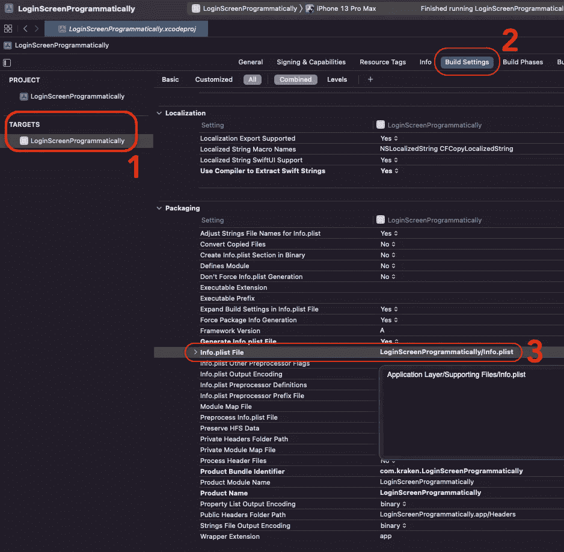

Fix the Info.plist Path

# 删除故事板

下一步是删除`storyboard`，因为我们不会使用它。

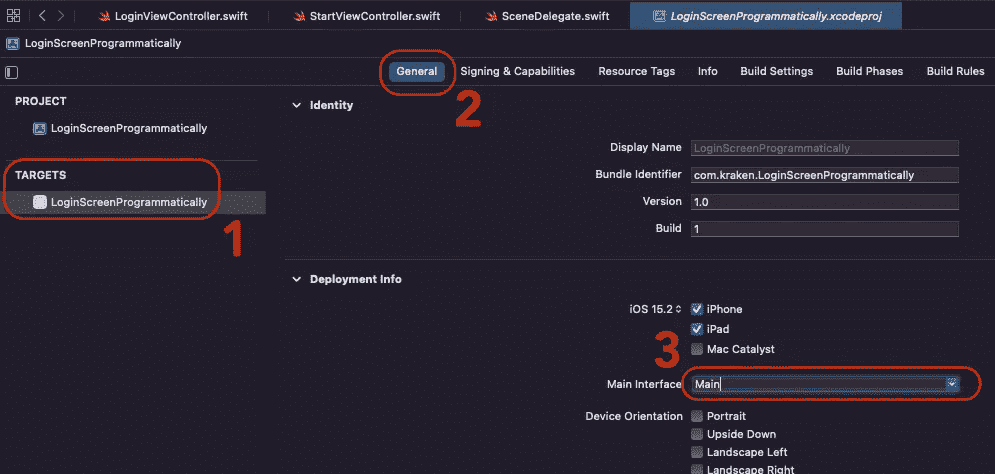

Delete the Storyboard

接下来是打开我们刚刚移动到新路径的`Info.plist`。

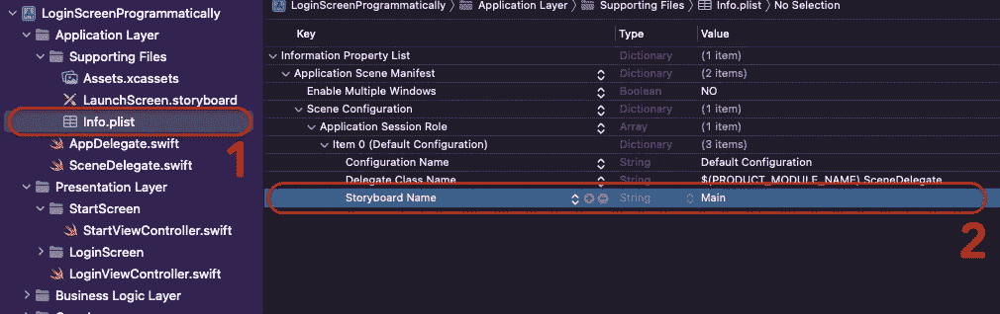

Delete Storyboard from Info.plist

下一步是从文件夹`Main.storyboard`中删除故事板。

# 以编程方式设置应用程序 SceneDelegate

无论在哪里使用`SceneDelegate`或`AppDelegate`，接下来的步骤都是相似的。如果你在这一步之前启动了应用程序，那么你可能会看到一个黑屏。这就是没有创建窗口的原因。接下来的代码显示了如何创建它以及如何设置`rootViewController`。在 **3 下。**在代码中有一个关于如何将依赖项提取到单独文件中的小技巧。

Creating Windows and UIViewController

# 以编程方式设置 UIView

**例如，我们将创建一个登录流。它有三个屏幕:**开始屏幕** ( *代表预加载、自动登录*)、**登录屏幕** ( *用户可以使用用户名和密码登录*)和**中央屏幕** ( *主屏幕*)。**

**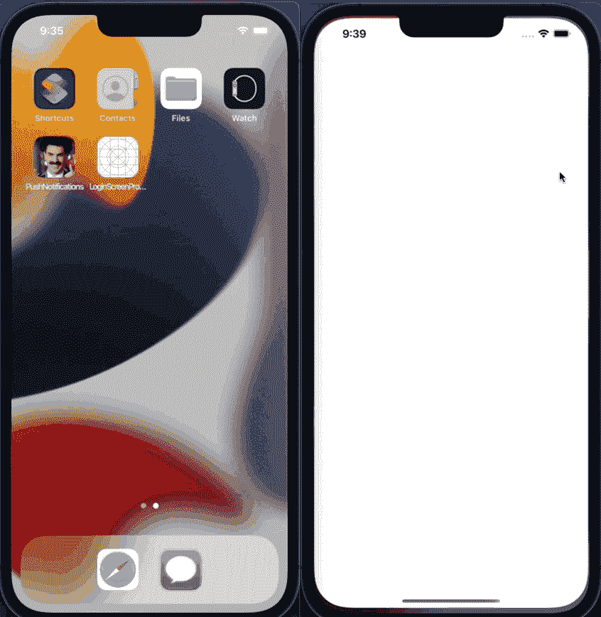**

**Example of View. With and Without coloured background.**

**我最喜欢的选择是创建分离的`lazy` `UIView`元素。这是在文件中对这些元素进行分组的一种简洁方式，但仍然具有良好的可读性。正如你所注意到的，我在景色上添加了很多颜色。这有助于我轻松地调试和理解正在发生的事情。`styleUI()`是实际应用主题，清除明亮的**调试**颜色。**

**Example of Programmatically created View.**

*   **真正重要的部分是:`translatesAutoresizingMaskIntoConstraints = false`，它告诉我们将不使用自动调整遮罩大小，并将其转换为自动布局约束。但是我们想手动设置约束。**
*   **接下来，我们需要使用方法`addSubview`将例如:`UIView`、`ActivityIndicator`添加到屏幕上。添加视图但未设置后。通常它弹出在超级视图的顶角，(x:y)-(0:0)坐标。**
*   **接下来的事情是现在设置约束。喜欢:`ativityIndicator.centerXAnchor.constraint(equalTo: centerXAnchor).isActive = true`。这一行告诉我们，在 X 坐标上，我们希望将`ActivityIndicator`水平居中到当前的`view`(当前的类)。`isActive`将启用约束。您可以设置多个约束，并根据我们的需要启用或禁用它们。**

# ****布局** **锚点****

**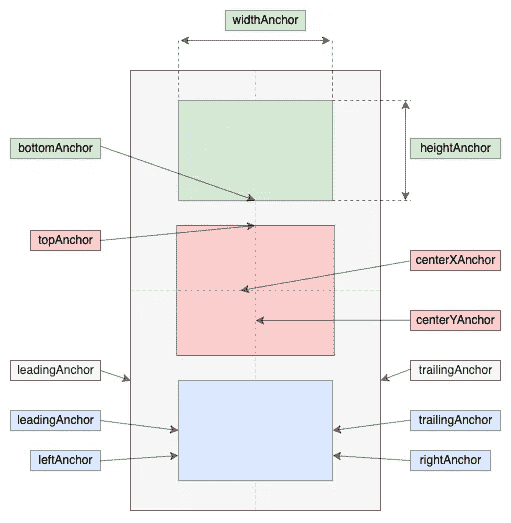**

**Different kind of Anchors**

## ****基础布置锚****

*   **`leadingAnchor` -视图框架的前沿。
    *文字从这条边开始。***
*   **`trailingAnchor` -视图框架的后缘。文本在这一边结束。**
*   **`topAnchor` -视图框架的上边缘。**
*   **`bottomAnchor` -视图框架的底部边缘。**
*   **`leftAnchor` -视图框架的左边缘。**
*   **`rightAnchor` -视图框架的右边缘。**

**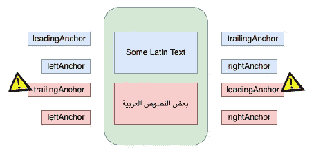**

**Some Languages turn over the Leading and Trailing**

**像阿拉伯语，希伯来语等。语言是从右向左书写的。正是因为这个原因，你有`leadingAnchor`和`trailingAnchor`。您希望用户界面保持不变，但改变一些标签文本的方向。**

## **推断的布局锚点**

*   **`centerXAnchor` -视图框架的水平中心。
    *(前导+尾随)***
*   **`centerYAnchor` -视图框架的垂直中心。
    *(上+下)***
*   **`widthAnchor` -视图框架的宽度。
    *|尾随—前导|***
*   **`heightAnchor` -视图框架的高度。
    *|底部—顶部|***

## **文本布局锚点**

**这个锚点只对像`UILabels`和`UITextViews`这样的 UI 元素有效。这都是关于文本和字体的。**

**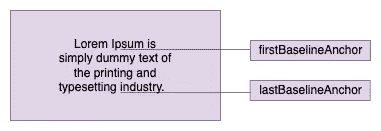**

**Baseline Anchors**

*   **`lastBaselineAnchor` -对于有多行文本的视图，此锚点代表文本底部行的基线。**
*   **`firstBaselineAnchor` -对于有多行文本的视图，此锚点代表文本顶行的基线。**

**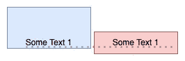**

**Align Element based on text firstBaseLineAnchor**

# **如何应用约束**

*   **`constraint(equalTo:)`**
*   **`constraint(equalTo:constant:)`**
*   **`constraint(greaterThanOrEqualTo:)`**
*   **`constraint(lessThanOrEqualTo:)`**
*   **`constraint(greaterThanOrEqualTo:constant:)`**
*   **`constraint(lessThanOrEqualTo:constant:)`**

**Example how to set `constraint`**

**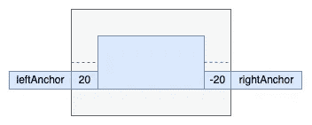**

**Example of Constants**

# **布局优先级**

**优先级由 1 到 1000 范围内的整数值表示。优先级越高，约束越重要。它帮助系统决定使用什么约束并做出适当的权衡。**

**默认情况下，约束优先级为 1000。如果有一些冲突，那么约束将失效。这不会使应用程序崩溃，但可能会有一些视觉故障。**

**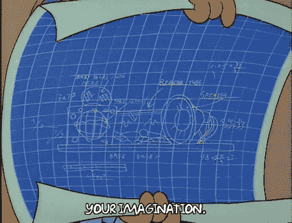**

**Failing Constraints by Giphy**

## **系统优先级:**

*   **UILayoutPriority .必选//1000**
*   **uilayoutpriority . default high .//750**
*   **uilayoutpriority . defaultlow//250**

**Example of the Priorities**

# **安全区**

**引进带槽口的装置，`safeArea`成了标准。它代表中央可用区域。**

**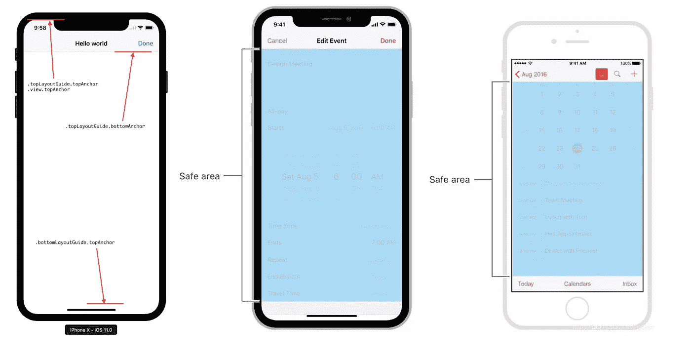**

**SafeArea vs older LayoutGuide**

# **VFL(视觉格式语言)**

**[可视化格式语言](https://developer.apple.com/library/archive/documentation/UserExperience/Conceptual/AutolayoutPG/VisualFormatLanguage.html)只是另一种设置约束的方式。我个人的经验是，对于一些中等布局复杂度的还是不错的。但是随着用户界面变得越来越复杂，理解和改变变得越来越困难。**

****VFL 数字和符号描述的布局:****

*   **超级查看**
*   ****H:** (水平)水平方向**
*   ****-** 标准间距(通常为 8 点，如果是到超级视图边缘的间距，数值可以改变)**
*   ****==** 等宽(可省略)**
*   ****-20-** 非标准间距(20 分)**
*   ****(括号)对象名称(`UILabel`、`UIButton`、`UIView`等。)****
*   ******()** (括号)物体的大小****
*   ******< =** 小于或等于****
*   ******> =** 大于或等于****
*   ******@250** 约束的优先级；可以是 0 到 1000 之间的任何值
    250 —低优先级
    750 —高优先级
    1000 —必需优先级****

******举例** :
`H:|-[icon(==date)]-20-[iconLabel(120@250)]-20@750-[date(>=50)]-|`****

****Example of VFL****

****完整代码在这个链接 [GitHub](https://github.com/skyspirit86/LoginScreenProgrammatically) 上。它有两种方式创建的屏幕。并介绍如何组织好这个项目。****

# ****总结****

****现在你至少知道了另外两种布局 UI 的方法。万一终端给你一条消息，说约束失败了，而你又不容易读懂。不用担心，有一个很好的在线[工具](https://www.wtfautolayout.com/)。****

****如果你到了这一步，感谢你的阅读。你应该得到一杯咖啡☕️.🙂如果你喜欢的内容，请👏，分享，还有[跟着](https://varga-zolt.medium.com/)，对我来说就意味着一个。如果您有一些建议或问题，请随时发表评论。****

******想要连接？**
你可以在 [LinkedIn](https://www.linkedin.com/in/varga-zolt/) 、 [Twitter](https://twitter.com/skyspirit86) 或[https://skyspiritlabs.com/](https://skyspiritlabs.com/)与我联系。还有更多文章和教程。****