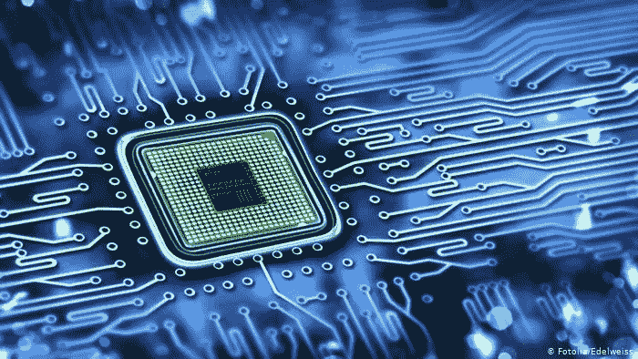

# 提高计算机系统性能的两种方法

> 原文：<https://medium.com/geekculture/2-ways-to-increase-computer-system-performance-841c9afff804?source=collection_archive---------15----------------------->

source: [https://medium.com/swlh/computer-architecture-essentials-part-i-performance-evaluation-2dbdfd6ee020](/swlh/computer-architecture-essentials-part-i-performance-evaluation-2dbdfd6ee020)

## 概观

这篇文章讨论了两种提高计算机性能的方法，特别是通过 FSB 和微体系结构。有许多方法可以提高性能，决定专注于这些是武断的，是基于好奇心。无论如何，这篇文章将概述计算机性能，以及如何利用微体系结构和前端总线来提高性能。

## 介绍

提高计算机系统性能对于拓展创新领域至关重要。在系统层面，影响性能的因素有 CPU、RAM 和系统的整体架构(“影响 CPU 性能的因素”)。这些因素中的每一个都有各自影响性能的因素。例如，CPU 性能因素包括指令集、时钟速度、带宽、前端总线速度和板载缓存；同样，这些因素中的每一个都有自己的影响性能的因素。这就是抽象的美。有许多方法可以用来提高系统级的性能；每条路线都有自己的取舍。在寻求提高性能时，我们必须确定瓶颈在哪里。影响系统性能的两个因素是微体系结构和前端总线速度。

## 微结构

在我们了解什么是微体系结构之前，我们必须了解指令集体系结构。简而言之，指令集架构是你的计算机系统的抽象。它提供了允许不同实现的 CPU 的基本工具。微体系结构位于 ISA 之下的一个抽象层，以及计算机寄存器和计数器之上的一个抽象层(Lundman)。微体系结构是系统电路组织的高级结构，负责:功能单元的数量、存储器层次结构、输入和输出接口、流水线中功能单元的顺序、单元用于计算的时钟周期数，以及分支预测和数据转发逻辑(Chinnery 和 Keutzer)。根据 Chinnery 和 Keutzer 的观点，微体系结构的改变是提高计算机性能的最重要的方法。例如，流水线电路允许更高的时钟频率。由于每个流水线的组合延迟降低，时钟频率被提高。此外，流水线允许我们实现并行性，这增加了每秒的计算量和完成的计算量(Chinnery 和 Keutzer)。

## 前端总线

提高性能的另一种方法是提高数据传输到系统其余部分的最大速率。通过提高前端总线(FSB)速度，可以实现更快的数据传输速率。FSB 是处理器和系统内存之间的接口。FSB 可能会限制数据到达 CPU 的速率，这不可避免地会限制 CPU 处理该数据的速率。本质上，CPU 从 FSB 获得其时钟速度。这可以用公式 *CPU 时钟= FSB *时钟乘数(Shimpi)* 来描述。增加 FSB 是一种被称为 CPU 超频的方法。另一个好处是这种方法很容易配置，因为大多数系统都提供用户功能来调整 FSB 速度。然而，这样做的一个缺点是，超频会提高系统主板上所有组件的 FSB 速度，如果走得太远，会导致性能问题(Shimpi)。因此，超频时，必须了解系统组件的能力。

## 引用的作品

阿南德·拉尔·辛皮。" *AMD 速龙超频指南*"【https://www.anandtech.com/show/457/3.】2000 年 1 月 25 日【安特技术】RSS

钦纳里，大卫&库特泽，库尔特。“*缩小 ASIC 之间的差距&定制:高性能 ASIC 设计的工具和技术*”，波士顿，马萨诸塞州，Kluwer 学术出版社，2002 年

苏珊.伦德曼。《指令集架构与扩展性快速入门》*嵌入式*，[www . embedded . com/A-Quick-Introduction-to-Instruction-Set-Architecture-and-Extensibility/。](http://www.embedded.com/a-quick-introduction-to-instruction-set-architecture-and-extensibility/.)2022 年 1 月 30 日访问。

【影响 CPU 性能的因素】 *kitchentablecomputers* ，[https://www . kitchentablecomputers . com/processor 2 . PHP #:~:text = The % 20 CPU % 27s % 20 FSB % 20 speed % 20 确定，芯片组% 2C % 20 和%20RAM%20speed](https://www.kitchentablecomputers.com/processor2.php#:~:text=The%20CPU%27s%20FSB%20speed%20determines,chipset%2C%20and%20the%20RAM%20speed) 。