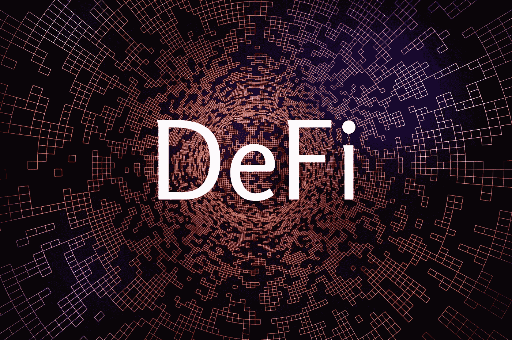
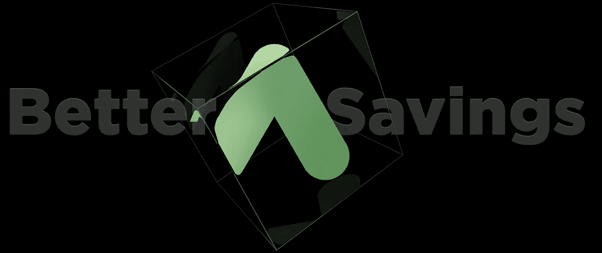
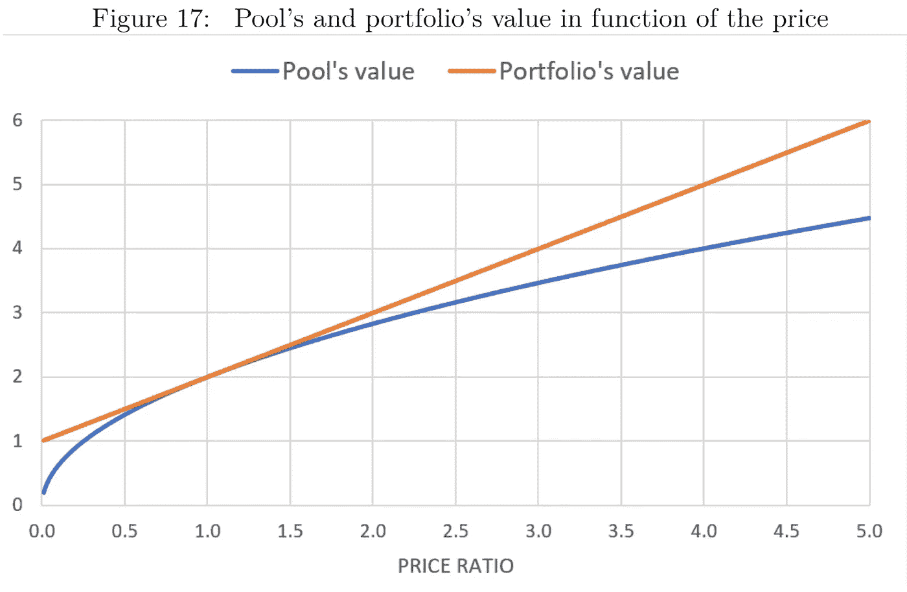
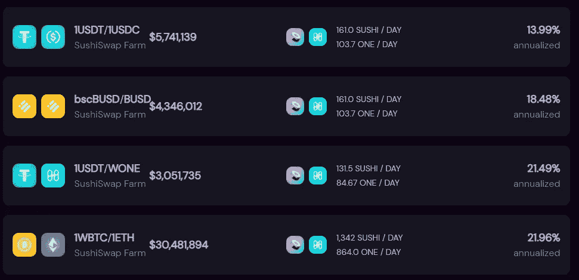
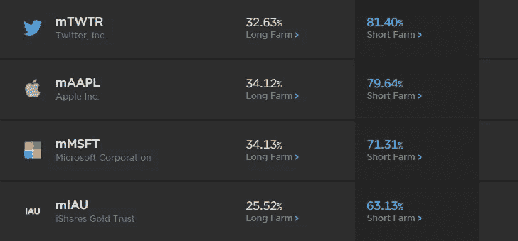

# 如何赚取 20%的 APY 在 4 种不同的方式与 DeFi

> 原文：<https://medium.com/geekculture/20-is-the-new-2-how-to-earn-20-apy-in-4-different-ways-with-defi-1d85b4184dc8?source=collection_archive---------1----------------------->

在过去的一年里， [DeFi](https://en.bitpush.news/articles/tag/defi) 已经接管了加密货币领域，并提供了比传统储蓄账户高出 50-100 倍的可持续高收益。DeFi 基准利率已经固定在 20%左右，所以让我们来看看实现这一收益率的几种方法。

采用 DeFi 的最大原因是其高利率，几乎总是高于传统银行储蓄和支票账户的利率。像 Aave 和 Compound 这样的 DeFi 项目促进了区块链的货币市场，提供了各种不同资产的收益率，并真正帮助投资者在睡觉时让他们的钱为他们工作。

最近，由于多种原因，DeFi 基本利率，或人们可以预期在 DeFi 中获得稳定收入的基线，处于 20%左右。这一数字在未来可能会有所变化，并可能会下降，但目前来看，这意味着投资股市的收益是预期的两倍以上，并导致初始投资在大约三年内翻一番。对于目前在 DeFi 的任何人来说，收益是令人难以置信的利润，但也伴随着许多不同的风险和不确定性。让我们来看看 DeFi 中获得 20%以上稳定收益率的五种最佳方法，它们是如何工作的，以及我们可以期待它持续多长时间。

第一个也是最广为人知的选择是[主播](https://en.bitpush.news/articles/tag/anchor)协议，基于[泰拉](https://en.bitpush.news/articles/tag/terra)区块链的高收益储蓄平台。Anchor 允许用户存入 UST(Terra 生态系统的算法稳定点),并获得约 20%的 APY。Anchor 的工作方式类似于其他 DeFi 货币市场，如 Aave 和 Compound，但有一个独特的附加功能:当用户想从协议中借钱时，他们会提供一个抵押资产作为抵押品。这些抵押资产，如 bETH 或 bLUNA，在作为抵押品时被押上并持续赚取利息，任何押上的回报都用于回报贷款人。由于 LUNA 的利率约为 5%,抵押率为 200%,这一赌注占贷款人获得的利率的一半。

另一方面，借款人目前有贷款的动机，因为 Anchor 向任何借钱的人发放他们的 ANC 令牌。ANC 的分发率目前比借款率高 12%，这意味着他们实际上是在付钱给人们从平台借钱。从长期来看，这显然是不可持续的，一旦激励机制枯竭，高利率是否会持续还有待观察。尽管如此，它目前提供了稳定的高收益，似乎不会很快消失。

另一个获得收益的诱人选择来自分散交易所的收益农业流动性池，如 Sushi 和 Dfyn。每个 DEX 都需要一样东西才能成功:流动性。没有流动性，任何人都无法在不显著影响资产价格的情况下进行交易，因此他们支付的价格不能反映资产的真实市场价值。DEXes 对一些令牌对提供流动性激励，因此这种滑点更不常见。通常情况下，这些流动性激励是以 DEX 的固有符号支付的，比如用蛋糕交换 PancakeSwap 或者用[寿司](https://en.bitpush.news/articles/tag/sushi)交换 SushiSwap。

提供流动性的主要风险之一是非永久性损失的风险，即一种资产的价格涨幅超过另一种资产。由于在大多数情况下，提供流动性要求资产与美元价值保持 1:1 的比例，一项资产的价格上涨意味着你不提供流动性，而是简单地持有该资产会更好。但是，如果价格回落，损失就消失了，这就是为什么它是无常的。此外，如果流动性激励足够高，非永久性损失可能无关紧要。

在相对安全的池上提供高 apy 的两个指数是多边形区块链的 Dfyn 和和谐区块链的 Sushi。Dfyn 为他们的 UST-USDT 对提供 38%的 APY，为他们的 USDC-USDT 对提供 28%的，所有费用都以 DFYN 支付。寿司在 bscBUSD-BUSD 提供 20%的折扣，在 BTC-ETH pairs 提供 22%的折扣，在 ONE 和 Sushi 中支付。在这两者中，尽管 Dfyn 的利率更高，但与寿司和 ONE 相比，他们的硬币更不稳定，更不稳定，所以寿司可能是更安全的选择。

如果为加密货币提供流动性感觉风险太大，可以选择在[镜像](https://en.bitpush.news/articles/tag/mirror)协议上为令牌化股票对提供流动性。Mirror 也是基于 Terra 区块链，允许用户铸造、交易和卖空像苹果、亚马逊和特斯拉这样的股票。他们还为交易对手提供流动性，提供收益农业激励。为 AAPL-UST 这样的投资组合提供流动性，投资者可以获得 34%的收益，对于波动性更大的股票，收益甚至会更高。

对于普通投资者来说，每年 20%的收益几乎不可能持续实现。然而，由于 DeFi 的力量，这现在是可能的，至少在短期内是可能的。随着越来越多的用户进入 DeFi，回报可能会下降，因为它们会在更多的人中传播。因此，今天的 DeFi 用户应该利用这些税率，只要他们能够并且有希望变得足够富裕，当它们降低时就不会有问题。

林肯·穆尔