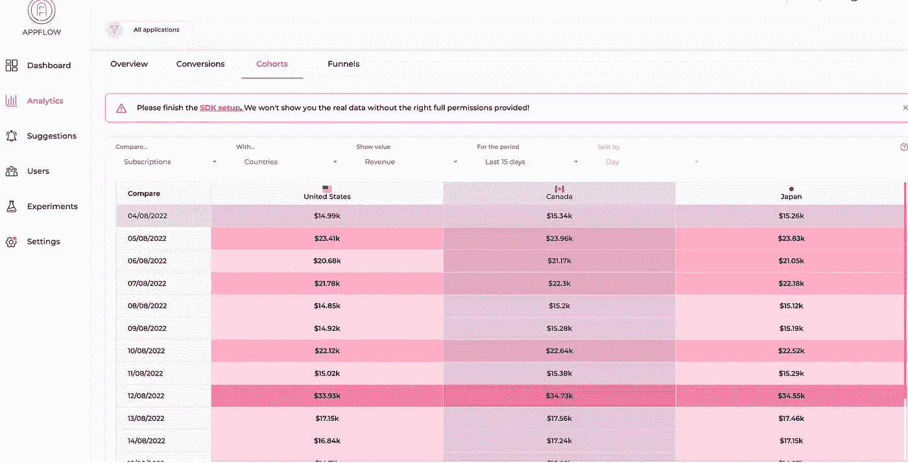
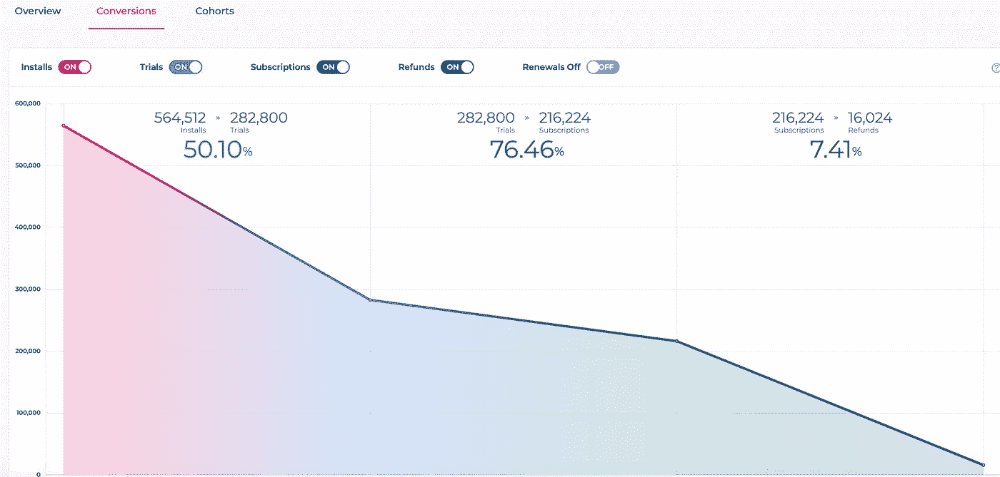
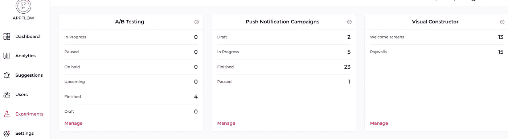

# 你应该知道的 20 多个移动应用指标

> 原文：<https://medium.com/geekculture/20-mobile-app-metrics-you-should-know-5dab5f100cd7?source=collection_archive---------11----------------------->

> 彼得·德鲁克:如果你不能衡量它，你就不能改进它。

在评估应用性能、分析用户画像、利用用户参与度，尤其是增加销售收入时，指标最为重要。然而，应该跟踪和监控哪些应用指标是每个应用业务人员都很头疼的问题。

因此，本文针对 [**应用分析**](https://www.appflow.ai/analytics) 的不同视角，编制了一份全面的移动应用指标清单，这无疑有助于你理解和建立自己的指标体系。从移动应用指标的定义开始，本文将详细阐述:

## *用户获取的应用指标*

*   *下载*
*   *用户总数*
*   *新用户*
*   *每日卸载*

## *用户参与度的应用指标*

*   *激活*
*   *花费的时间*
*   *会议间隔*
*   *平均会话长度*
*   *DAU & WAU &毛*
*   *每用户总活跃天数(TAD)*
*   *应用发布保持群组*
*   *保持力*
*   *搅动*

## *应用收入指标*

*   *转换率*
*   *收入*
*   *每用户平均收入(ARPU)*
*   *每位付费用户的平均收入(ARPPU)*
*   *每次收购成本(CPA)*
*   *投资回报*
*   *生命值(LTV)*

## *应用性能的应用指标*

*   *App 加载时间*
*   *用户满意度*
*   *用户评分*
*   *净推介值(NPS)*

[Mobile APP Metrics](https://www.appflow.ai/blog/mobile-app-metrics-comprehensive-guide) by Appflow.ai

# 什么是移动应用衡量标准？

A pp 指标是与 app 数据相关的参数，简单来说，指标是对 app 分析至关重要的特定类别 app 数据的名称。比如下载 app 的用户数，叫做“用户下载量”的数据，实际上和“用户获取量”的数据有关。即“用户下载量”是一个与用户获取相关的 app 指标。因此，通过了解所有这些应用数据和指标的全貌，应用开发人员&营销人员知道如何评估他们应用的性能，并建立自己的指标体系。

# 用户获取的应用指标

## 1.下载

下载量是一个基本的应用程序指标，用于统计下载应用程序的用户总数。该参数给出了应用程序在市场中价值的大致概念。

## 2.用户总数

“总用户数”是指至少启动过一次应用的用户数。这是一个有用的指标，可以显示有多少用户对该应用程序感兴趣，以及该应用程序的潜力有多大。通常，GA 可以向营销人员显示用户的总体数量。应用程序所有者可以自行或从第三方数据分析平台(如 appflow.ai)构建数据库，该平台可以在一个仪表板中列出所有用户，如下所示:

## 3.新用户

新用户是一项应用指标，用于计算在所选时间段内首次启动应用的用户总数。当营销人员保证他们的营销渠道是否正常运作时，观察这个应用程序指标是必要的。比如，他们可以研究自己的新用户来自哪个渠道或媒体，不同渠道的用户留存率是多少。有了这种洞察力，他们就可以做出相应的调整。

## 4.每日卸载

每日卸载指的是一天的卸载量。用户有权安装和卸载手机上的任何应用，这是事实。但是调查那些卸载的人，总能把原因搞清楚。如果他们卸载的最可能的原因是应用程序没有为他们提供价值，那么营销人员可以做的是在第一天告诉他们的用户价值。这就是为什么每天跟踪卸载数量很重要:它有助于了解入职流程是否合理，并随着时间的推移获得有价值的数据和更多的用户。

# 用户参与度的应用关键指标

## 1.激活

“激活”代表有多少用户在下载后实际启动应用程序。这一指标对营销人员促进应用增长意义重大，因为用户只有在推出应用后才能意识到应用的价值。现实情况是，app store 中有如此多的应用程序可以方便地下载，用户很有可能在没有启动应用程序的情况下就将其卸载。因此，做一些事情来优化这一指标可能是扩大用户规模的关键因素。

## 2.花费的时间

花费时间是一个很好的应用程序指标，可以衡量用户在特定屏幕上花费的时间。从这一方面，营销人员可以了解用户在哪个屏幕上花费的时间最多，并决定是否是预期的。如果不是，他们可以及时采取行动。

## 3.会话间隔

会话间隔是用户从第一个屏幕到下一个屏幕的持续时间。这一应用指标可以判断应用程序上线过程是否有效，并研究下载和购买之间的用户漏斗，以便营销人员可以优化应用程序上线过程并增加销售额。

## 4.平均会话长度

平均会话长度是指平均水平上每个应用程序用户在应用程序上花费的时间。清楚地了解普通用户在应用上花费的时间有助于更好地理解应用的功能。营销人员可以改善这一应用指标，以提高用户在应用中的粘性，促进应用增长。

## 5.每日活跃用户(DAU) &每周活跃用户(WAU)&每月活跃用户(MAU)

DAU、WAU 和 MAU 分别指在一天、一周和一个月内启动该应用的独立用户数量。衡量这三个应用指标有助于了解一个应用对下载它的人有多大帮助，从而采取相应的行动。例如，当作为应用增长的重要应用指标的 DAU 低于预期时，营销人员应该采取响应措施，例如发送推送通知来改善这一指标。

# 6.每个用户的总活动天数(TAD)

每个用户的总活跃天数是指每个用户在统计期间平均花费在应用上的时间。该应用指标显示了应用对用户的价值，并反映了用户的质量和粘性。

## 7.应用发布保留群组

App launch retention grounds 是一个短语，指的是对安装了一个 app，与之互动，然后不断回来的用户的分析。这个应用程序指标意味着分析用户在应用程序中的行为，并将他们分成不同的群组。通过这种方式，营销人员开始了解他们的用户并实施相应的策略。通常，营销人员可以通过使用 appflow.ai 这样的 app 数据分析工具，将用户分为这三个方面:日常获取、行为类型、返回用户，这可以帮助营销人员轻松细分用户，并进行队列对比和调查。

[APP Cohort Analysis](https://www.appflow.ai/cohort)

## 8.保留

对于几乎所有应用来说，留存是最重要的应用指标。此指标衡量在特定时间段后有多少人返回您的应用。一般来说，营销人员更关注一天、七天、三十天后仍在使用该应用的用户数量。根据这些数据，他们可以对用户流失的原因做出假设，并做出改变以提高保留率。

## 9.搅拌

客户流失是一项应用指标，用于计算停止使用该应用的用户数量。分析流失的用户可以帮助营销人员赢回他们。对这些用户进行群组分析，找出他们的相似之处，这可能是帮助营销人员带回他们并减少未来流失的关键要素或突破。

# 收入的应用指标

## 1.转化率

转换率是指用户旅程里程碑之间的转换次数，如安装试用率、试用订阅率…您不需要一次监督所有 CRs，而是选择一个重要的、适合您当前阶段的 CRs。

Appflow.ai — Conversions

## 2.收入

收入是指在特定时间段内，你通过应用内购买、订阅或购物车获得的总收入。这是一个与应用程序增长和开发密切相关的应用程序指标。毫无疑问，每个 app 员工所做的一切都是为了提高这个 app 指标。因此，使用像 appflow.ai 这样的数据分析平台，为您准确计算总收入和净收入，是值得每天关注的。

## 3.每用户平均收入(ARPU)

每个用户的平均收入表明每个用户在一个应用上花了多少钱。这里提醒一下，这里的用户既指未付费用户，也指付费用户。它是用总收入除以所有用户数来衡量的。如果 ARPU 相当低，这意味着大多数应用程序用户没有花钱。

## 4.每位付费用户的平均收入(ARPPU)

每个付费用户的平均收入显示了每个付费用户在一个应用上花了多少钱。与 ARPU 不同，它的计算方法是总收入除以付费用户数量。这个应用指标可以帮助营销人员更准确地了解每个付费用户的价值。

## 5.每次收购成本

每次购买成本是一个应用指标，显示了为一个应用用户带来的成本。大多数公司通过将总营销获取成本除以获取的用户总数来计算这一指标。然而，这种计算方法得出的 CPA 比实际情况要低一些，因为运营和产品开发成本没有包括在内。

## 6.投资回报(ROI)

在任何企业中，投资回报都是普遍且重要的。它可以是一颗北极星，指引营销者决定选择哪种营销策略。ROI 可以通过特定营销活动的净收入除以该活动的总支出来计算。

## 7.终身价值(LTV)

终身价值，从 app 的角度来说，是计算一个 app 用户终身价值的一个重要指标，也就是从一个 app 用户身上可以赚到的钱的总量。为了从每个用户身上获得更多的钱，尽量延长他们的使用寿命，并尽量降低流失率。

# 应用性能的应用指标

## 1.应用程序加载时间

应用程序加载时间是一个与用户体验相关的重要应用程序指标。根据一份[报告](https://www.vmware.com/products/workspace-one/intelligence-consumer-apps.html)，长时间的应用加载给用户留下了不好的印象，25%的用户在应用加载超过 2 秒后就选择放弃。所以在某种程度上，更长的应用加载时间意味着更差的应用性能。

## 2.用户满意度

用户满意度是一种常用的方法，用来决定应用程序是否符合用户的期望。它显示了应用程序的性能。获得这一应用指标的一个很好的方法是向用户发送一个**[**app flow . ai**](https://www.appflow.ai/remote-configuration)擅长的推送通知，并直接询问他们。**

****

**Push Notification**

## **3.用户评级**

**用户评价的星级数是 app 性能和客户满意度的重要指标。鼓励用户对应用进行评级，可以让产品经理密切关注应用的性能，并让营销人员在应用评级下降时及时进行优化。**

## **4.净推介值(NPS)**

**净推广分数衡量用户将应用推荐给朋友或同事等其他人的可能性。高 NPS 意味着高 app 性能。**

# **结论**

**App 度量是营销人在 [**app 营销**](https://www.appflow.ai/blog/guide-on-app-marketing) 的道路上的北极星。这些应用指标反映了应用的性能，并让营销人员了解用户的留存、参与、转化和创收潜力。但是请记住，对营销人员来说，追踪对他们的业务最有价值的正确指标是至关重要的。构建自主开发的数据库或使用第三方**立即开始跟踪应用指标。****

*******现在您可以加入 Appflow 测试计划来跟踪您的指标。*******

**** [## 测试计划- Appflow，应用内订阅分析工具

### 加入我们的测试计划，并获得 12 个月的高级计划免费试用

bit.ly](https://bit.ly/3vB1qH2)****