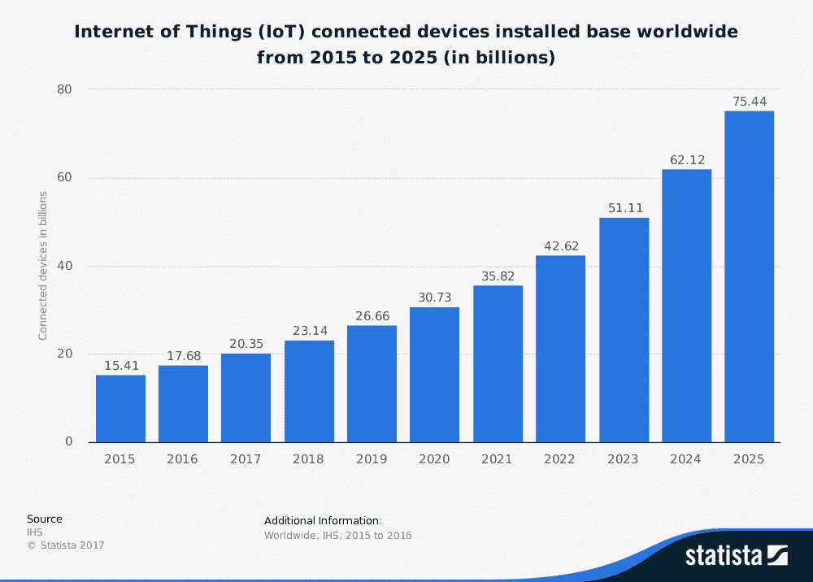
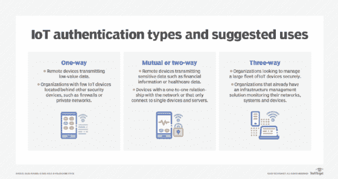
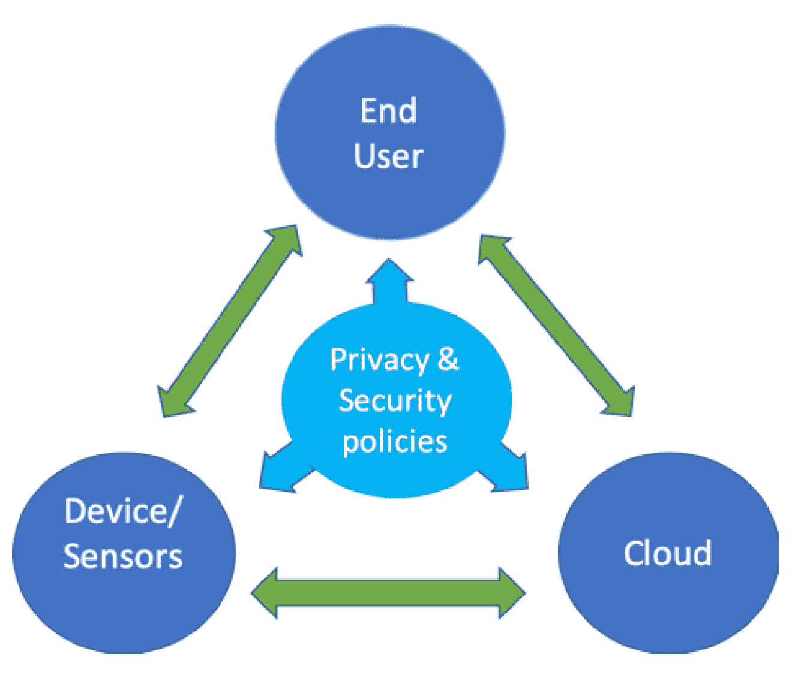
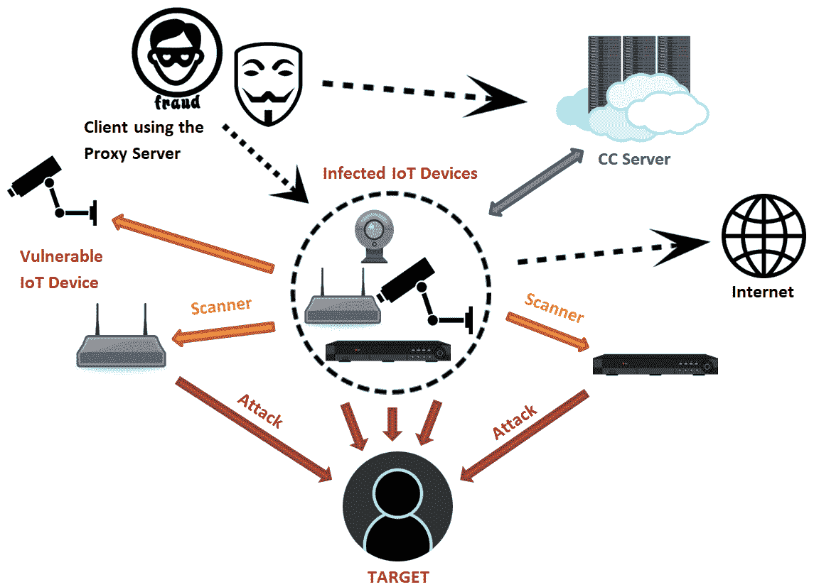

# 2021–22 年要避免的 20 大物联网安全挑战

> 原文：<https://medium.com/geekculture/20-top-iot-security-challenges-to-avoid-in-2021-22-f98744ee408e?source=collection_archive---------16----------------------->

物联网(IoT)正以前所未有的速度增长，做企业家；你一定很兴奋看到人们正在寻找创造性的方法来应用这项技术。根据有关这项技术的估计数字，到 2025 年**，物联网将达到**1.6 万亿**美元。**

与任何新的发展一样，这项技术也带来了一些问题和挑战，包括物联网安全挑战；在推出你的产品或服务之前，你应该了解并做好计划。

这里有 20 个你今天需要知道的物联网安全问题，以避免未来出现重大问题，以及一些关于如何在你意识到这些问题后成功应对它们的提示。

**1。匿名**

当从数以千计或数百万计的设备收集数据时，保持匿名可能很困难，因为可能没有足够的关于每个设备的信息来进行适当的匿名化。

**2。设备认证**

认证设备本身也很困难，因为物联网设备可能会通过多种方式遭到破坏。例如，如果你[雇佣 IOT 开发者](https://www.valuecoders.com/hire-developers/hire-iot-developers?utm_source=Ang_N12&utm_medium=web&utm_id=iotsecurity)，他们可能需要对设备硬件和软件进行认证，以确保合法用户能够访问其数据或在其上运行命令。

**3。数据可用性**

物联网应用开发带来的另一个挑战是信息过载，因为连接到互联网的一切都有能力非常快速地生成大量数据。这使得收集这些数据的组织更难以正确分析所有数据并将其放入上下文中，同时跟上实时发展，以便在必要时及时做出响应。

**4。缺乏上下文**

另一个问题是“上下文崩溃”，当物联网设备数据被收集并与其他类型的数据集(如社交媒体)放在一起，但由于缺乏正确的标签或元数据而无法正确分析时，就会发生这种情况。这可能导致信息过载，以及假阳性和假阴性。

**5。访问控制**

接入控制带来了另一系列挑战，这是由连接到互联网的设备数量的增加带来的，每种设备都有不同的漏洞，需要在允许接入之前应用特定的安全措施。例如，一些物联网设备可能只需要有限的平台访问权限，而另一些设备只需要对系统的某些部分进行只读访问，然后才能完成工作。因此，出于安全目的访问这些设备可能会很棘手。

**6。安全分析**

物联网应用程序开发的另一个挑战是在部署前和使用中/部署后进行安全分析，因为连接到互联网的设备数量增加了复杂性，这些设备具有不同的漏洞，使得组织很难对物联网设备安全进行适当的风险评估。

**7。漏洞缓解**

由于目前存在大量的物联网设备，缓解漏洞的过程变得更具挑战性，这提出了一些困难的问题，如应如何处理它们、哪种修补策略是最佳的、应如何确定它们的优先级等。当您考虑到不同的操作系统和硬件平台需要不同类型的漏洞补丁时，这也变得更加困难。

**8。物联网标准**

物联网行业缺乏标准是另一个需要在某个时候解决的安全挑战，无论是通过单独的计划还是联合国和其他国际组织等管理机构自上而下的方法。如果没有某种标准化和监管，就很难在维护用户隐私和最小化安全风险的同时跨多种技术实施安全措施。

**9。互操作性问题**

当您考虑到物联网设备上的不同操作系统无法有效(或根本无法)相互通信时，例如 iOS 和 Android 系统之间，或者当应用程序可以访问系统的一部分而不能访问其他部分时，也会出现互操作性挑战。这也可能产生安全问题，如跨站点脚本(XSS)漏洞，黑客可以通过另一条路径或命令注入漏洞对系统进行后门访问，攻击者可以通过利用现有代码将自己的命令注入软件。

**10。第三方担保**

另一个挑战是物联网对第三方组织的依赖，第三方组织可能不像人们希望的那样关注安全性，这导致组织的系统上有更多需要缓解的攻击媒介。这方面的一些示例包括不安全的云存储服务和数据处理工具，由于服务提供商侧或客户端侧的安全措施实施不力(即，设备制造商未能保护其设备或正确实施安全措施)，这些工具可能使设备容易受到攻击。

**11。数据隐私**

物联网数据隐私带来了另一系列挑战，特别是当你考虑到这些物联网设备上收集和存储了多少数据，然后可以通过基于云的系统进行管理，在这些系统中进行实际处理。这就是为什么物联网公司在开发过程中考虑隐私以及开发符合 GDPR 法规的安全协议非常重要，因为大多数组织都位于欧洲，如果他们想在英国退出欧盟之后继续在那里开展业务，就需要在 2018 年 5 月之前遵守 GDPR。

**12。认证方法**

物联网设备使用增加带来的另一个安全挑战是身份认证方法。通过物联网上数量庞大的设备来验证用户、机器和服务变得更加困难。一些组织可能会选择目前由企业通过集中式系统使用的多因素身份认证(MFA ),如需要硬件令牌或证书的 Active Directory 域服务(AD DS ),而其他组织可能会发现实施不依赖于额外设备的自主或零接触身份认证协议更具成本效益。

**13。打补丁**

由于资源有限，物联网修补可能是一项重大的安全挑战，尤其是如果一个组织有数千台设备分布在不同的地理区域。这就是为什么物联网设备制造商需要优先考虑他们的补丁，以便他们可以高效地部署，而不会浪费时间或忽略其他也需要修补的漏洞。

**14。软件更新**

物联网设备的另一个安全挑战是，一旦发现漏洞，用新固件或软件更新来更新它们需要很长时间。许多物联网公司仍在使用不支持敏捷开发的旧软件开发模型，这意味着由于测试和向市场发布新产品的过时方法，他们无法尽快响应威胁。这意味着一些制造商正在转向 DevOps 驱动的 QA 流程，在该流程中，测试在整个开发流程中持续进行，而不仅仅是在产品上线前的最后阶段。

15。软件碎片

物联网软件有许多方面，其中一个是其底层操作系统，根据其用于的设备或系统，这些操作系统有不同的风格。这意味着，即使一个组织设法修补了他们所有的软件，也不能保证其他物联网设备也会被修补，因为不是每个制造商都在不同类型的物联网产品上使用相同的操作系统。解决方案需要某种通用的安全更新框架来保护使用任何给定操作系统的每个物联网产品，以便可以在一个集中的位置更新补丁。

**16。硬件黑客**

由于增加了更多功能，如 Wi-Fi 和蓝牙连接，物联网硬件也比非连接硬件更容易受到黑客攻击，这为黑客提供了新的攻击载体，他们试图利用连接设备中的漏洞。已经有概念验证恶意软件针对网络摄像头和路由器等物联网设备发送垃圾邮件或参与拒绝服务(DoS)攻击，这导致一些制造商通过选择硬编码密码来限制其产品暴露于外部威胁。

**17。低级攻击面**

物联网设备通常具有非常低的内存容量和廉价的 CPU，但如果被利用，也会非常危险，因为它们包含许多黑客可以利用的入口。特别是由于更新在目前市场上的大量物联网产品中推广缓慢，这意味着仍有大量未打补丁的漏洞，如果在开发期间没有适当的保护，这些漏洞很容易被攻破。这就是为什么物联网设备制造商需要专注于在物理层、数据链路层和网络层保护每个产品。

**18。勒索软件攻击**

还存在勒索软件攻击的风险，今年早些时候，黑客首次发现了这种攻击，他们利用网络摄像头或电视等物联网设备的漏洞将这些设备作为人质，直到受害者以比特币数字货币支付赎金。

这种利用利用了通用即插即用(UPnP)协议，该协议用于在不需要密码或登录的情况下建立物联网设备之间的直接连接，这意味着如果你的智能电视被劫持，你将别无选择，只能在它被远程拔掉之前付费。

在开始收到越来越多来自物联网设备所有者的报告后，联邦调查局已经发布了关于这些类型的勒索软件攻击的建议。

**19。不安全的云服务**

物联网设备的另一个安全挑战是，许多制造商目前正在将其基于云的服务外包给第三方提供商，这意味着消费者几乎无法控制谁可以访问他们的个人数据，或者他们在云中存储各种敏感信息时使用了哪些安全措施。这意味着，如果这些类型的公司在处理信息存储和检索方法时不遵循最佳实践，黑客获得您的物联网数据的可能性更高。对此的解决方案是，制造商将消费者数据安全地存储在设备本身上，而不是第三方服务器上。

20。缺乏认证

最后一个物联网安全挑战是，许多制造商目前在将物联网设备连接到给定网络时不使用任何身份认证方法。这意味着任何可以访问您家中 Wi-Fi 的人，如邻居或公共场所的陌生人，如果他们设法在网络上找到设备，就可以轻松拦截数据或劫持连接。

一种解决方案是让物联网设备寻找它已经知道的其他物联网设备(例如，你的智能手机)，并只允许通过你信任的设备进行连接，但这需要制造商在黑客利用这些安全措施来增加自己的销售之前开始实施这些安全措施。

**结论:**

本着创新的精神，你一定很兴奋地看到人们为这项新技术想出了什么。我们希望通过现在了解这些物联网安全挑战，您可以避免未来的重大问题，并在解决这些问题时取得领先，同时它们可能更容易管理。

如果您需要入门帮助，或者想要了解更多关于 **ValueCoders** (领先的[**物联网应用开发公司**](https://www.valuecoders.com/iot-development-company?utm_source=Ang_N12&utm_medium=web&utm_id=iotsecurity) )的物联网开发专家团队如何帮助您实现产品创意的信息，请立即在线访问我们！