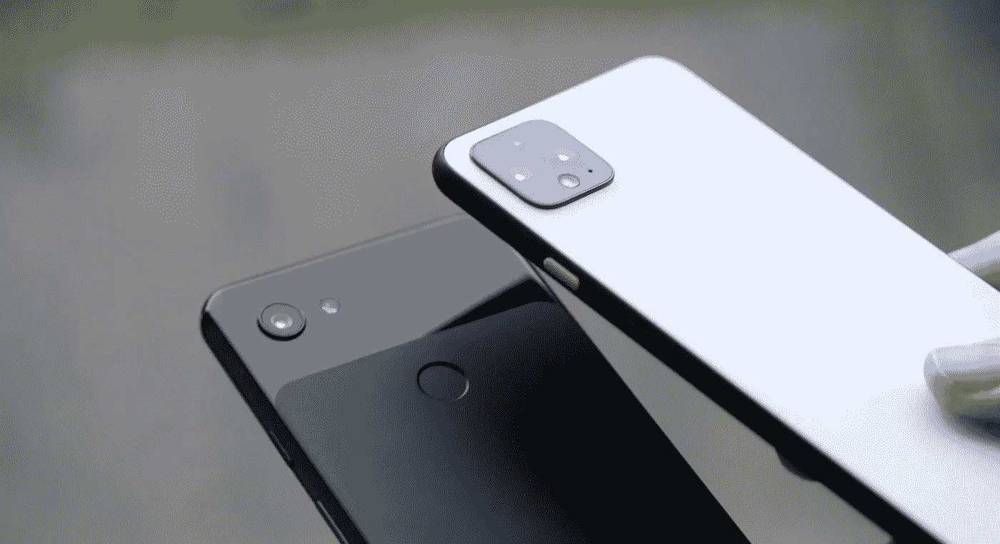
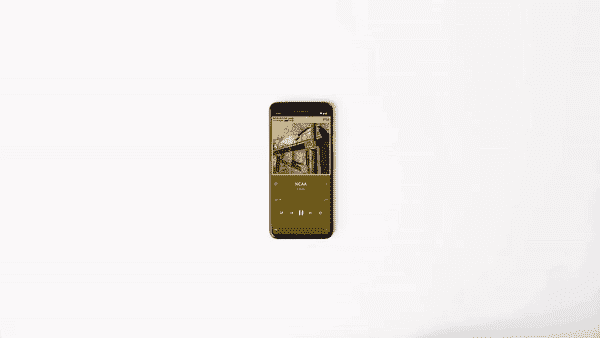
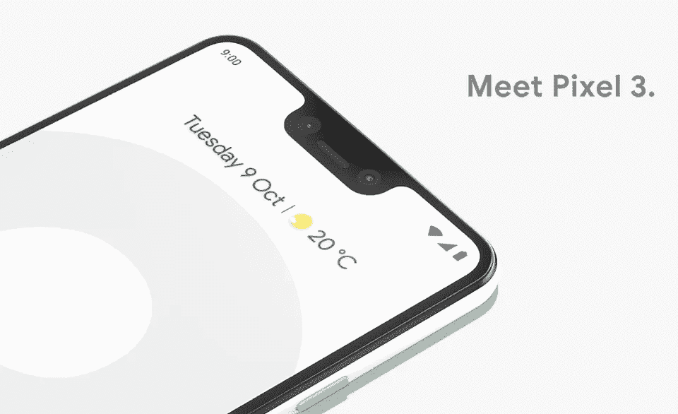

# 2021 年是谷歌的最后机会

> 原文：<https://medium.com/geekculture/2021-is-googles-last-chance-c6a41c54d745?source=collection_archive---------9----------------------->

## 安卓的现状

## 如果 Pixel 6 失败了，我会换成 iPhone

Various Google Pixel smartphones. [iGeekPhone](https://www.igeekphone.com/google-pixel-6-specs-has-been-appeared-and-pixel-5a-releasing-soon/)

在很大程度上，2021 年已经远远好于 2020 年。在某些地区，新冠肺炎的疫苗供应将超过需求，看起来今年我们将迎来一个完整的 f1 赛季。2021 年是个人、家庭和企业的复苏之年。

我真正希望看到复苏的一项业务是谷歌的智能手机 Pixel 系列。虽然每个主要的智能手机制造商都已经发布了他们的 2021 年旗舰机型，但谷歌的竞争对手可能要到 10 月下旬才会到来。Pixel 手机的发布总是比竞争对手的产品晚得多，这导致了一种奇怪的动态。

谷歌通常要等半年以上才能对竞争对手的产品做出回应。比如 2020 年 3 月 6 日发布的三星 Galaxy S20。7 个月后的 2020 年 10 月 15 日，谷歌发布了 Pixel 5。理想情况下，在今年晚些时候发布一款产品，可以让一家公司真正完善自己的产品，并控制市场。

问题是，谷歌发布 Pixel 手机的时间太晚了，以至于没有人对它们大肆宣传。那一年的智能手机趋势已经决定了——哪一款手机具有最好的性能、摄像头、电池寿命等等。7 个月后，谷歌推出了他们的产品。即使那一年谷歌最终拥有比三星手机更好的相机，三星也会在谷歌发布 5 个月后发布一款*新*手机。很奇怪。

Pixel 4’s gesture features being used to interact with Spotify. [The Verge](https://www.theverge.com/2019/10/15/20907715/google-pixel-4-motion-sense-gesture-controls-radar-sensor-project-soli-demo-features)

不仅发布时间表很奇怪，而且最近，事情对谷歌来说并不顺利。Pixel 4 带来了传闻已久的基于雷达的技术，有助于动作感应和手势；理论上很酷，但实际上几乎没用——效果不好。他们通过 Pixel 5 彻底摆脱了它，并使手机变得足够笨，以至于它不能真正作为旗舰手机竞争；尽管如此，与竞争对手相比，这款手机还是有点贵。

如果你看一下 Pixel 5 的[产品页面](https://store.google.com/us/product/pixel_5?hl=en-US)，你会立刻发现这款手机是多么没有灵魂；从使用的颜色到实际的颜色*名称*(绿色的‘Sorta Sage’)，Pixel 5 很无聊，没有灵感，没有竞争力。谷歌宣传这款手机可以做的事情是大多数其他手机都可以做的。不仅如此，它们也是大多数手机简单地*期望*做的事情:

*   无线充电
*   提供“流畅、快速的性能”
*   溅入或溅出都没有问题(防水)
*   拍好照片

以上几点都没有将 Pixel 5 与竞争对手区分开来。有一些手机具有更好的有线和无线充电功能，提供更流畅和更快的性能，提供更强的防水等级，拍摄更好的照片[和视频]。尽管如此，当人们可以用更少的钱买到 Galaxy S21 时，为什么还要花 700 美元买 Pixel 5 呢？三星的手机做什么都比 Pixel 5 好。

如果你想要一个 Pixel 5，又不想花 700 美元，那就买一个 Pixel 4A 5G 吧——它做的事情基本相同，但价格要低 200 美元。不在乎 5G？以 Pixel 5 一半的价格购买 Pixel 4A。4A 拍摄同样的照片，提供大致相同的软件体验。

好吧，我希望我已经确定谷歌的手机现在一团糟。他们缺乏灵感，不与其他公司竞争——相反，他们与自己竞争。这对我来说是最后一根稻草的原因是因为这已经持续了很长时间。

从 Pixel 2 XL 开始我就有 Pixel 了——这是一款极具竞争力和创新性的手机；我喜欢它。从那以后，谷歌就开始搞砸一切。Pixel 3 XL 有一个更好的摄像头，但巨大的浴缸式凹槽让人感觉不那么鼓舞人心。无论如何，像素 4 都没有提高标准。它带来了糟糕的动作感应，而谷歌不在乎在其他地方创新。像素 5 一般都很烂。最近关于谷歌和安卓本身的一切对我来说都糟透了。

Meet the massive notch. [Forbes](https://www.forbes.com/sites/gordonkelly/2018/10/10/google-pixel-3-vs-pixel-3-xl-upgrade-whats-the-difference-release-date-price-cost/?sh=38ad34273cfb)

iMessage 发布已经*年*了。谷歌吹捧 RCS 是 Android 对它的回答，但 RCS 未能起飞。它的推出非常草率，大多数人都不知道它的存在。在这一点上——对我来说——看起来谷歌不再尝试了。Pixel 5 是我个人对谷歌目前一切的认可:自满、失落、缺乏灵感。

Pixel 5 是你永远不想成为其中一部分的关系，如果你*陷入其中*——这是你在分手前给它的“最后一年”(当你这样做时，你会想“我早就应该这样做了。”)我已经厌倦了不能正常观看 iPhone 用户发给我的图片和视频。就像，现在是 2021 年——为什么图片和视频这么粗糙？不，不要回答这个问题。我不是在寻找答案。关键是，在这个时代，没有理由让这成为*的事情*。它应该只是*工作*。

还有，Pixel 手表到底在哪里？我感觉我已经听说了一个出来的谣言有*年了，*而我们现在一无所有。不久前，谷歌甚至从手表制造商 Fossil 那里获得了知识产权；他们甚至*买下了* Fitbit *。那么，他们还在等什么？为什么我们即将推出 Apple Watch 系列 **SEVEN** 而没有谷歌**的竞争手表？是的，他们确实有 Wear OS，但是你猜怎么着？功能有限，硬件有限，让人看得出谷歌不在乎尝试。***

甚至芯片制造商也不在乎——高通花了 2.5 年时间才发布了安卓智能手表制造商主要使用的新版本芯片。期待已久的“升级”仅仅是对旧版本的改进。这或多或少是完全相同的事情；他们刚刚添加了一个协处理器，让制表商可以添加像永远在线显示这样的东西。新老之间有 2.5 年的差距，却没有任何表现。

当我说这是谷歌(对我来说)的最后一次机会时，我指的就是这个。我不在乎是谁的错。我不在乎是否有人搞砸了 RCS 的推广。我不在乎高通是否在安卓智能手表芯片上做得不好。我经常看到谷歌对自己不加努力，Pixel 5 这个可悲的笑话证实了这种观点。

我觉得我给了谷歌和安卓太多机会去追赶 iPhone。自从令人惊叹的 HTC One M7 问世以来，我就一直坚持使用 Android，我一直觉得 Android 正在追赶苹果。不过，我从来没有觉得它很接近。老实说，我真的不在乎谷歌是否赶上苹果。我不需要他们像苹果一样。我需要它们有足够的竞争力，让我*而不是*想换 iPhone。

直言不讳的 Android 粉丝过去常常嘲笑苹果没有任何创新。自从 Android 5 (Lollipop)在屏幕底部引入更花哨的触摸图标以来，Android 有什么变化吗？我认为没有。我已经推迟了切换，因为我一直在等待，等待，等待，等待，等待，看看谷歌是否会最终发布他们自己的智能手表，或者革新安卓系统，超越 iPhone。我一直希望 Pixel 系列能够回归创新、古怪和有趣。

对我来说，像素 4 和 5 基本上是‘1’和‘2’。如果 Pixel 6 很烂，我就等够了。实际上，我已经等了很长时间了。在这一点上，我只是受够了，我可能真的会做些什么。

苹果甚至不需要做任何正确的事情来用 iPhone 13 赢得我的心——谷歌只需要继续做谷歌，做所有错误的事情。我真的希望 Pixel 6 是一款革命性的手机，最终会利用谷歌收购 HTC Mobile 的优势。我也从可靠的来源听到了关于谷歌为新手机开发自己的芯片的传言。

我为此感到兴奋——我怎么能不兴奋呢？我*想要*Pixel 6 惊艳，这样我就可以买了。然而，我不得不应对谷歌的无能太久了，我终于准备在今年秋天做点什么了。你认为我会在 11 月推出 Pixel 6 或 iPhone 13 吗？