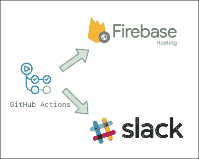

# [2022]自动 Firebase 部署和从 Github Actions 发送 Slack 通知

> 原文：<https://medium.com/geekculture/2022-auto-firebase-deployment-and-sending-slack-notification-from-github-actions-68ca9b9d579b?source=collection_archive---------9----------------------->

如果有多人使用 Firebase 托管进行开发，您可能会想

*   “我推了 github，但是忘了部署 firebase”
*   “我部署了 firebase，但忘记了推送到 github……”
*   “上传的是生产版本吗…