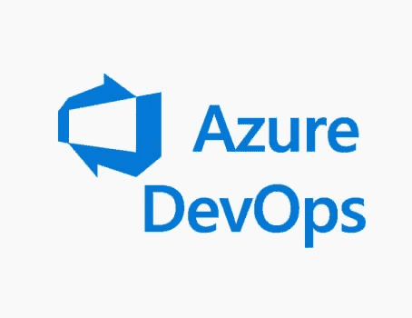

# [2022]如何从 Azure DevOps 克隆回购

> 原文：<https://medium.com/geekculture/2022-how-to-clone-a-repo-from-azure-devops-fac78fc726b5?source=collection_archive---------0----------------------->

Azure DevOps 提供开发人员服务，允许团队规划工作、协作开发代码、构建和部署应用程序。Azure DevOps 支持一种协作文化和一套流程，将开发人员、项目经理和贡献者聚集在一起开发软件。它允许组织以比传统软件更快的速度创建和改进产品 …