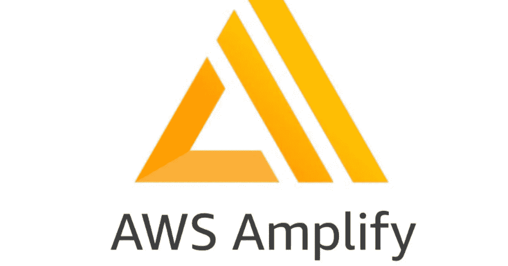

# [2022]如何使用 Amplify-CLI + React 托管 web 应用程序

> 原文：<https://medium.com/geekculture/2022-how-to-host-a-web-app-with-amplify-cli-react-fa9a09763c8c?source=collection_archive---------4----------------------->

# 介绍

Amplify 是一项 AWS 服务，可以自动执行 web、iOS、Android 等平台的前端和后端应用程序发布流程。

Amplify 通过 web 控制台进行配置。Amplify 有两种:Console 和 CLI，这次我就介绍一下 **CLI** 。