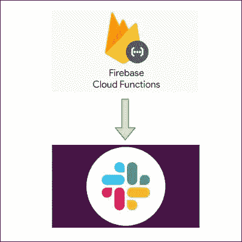

# [2022]如何从 Firebase 云功能向 Slack 发送消息

> 原文：<https://medium.com/geekculture/2022-how-to-send-messages-from-firebase-cloud-functions-to-slack-33fb4857bc10?source=collection_archive---------4----------------------->

# —导言

我们经常想从一些 web 应用程序向 Slack 发送消息。

我已经把**整个程序**文档化了，包括代码，和大家分享一下。

希望这篇文章对你有所帮助。

# —发布 Slack Webhook URL