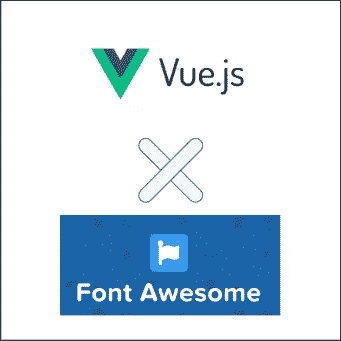

# [2022]如何在 Vue3 CLI 中使用字体图标

> 原文：<https://medium.com/geekculture/2022-how-to-use-fontawsome-icon-in-vue3-cli-3dbd3dcf2edd?source=collection_archive---------13----------------------->

FontAwsome 是一个免费的强大的网络制作工具。然而，我们在 Vue3 CLI 中使用 FontAwsome 时遇到了一些困难，因此我们与您分享我们的知识，以节省您的时间！

例如，使用 FontAwsome，您可以创建一个像这样的好看的页脚。