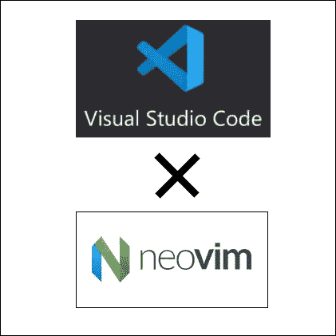

# [2022]如何将 NeoVim 与 VScode 一起使用

> 原文：<https://medium.com/geekculture/2022-how-to-use-neovim-with-vscode-528706e757a4?source=collection_archive---------2----------------------->

觉得 Vim 只是个不好用的老编辑器？
你错了，因为 Vim 仍然被许多人使用，并且仍然允许快速的代码编辑，这是你用 Vim 做不到的。

**你知道在 VScode 插件中有这样一个有用的 Vim 吗？**