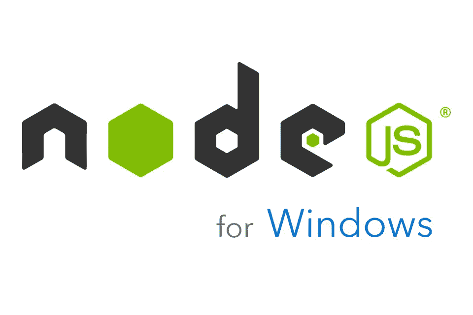

# [2022]如何在 Windows 10 上使用 Node.js

> 原文：<https://medium.com/geekculture/2022-how-to-use-node-js-on-windows-10-7888e7e67647?source=collection_archive---------13----------------------->

## 节点. js

*   **Node.js** 让一直局限在浏览器环境下的 JavaScript 可以像 Python、Ruby 一样在 PC 上运行。
*   经常被误解， **Node.js** 既不是 web 服务器，也不是 Rails、Django 那样的 web 框架；它是一个 JavaScript 执行环境。
*   正如在…上安装 Python 一样