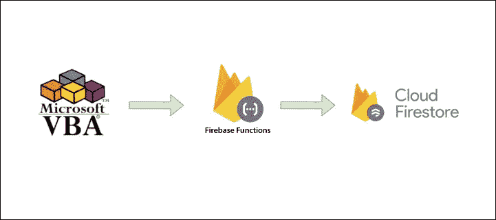

# [2022]通过 VBA 和 Firestore 发送用户信息

> 原文：<https://medium.com/geekculture/2022-sending-user-info-with-vba-and-firestore-4b5ab28f754?source=collection_archive---------8----------------------->

## **——这篇文章的摘要**

我开发了 **VBA -凡斯托系统**，并与你分享以帮助他人。

如果你读了这篇文章，你可以学到

**“如何从您的 VBA 应用发送用户数据”**