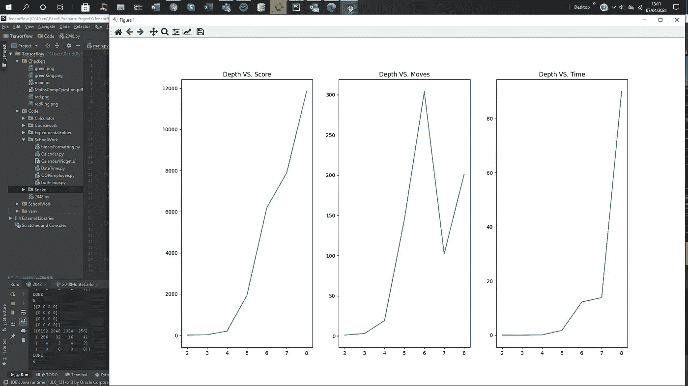
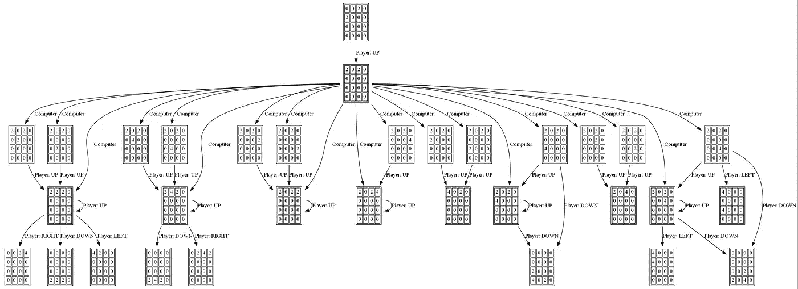

# 2048 AI Python 可能最高分

> 原文：<https://medium.com/geekculture/2048-ai-python-highest-score-cc143b55994c?source=collection_archive---------11----------------------->

**简介:**

这是一个由我和一个叫埃德温的人参与的项目。我负责最高分代码，Edwin 负责蒙特卡洛代码，因为他们都是不同的，我相信他们都应该有自己的文章。两者都有其优点和缺点，在实际人工智能的应用中，蒙特卡罗方法将是唯一可行的选择，因为最高分具有欺骗性，因为它可以从许多棋盘的选项中决定最好的棋盘。尽管如此，看到代码在不到一秒钟的时间内获得一个获胜的棋盘(2048 块)仍然是非常令人满意的。

为了查看代码的结果，我附上了代码结果的图表，以便您可以自己衡量它的性能。请注意，我们的评分系统与 2048 年的真实评分系统略有不同，在 2048 年的真实评分系统中，分数由网格上所有瓷砖的总和决定。



如果你跑很高的深度，例如深度 10，我跑了 2 个小时，它达到了最高分 65，536 瓦！您可以在 pycharm 终端上的网格右侧看到深度为 8 的最终网格。

```
import random
import numpy as np
import sys
import time
from itertools import product
import matplotlib.pyplot as plt

ROW_LENGTH = 4
STARTING_NUMBERS = 2
CHANCE_OF_TWO = 90
PLAYER_SCORE = 0
TOTAL_MOVES = 0
NUMBER_OF_RUNS = 7

POSSIBLE_MOVES = ["up", "right", "down", "left"]
DEPTH = 2
POSSIBLE_ARRANGEMENTS = product(POSSIBLE_MOVES, repeat=DEPTH)
TEMPLATE = [[0.135, 0.121, 0.102, 0.0999],
            [0.0997, 0.088, 0.076, 0.0724],
            [0.0606, 0.0562, 0.0371, 0.0161],
            [0.0125, 0.0099, 0.0057, 0.0033]]

BEST_DIRECTION = ""
BEST_SCORE = 0
BEST_GRID = None
PLT_SCORE = [[],[],[],[]]

def generateTile():
    RANDOM_NUM = random.randint(1, 100)
    if RANDOM_NUM < CHANCE_OF_TWO:
        number = 2
    else:
        number = 4
    return number

def createGrid(dimensions):
    grid = [[0 for i in range(dimensions)] for j in range(dimensions)]
    for i in range(STARTING_NUMBERS):
        number = generateTile()
        grid[random.randint(0, ROW_LENGTH - 1)][random.randint(0, ROW_LENGTH - 1)] = number
    displayGrid(grid)
    return grid

def displayGrid(*grids):
    for grid in grids:
        print(np.array(grid))

def evalgrid(grid):
    return np.sum(np.array(grid) * TEMPLATE)

def move(direction, grid, score):
    if direction == "left" or direction == "right":
        for i in range(ROW_LENGTH):
            if direction == "right": grid[i] = grid[i][::-1]
            for j in range(grid[i].count(0)):
                grid[i].append(grid[i].pop(grid[i].index(0)))

            for element in range(0, ROW_LENGTH - 1):
                if grid[i][element] == grid[i][element + 1]:
                    score += grid[i][element] * 2
                    grid[i][element] = grid[i][element] * 2
                    grid[i].remove(grid[i][element + 1])
                    grid[i].append(0)
            if direction == "right": grid[i] = grid[i][::-1]

        return grid, score

    else:
        collection = [grid[j][i] for i in range(0, ROW_LENGTH) for j in range(0, ROW_LENGTH)]
        vGrid = [collection[i * ROW_LENGTH:((i + 1) * ROW_LENGTH)] for i in range(ROW_LENGTH)]

        for i in range(ROW_LENGTH):
            if direction == "down": vGrid[i] = vGrid[i][::-1]
            for j in range(vGrid[i].count(0)):
                vGrid[i].append(vGrid[i].pop(vGrid[i].index(0)))
            for element in range(0, ROW_LENGTH - 1):
                if vGrid[i][element] == vGrid[i][element + 1]:
                    score += grid[i][element] * 2
                    vGrid[i][element] = vGrid[i][element] * 2
                    vGrid[i].remove(vGrid[i][element + 1])
                    vGrid[i].append(0)
            if direction == "down": vGrid[i] = vGrid[i][::-1]

        for row in range(ROW_LENGTH):
            for column in range(ROW_LENGTH):
                grid[row][column] = vGrid[column][row]

        return grid, score

def check(grid):
    gridArr = []

    for direction in POSSIBLE_MOVES:
        temp = [x[:] for x in grid]
        gridArr.append(move(direction, temp, PLAYER_SCORE))

    for potentialGrid in gridArr:
        if grid != potentialGrid[0]:
            return False
    return True

def updateGrid(grid, state):
    count = 0
    for i in range(ROW_LENGTH):
        count += grid[i].count(0)

    if not count:
        if check(grid):
            return grid, True

    if state == True:
        while True:
            row = random.randint(0, ROW_LENGTH - 1)
            column = random.randint(0, ROW_LENGTH - 1)
            if grid[row][column] == 0:
                grid[row][column] = generateTile()
                return grid, False
    return grid, False

def bestmove(grid, CURR_DEPTH, SET_OF_MOVES, currentscore):
    CURR_DEPTH += 1
    placeholder = [x[:] for x in grid]
    if CURR_DEPTH != DEPTH:
        for DIRECTION in POSSIBLE_MOVES:
            grid = move(DIRECTION, grid, currentscore)[0]
            SET_OF_MOVES.append(DIRECTION)
            # print(f"Depth {CURR_DEPTH}")
            # displayGrid(grid)
            if grid != placeholder:
                grid = updateGrid(grid, True)[0]
                bestmove(grid, CURR_DEPTH, SET_OF_MOVES, currentscore)

            SET_OF_MOVES.pop()
            grid = [x[:] for x in placeholder]
        return

    else:
        global BEST_SCORE
        global BEST_DIRECTION
        global BEST_GRID
        SCORE = evalgrid(grid)
        if BEST_SCORE < SCORE:
            BEST_SCORE = SCORE
            BEST_DIRECTION = SET_OF_MOVES[0]
            BEST_GRID = grid

        return
    return

def main():

    board = createGrid(ROW_LENGTH)
    TOTAL_MOVES = 0
    PLAYER_SCORE = 0

    while board:
        # PLAYER_CURRENT_MOVE= input(f"Enter your move, your current score is {PLAYER_SCORE}")
        # PLAYER_CURRENT_MOVE=random.choice(POSSIBLE_MOVES)
        BEST_SCORE = 0
        BEST_DIRECTION = ""

        bestmove(board, 0, [], PLAYER_SCORE)
        # sys.exit()
        placeholder = [x[:] for x in board]
        board = BEST_GRID

        if placeholder == board:

            ended = True
        else:
            board, ended = updateGrid(board, True)
        TOTAL_MOVES += 1
        if TOTAL_MOVES%1000==0:
            displayGrid(board)
        if ended:
            displayGrid(board)
            print("DONE")
            PLAYER_SCORE = sum(map(sum,board))
            return TOTAL_MOVES, PLAYER_SCORE

for i in range(NUMBER_OF_RUNS):
    start = time.time()
    moves, score = main()
    PLT_SCORE[0].append(DEPTH)
    PLT_SCORE[1].append(score)
    PLT_SCORE[2].append(moves)
    PLT_SCORE[3].append(time.time()-start)
    DEPTH += 1
    print(i)
figure, axis = plt.subplots(1,3)

axis[0].plot(PLT_SCORE[0], PLT_SCORE[1])
axis[0].set_title("Depth VS. Score")
axis[1].plot(PLT_SCORE[0], PLT_SCORE[2])
axis[1].set_title("Depth VS. Moves")
axis[2].plot(PLT_SCORE[0], PLT_SCORE[3])
axis[2].set_title("Depth VS. Time")
plt.show()
sys.exit() 
```

**出轨:**

Edwin 和我就这段代码的内在欺诈性进行了辩论，因为它的运行方式，我在这里做的是通过使用递归，我正在构建一个未来网格可能性的博弈树。



这是一个博弈树的例子，我的代码所做的是生成一个我们描述的一定深度的博弈树，然后从生成的结果网格中，我选择具有最大评估值的网格，这意味着它是最佳网格。我们使用一个启发式函数来做这件事，这个函数是网格上所有数字的总和，同时也是一个矩阵，这个矩阵是我们从互联网上某个人那里复制来的，他创造了一个比我们自己的人工智能优越得多的人工智能。

大部分代码是为了让 2048 的功能游戏运行而构建的，现在它们都打印到了终端上，但我们希望随着时间的推移，我们可以将它可视化，这样它看起来更美观。我们必须使我们的移动函数尽可能高效，因为如果没有它，让代码生成下一个网格将会浪费大量的计算时间，因此我们创建了如下的移动函数:

```
def move(direction, grid, score):
    if direction == "left" or direction == "right":
        for i in range(ROW_LENGTH):
            if direction == "right": grid[i] = grid[i][::-1]
            for j in range(grid[i].count(0)):
                grid[i].append(grid[i].pop(grid[i].index(0)))

            for element in range(0, ROW_LENGTH - 1):
                if grid[i][element] == grid[i][element + 1]:
                    score += grid[i][element] * 2
                    grid[i][element] = grid[i][element] * 2
                    grid[i].remove(grid[i][element + 1])
                    grid[i].append(0)
            if direction == "right": grid[i] = grid[i][::-1]

        return grid, score

    else:
        collection = [grid[j][i] for i in range(0, ROW_LENGTH) for j in range(0, ROW_LENGTH)]
        vGrid = [collection[i * ROW_LENGTH:((i + 1) * ROW_LENGTH)] for i in range(ROW_LENGTH)]

        for i in range(ROW_LENGTH):
            if direction == "down": vGrid[i] = vGrid[i][::-1]
            for j in range(vGrid[i].count(0)):
                vGrid[i].append(vGrid[i].pop(vGrid[i].index(0)))
            for element in range(0, ROW_LENGTH - 1):
                if vGrid[i][element] == vGrid[i][element + 1]:
                    score += grid[i][element] * 2
                    vGrid[i][element] = vGrid[i][element] * 2
                    vGrid[i].remove(vGrid[i][element + 1])
                    vGrid[i].append(0)
            if direction == "down": vGrid[i] = vGrid[i][::-1]

        for row in range(ROW_LENGTH):
            for column in range(ROW_LENGTH):
                grid[row][column] = vGrid[column][row]

        return grid, score
```

这有效地做了什么，它遍历数组，每当它遇到 0，它将弹出它，并将其插入到列表的末尾。在相反的方向，我们可以翻转列表，当移动 0 时，然后再次翻转列表，这具有相同的效果。这意味着我们只需要一个循环，这是我们能找到的最有效的方法。

```
def bestmove(grid, CURR_DEPTH, SET_OF_MOVES, currentscore):
    CURR_DEPTH += 1
    placeholder = [x[:] for x in grid]
    if CURR_DEPTH != DEPTH:
        for DIRECTION in POSSIBLE_MOVES:
            grid = move(DIRECTION, grid, currentscore)[0]
            SET_OF_MOVES.append(DIRECTION)
            # print(f"Depth {CURR_DEPTH}")
            # displayGrid(grid)
            if grid != placeholder:
                grid = updateGrid(grid, True)[0]
                bestmove(grid, CURR_DEPTH, SET_OF_MOVES, currentscore)

            SET_OF_MOVES.pop()
            grid = [x[:] for x in placeholder]
        return

    else:
        global BEST_SCORE
        global BEST_DIRECTION
        global BEST_GRID
        SCORE = evalgrid(grid)
        if BEST_SCORE < SCORE:
            BEST_SCORE = SCORE
            BEST_DIRECTION = SET_OF_MOVES[0]
            BEST_GRID = grid

        return
    return
```

最佳移动函数是这个代码的关键，它递归地遍历博弈树，直到它达到期望的深度，然后根据我们选择的启发式算法评估网格，如果它的分数大于当前的最大分数，那么我们用当前网格更新保存最佳网格的变量，然后我们将这个网格用于最佳移动的下一次迭代。

**启发式:**

```
def evalgrid(grid):
    return np.sum(np.array(grid) * TEMPLATE)TEMPLATE = [[0.135, 0.121, 0.102, 0.0999],
            [0.0997, 0.088, 0.076, 0.0724],
            [0.0606, 0.0562, 0.0371, 0.0161],
            [0.0125, 0.0099, 0.0057, 0.0033]]
```

我要感谢兰迪·奥尔森为我们提供的模板，因为这个模板是评估一个好职位的关键。它所做的是通过将最大的牌放在角落来最大化一组不同牌的分数，同时将其他牌以易于组合的方式放置。例如，第二和第三高的瓦片是顶行上的第二和第三瓦片，并且通过这样做，这意味着非常容易组合两个相同的瓦片，因为它们将彼此相邻。请注意，每当从最大到最小排序的所有图块被放置在网格上从最大到最小的位置时，evalgrid 将被最大化。

这就是我们如何建立我们的人工智能！