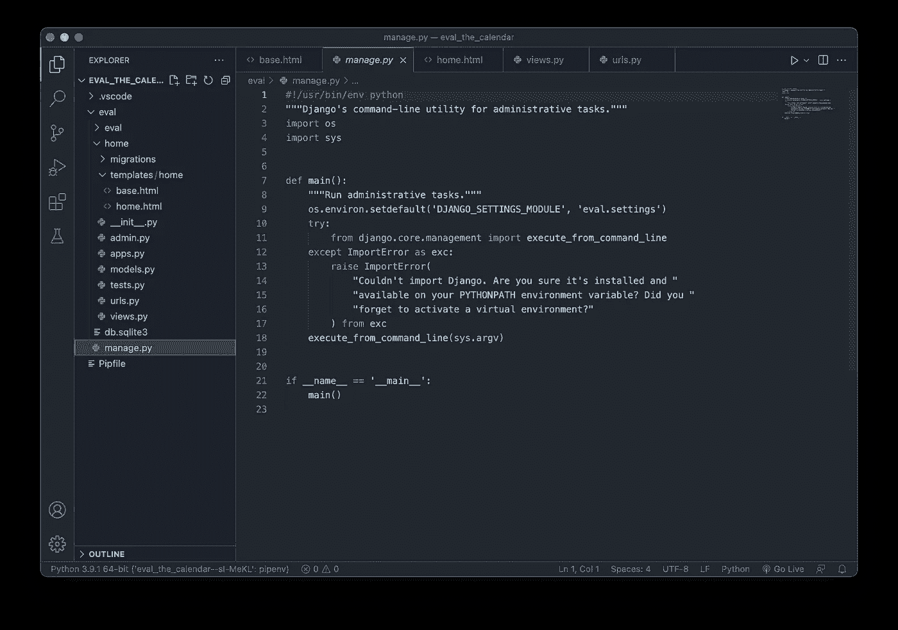

# 你应该知道的 21 个 VSCode 键盘快捷键

> 原文：<https://medium.com/geekculture/21-vscode-keyboard-shortcuts-you-should-know-1b96a65e9428?source=collection_archive---------17----------------------->

使用您最喜欢的代码编辑器提高编码效率

Photo of VSCode window by the author.

微软的 Visual Studio 代码是相当多开发人员最喜欢的代码编辑器。在全球范围内，开发人员似乎喜欢使用它，因为它提供了大量有用的代码编辑功能和扩展，使我们的生活每天都变得更加轻松。