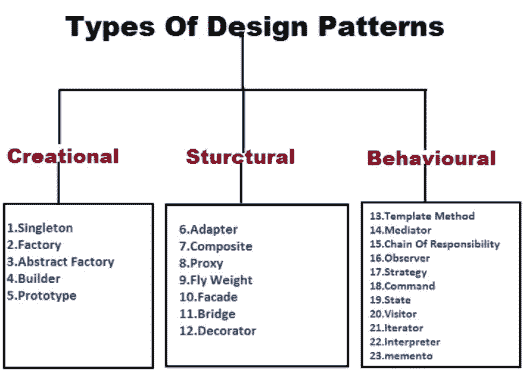

# 23 种 Java 设计模式

> 原文：<https://medium.com/geekculture/23-java-design-patterns-c1ff40faa5cd?source=collection_archive---------1----------------------->

这是我的学习笔记，不是原创。

设计模式的使用是为了确保代码的可靠性，并让其他人更容易理解。

下面列出了所有的设计模式。基本上，设计模式分为三类:

1.  **创作**
2.  **结构性**
3.  **行为模式**

[https://sis.binus.ac.id/2021/12/03/design-patterns/](https://sis.binus.ac.id/2021/12/03/design-patterns/)

1.  单个的 …