# 23 网站 Javascript 倒计时定时器

> 原文：<https://medium.com/geekculture/23-javascript-countdown-timer-for-website-273efc2f5618?source=collection_archive---------0----------------------->

今天的文章我们将一起学习如何创建一个倒计时器。在网站中，它通常主要用于计算您想要通知客户的促销、新产品发布、即将举行的活动的剩余时间。

# 选秀倒计时

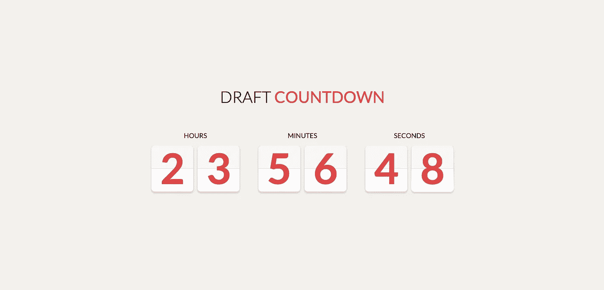

Draft Countdown

这是 Codepen 上的结果。

[链接](https://codepen.io/doriancami/pen/jEJvaV)

# 纯 CSS SVG 倒计时(就绪)

Pure CSS SVG Countdown (Ready)

这是 Codepen 上的结果。

[链接](https://codepen.io/suez/pen/dXbBGp)

# Javascript 倒计时

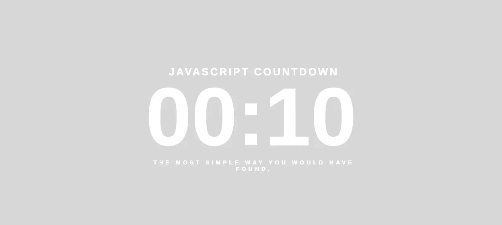

Javascript Countdown

这是 Codepen 上的结果。

[链接](https://codepen.io/glaubersampaio/pen/vOZbPx)

# 倒计时定时器

Countdown Timer

这是 Codepen 上的结果。

[链接](https://codepen.io/supah/pen/wGvNWN)

# 番茄钟

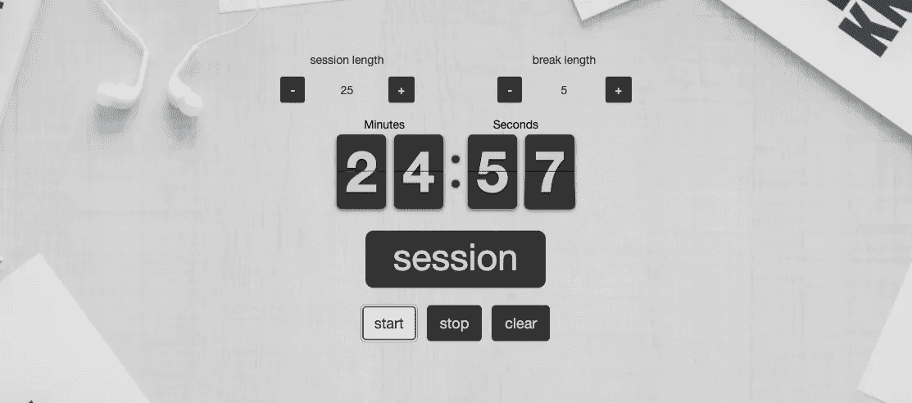

Pomodoro Clock

这是 Codepen 上的结果。

[链接](https://codepen.io/putraaryotama/pen/wgwqBB)

# CSS 可变功率时钟

CSS Variable-Powered Clock

这是 Codepen 上的结果。

[链接](https://codepen.io/eehayman/pen/jVPKpN)

# FlipDown.js 示例

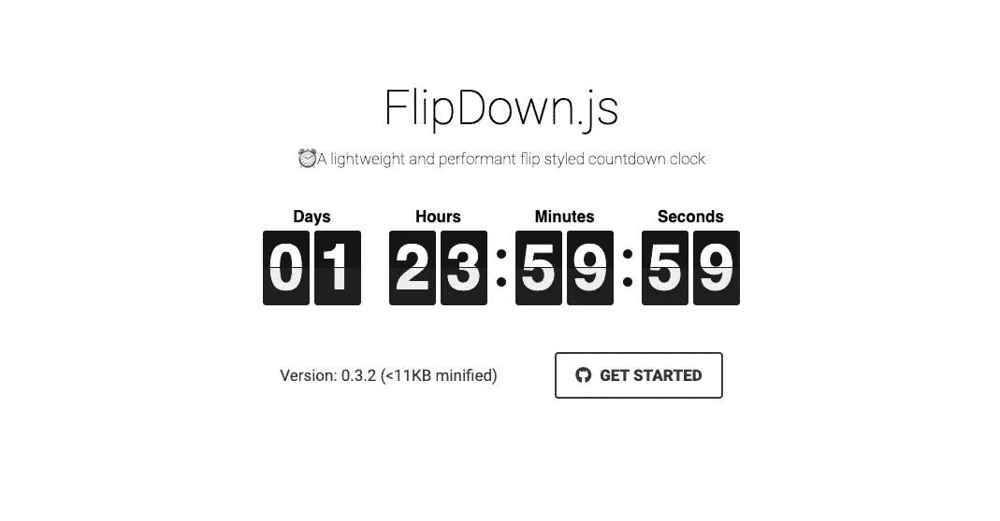

FlipDown.js Example

这是 Codepen 上的结果。

[链接](https://codepen.io/pbutcher/pen/dzvMzZ)

# 动画倒计时

Animated Countdown

这是 Codepen 上的结果。

[链接](https://codepen.io/FlorinPop17/pen/LzYNWa)

# 香草 JS 倒计时钟

Vanilla JS Countdown clock

这是 Codepen 上的结果。

[链接](https://codepen.io/timjackleus/pen/rjmxpW)

# 材料时钟倒计时

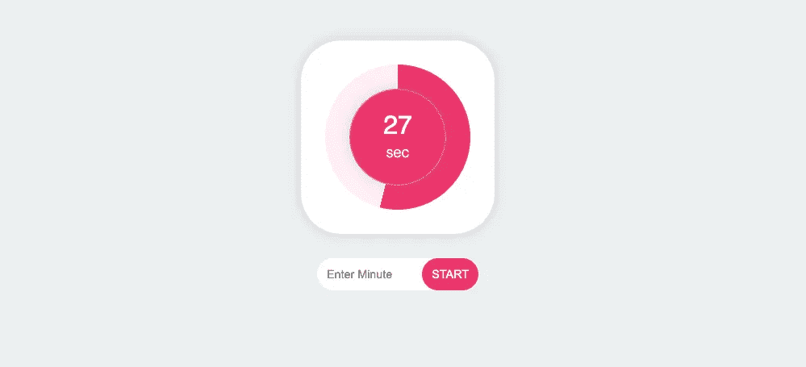

Vanilla JS Countdown clock

这是 Codepen 上的结果。

[链接](https://codepen.io/khadkamhn/pen/xRbyxR)

# 香草 JS 倒计时钟

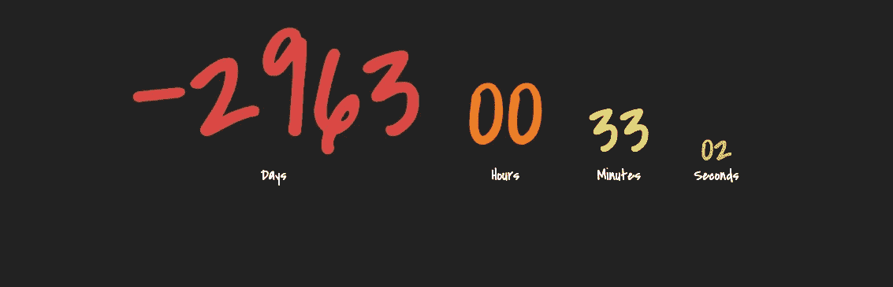

Vanilla JS Countdown clock

这是 Codepen 上的结果。

[链接](https://codepen.io/chriscoyier/pen/vbsHK)

# 倒计时器 Javascript。

Countdown Timer Javascript.

这是 Codepen 上的结果。

[链接](https://codepen.io/arcarr/pen/vGVGXN)

# CSS Javascript 倒计时

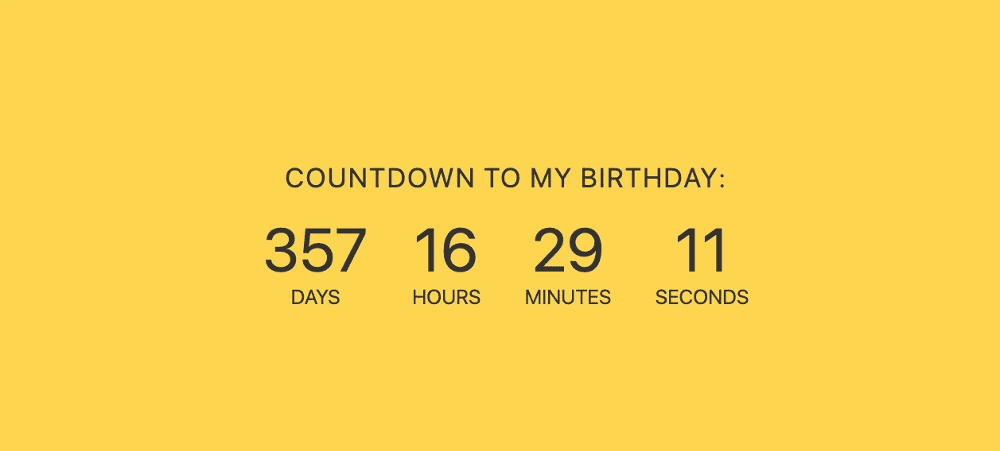

CSS Javascript Countdown

这是 Codepen 上的结果。

[链接](https://codepen.io/AllThingsSmitty/pen/JJavZN)

# CSS 倒计时数字

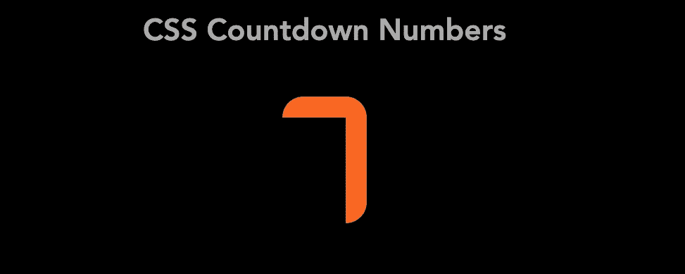

CSS Countdown Numbers

这是 Codepen 上的结果。

[链接](https://codepen.io/marcosmou/pen/VjrwAR)

# 噗噗魔法倒计时(CSS3)

Puff the Magic Countdown (CSS3)

这是 Codepen 上的结果。

[链接](https://codepen.io/scottpdawson/pen/Gzwbl)

# 倒计时

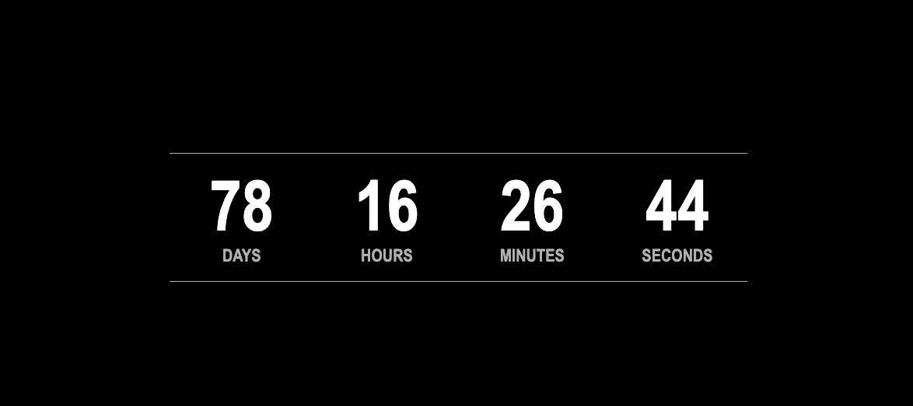

Countup and Countdown

这是 Codepen 上的结果。

[链接](https://codepen.io/chrisjdesigner/pen/dMbmoE)

# 谷歌输入/输出—倒数 16

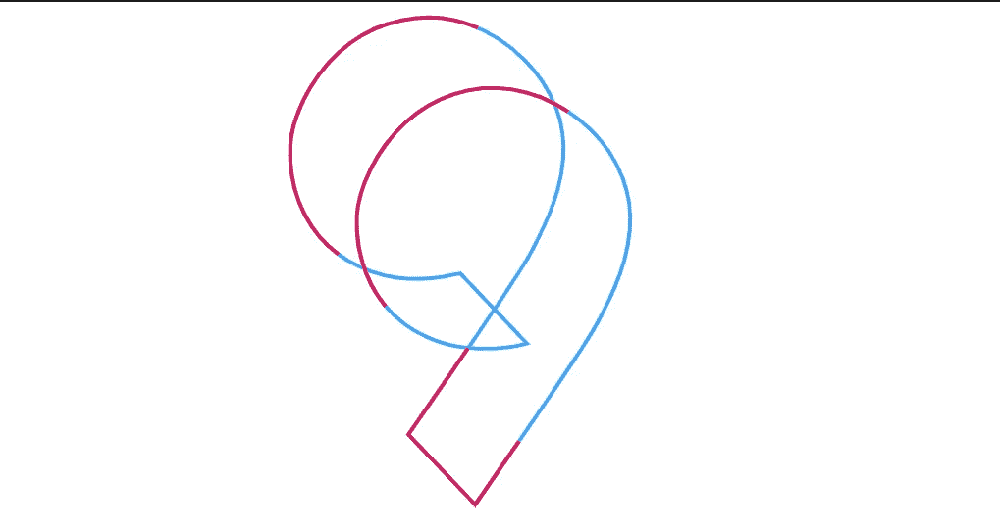

Google I/O — Countdown 16

这是 Codepen 上的结果。

[链接](https://codepen.io/72mena/pen/dMqbZp)

# GSAP 新年倒计时钟

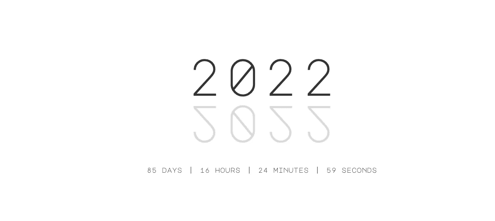

GSAP New Year Countdown Clock

这是 Codepen 上的结果。

[链接](https://codepen.io/animatedcreativity/pen/GPZMxB)

# jQuery.countdown 示例

jQuery.countdown example

这是 Codepen 上的结果。

[链接](https://codepen.io/bataimx/pen/yowYKK)

# 花式倒计时定时器

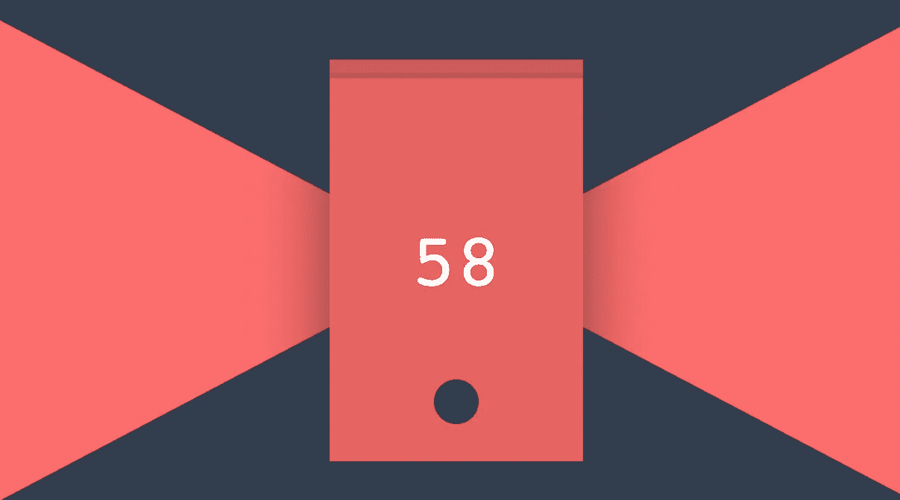

Fancy Countdown Timer

这是 Codepen 上的结果。

[链接](https://codepen.io/lmgonzalves/pen/JZJeYq)

# 现代倒计时

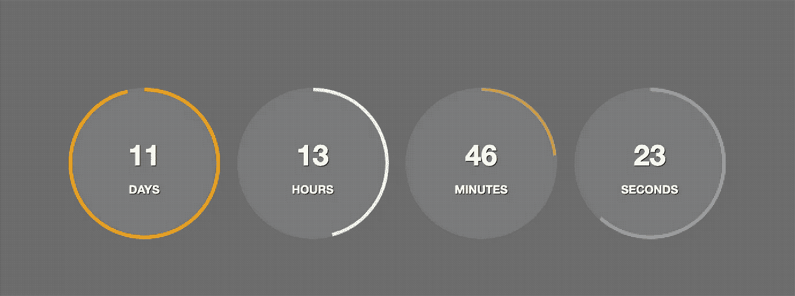

Modern Countdown

这是 Codepen 上的结果。

[链接](https://codepen.io/nathan76877/pen/WbqyEx)

# 倒计时定时器用户界面

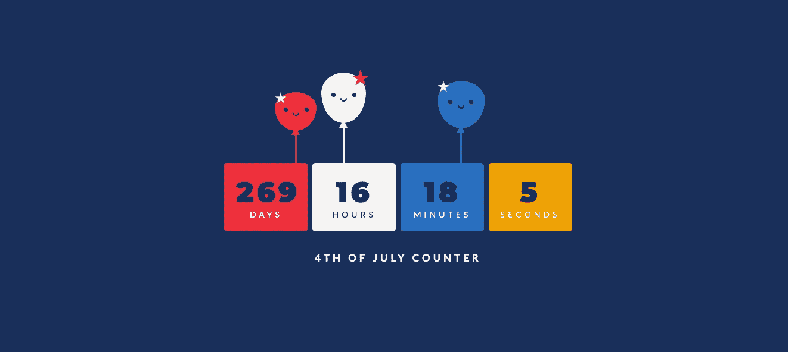

Countdown Timer UI

这是 Codepen 上的结果。

[链接](https://codepen.io/juliepark/pen/pKybKa)

# 最小倒计时定时器

Minimal Countdown Timer

这是 Codepen 上的结果。

[链接](https://codepen.io/nw/pen/zvQVWM)

# 摘要

我希望这篇文章能为你提供有用的网页开发和设计倒计时器，如果你有任何问题，请发邮件给我，我会尽快回复。希望大家继续支持网站，让我能写出更多好文章。祝您愉快！

如果你想阅读更多文章，请前往 https://us.niemvuilaptrinh.com/