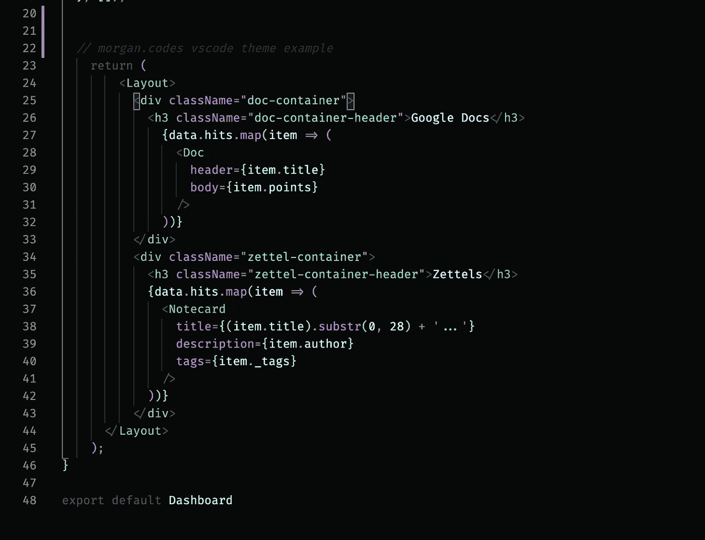

# 27 个项目想法来练习你的编程技能

> 原文：<https://medium.com/geekculture/28-project-ideas-to-practice-your-programming-skills-d27eaa3d8ada?source=collection_archive---------0----------------------->

## 你想学习如何编码，但是你应该做什么呢？

Image: Morgan.codes theme

> “每个人都应该学会给计算机编程，因为它会教你如何思考”1995 年是计算机已经在我们的社会中发挥重要作用的时候，但还没有像现在这样重要