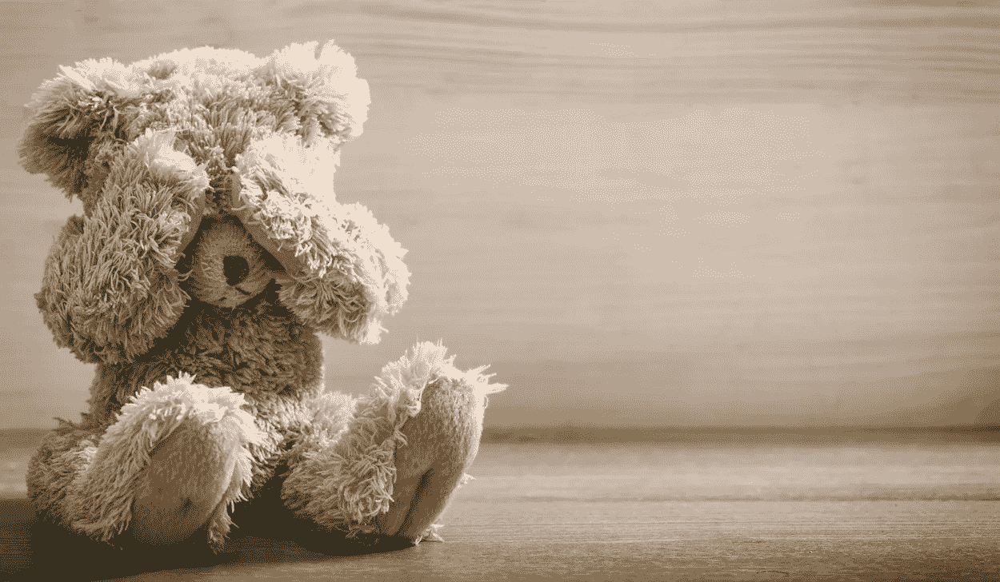

# 29k 美元让比特币远离熊市

> 原文：<https://medium.com/geekculture/29k-keeps-the-bitcoin-bear-market-away-44ff41f8e99a?source=collection_archive---------5----------------------->

一些人一直在谈论比特币熊市。

我不知道。

不仅仅是因为“熊市”的定义因人而异，取决于任意的图表模式和语义扭曲，还因为我们没有看到市场周期的顶峰。

至少，没有一座山峰与我们见过的任何山峰相匹配。