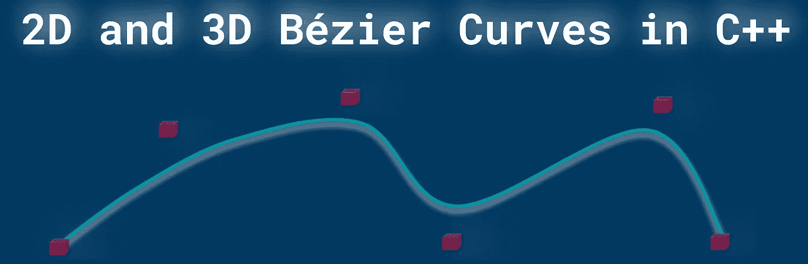
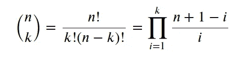
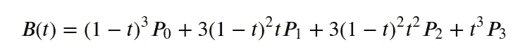
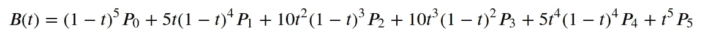
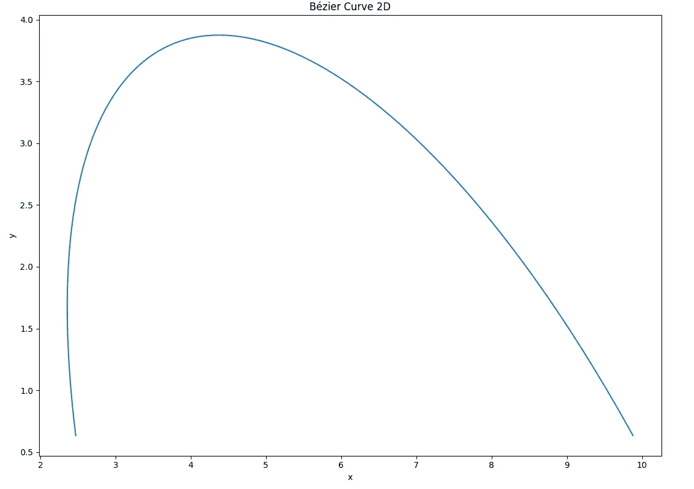
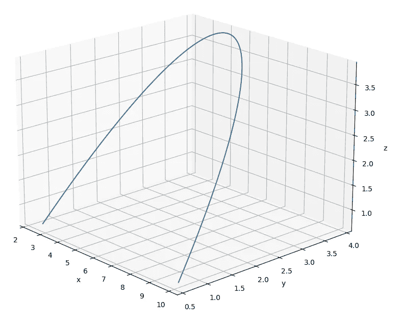
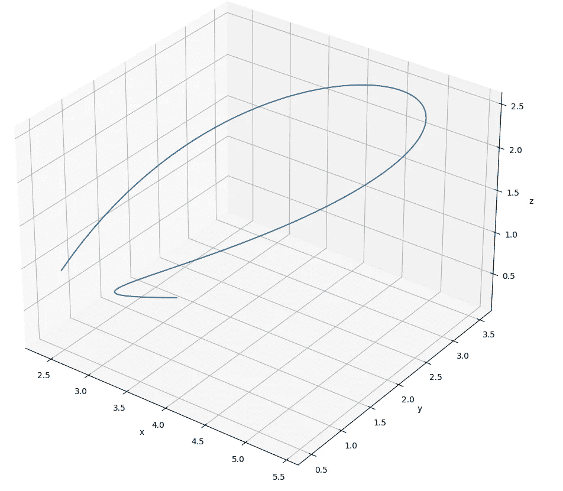

# C++中的 2D 和三维贝塞尔曲线

> 原文：<https://medium.com/geekculture/2d-and-3d-b%C3%A9zier-curves-in-c-499093ef45a9?source=collection_archive---------3----------------------->



by author

# **简介**

以下文章介绍了用 C++计算和绘制的 [**贝塞尔曲线**](https://en.wikipedia.org/wiki/B%C3%A9zier_curve) (2D 和 3D)。
贝塞尔曲线具有出色的计算路径(从起点到终点的曲线)的数学能力。曲线的形状是由“控制点”塑造的。所讨论的曲线最重要的特征是**光滑度**。在许多应用和领域中，平滑度是必不可少的。我们可以考虑机器人或其他机器的运动，其中运动必须是可预测的，以确保人类和硬件的安全(低磨损系数)。当机器人关节的轨迹被计算为一条平滑的路径时，我们可以假设机器人将会按照规划的路径平滑地运动，而不会出现不平稳或意外的运动。请注意，在机器人学中，除了路径，我们还考虑速度、加速度、加加速度和电机扭矩。所有这些参数主要影响最终路径。
除了机器人技术，贝塞尔曲线还用于动画、游戏和设计。

为了绘图的目的，我将使用我以前的帖子中讨论过的 C++的 matplotlib 库。

[头文件](https://github.com/lava/matplotlib-cpp)(用于绘图库)必须与你的 cpp 在同一个文件夹中。你的程序可以编译如下:

```
//compile
g++ my_prog.cpp -o my_prog -I/usr/include/python3.8 -lpython3.8// //run
./my_prog//folder tree
├── my_prog
├── my_prog.cpp
├── matplotlibcpp.h
```

# **功能**

可以为点集计算贝塞尔曲线:{ **P0，P1，P2 …Pn}** ，其中 **n** 定义我们建模的曲线(多项式)的阶。在每种情况下，第一个和最后一个点定义了曲线的起点和终点。其他点-控制点通常不属于计算曲线，但会影响贝塞尔曲线的形状。

**2D** 中的每个点 **P** 都有两个 **{x，y}** 笛卡尔坐标，但是在 **3D** 中，点 **P** 被三个 **{x，y，z}** 定义。

贝塞尔曲线的显式定义可以指定如下(我们将在模拟中使用该公式)。

以下等式以 Latex 格式给出(此处[为](https://gist.github.com/markusbuchholz/926e08f08eb31abb9cfc49aee0dbd01e))。


在哪里



是二项式系数。

在我们的例子中，二项式系数计算如下(如果你查看维基百科，你会发现递归实现，不过这是最简单的版本或更直观)。

C++中的实现如下所示，

平面空间中的四个点 **P** 0、 **P** 1、 **P** 2、 **P** 3 定义了一条三次贝塞尔曲线。该曲线可以被建模为三阶多项式。



当提供六个点 **P** 0、 **P** 1、 **P** 2、 **P** 3、P4 和 P5 时，贝塞尔曲线被计算为五阶多项式。



# **模拟**

现在，我们将显示上面定义的曲线的 2D 和 3D 模拟(4 点和 6 点)。代码(如下)为你提供了一个很好的可能性来计算和绘制你想要的任意点的贝塞尔曲线。

下图描绘的 2D 贝塞尔曲线，是为三次多项式(四点)计算的。

```
x{2.5, 1.5, 6.0, 10.0};
y{0.5, 5.0, 5.0, 0.5};
```



by author

对于同阶多项式(三阶)，我们可以计算三维贝塞尔曲线。

```
x{2.5, 1.5, 6.0, 10.0}; //same as 2D
y{0.5, 5.0, 5.0, 0.5}; //same as 2D
z{1.0, 2.0, 3.0, 4.0};
```



by author

这是一条 2D 贝塞尔曲线，它是针对五阶多项式(六点)计算的。

```
X{2.5, 1.5, 6, 10, 7, 3};
Y{0.5, 5.0, 5.0, 0.5, 1.0 , 2.0};
```


by author

如前所述，我们可以绘制三维贝塞尔曲线。

```
X{2.5, 1.5, 6.0, 10.0, 7.0, 3.0}; //as for 2D
Y{0.5, 5.0, 5.0, 0.5, 1.0 , 2.0}; //as for 2D
Z{1.0, 2.0, 3.0, 4.0, 5.0, 0.1};
```



by author

感谢您的阅读。