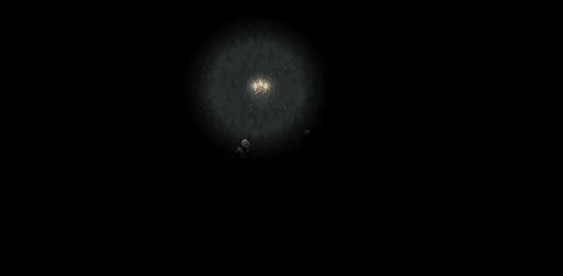

# 统一中的 2D 之光—简介

> 原文：<https://medium.com/geekculture/2d-lights-in-unity-intro-e659ad83cf60?source=collection_archive---------6----------------------->

**目标**:在 Unity 中开始使用 2D 灯光:一种让你的游戏更加身临其境和酷的简单方法

几个版本，可能是几年前， **Unity** 推出了 **2D 灯**用于 2D 的项目，而不是资源需求很大的 3D 项目。

从计算成本的角度来看，这些灯应该更轻**,这与 2D 游戏的需求很好地结合在一起，增加了美观和简单…**