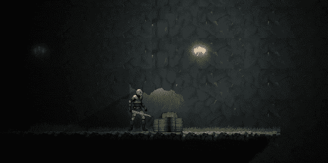

# 统一中的 2D 阴影——阴影施法者 2D 组件

> 原文：<https://medium.com/geekculture/2d-shadows-in-unity-shadow-caster-2d-component-e759ef1fd51a?source=collection_archive---------6----------------------->

## 让阴影存在

好的。我在 2D 的一个项目中安装了 2D 灯，这非常容易。它增加了游戏的深度，让人身临其境，使用起来也很有趣。

但是没有阴影的灯光听起来更像是一个漏洞百出的游戏**。所以这里是如何添加这个功能。**