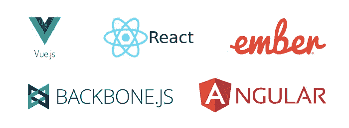
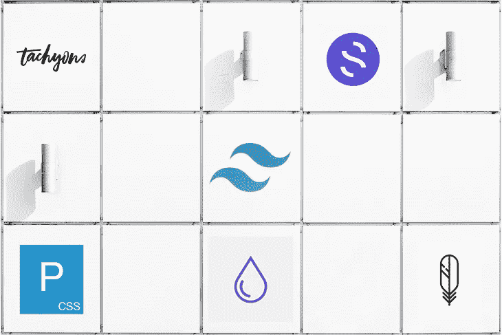
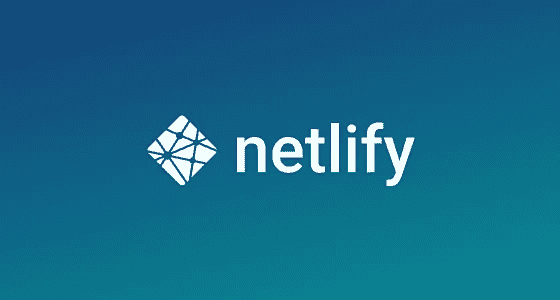

# 3…2…1…我们已经部署好了！

> 原文：<https://medium.com/geekculture/3-2-1-we-have-deployment-596faf20ac91?source=collection_archive---------20----------------------->

## 初学者指南。2

## 部署全栈应用的简单步骤

如果您从我在第 1 部分中停止的地方继续学习，那么您可能已经意识到，尽管部署可能涉及一些不稳定的步骤，但它不像您第一次登上这艘火箭船时那么麻烦。

我深入研究了用 Ruby on Rails 部署后端的过程，以便您可以查询任何想要呈现的数据点。

现在，让我们谈谈前端。

# 前端框架

就像后端一样，现在有太多的框架可供选择。一些公司会只选择其中一种，而其他公司可能会选择几种的组合。当今最大的公司最流行和使用的一些方法包括:

*   反应
*   有角的
*   vue . j
*   Ember.js
*   骨干网. js
*   苗条的

Svelte 是最新的一款，从去年(2020 年)开始，它实际上拥有最高的满意度。它自诩比更受欢迎的 React 或 Angular 更快，然而它的新颖性也伴随着缺乏社区和支持。

为了使事情变得更简单，有许多 UI 库可以像火箭助推器一样被附加，以加速样式化。

流行的 CSS 框架包括:

*   顺风 CSS
*   引导程序
*   超光子
*   羽毛
*   纯的
*   基础
*   幽灵
*   毫克

大多数都在类名中使用关键字来加速元素属性的样式化。它给人一种非常干净和流线型的感觉。解释每一个都可以是他们自己的博客，但是如果你不熟悉的话，我强烈建议你去看看。

# 部署

对于前端的实际部署，如果您计划处理大量流量或关注可伸缩性，它可以像您希望的那样简单或复杂得多。你可以找到一大堆真正免费提供这项服务的网站。

一些更受欢迎的免费增值服务发布点包括:

*   [Netlify](http://netlify.com)
*   [燃烧基地](http://firebase.com)
*   [云闪](http://pages.cloudflare.com)
*   [韦尔塞尔](http://Vercel.com)
*   [Heroku](http://heroku.com)
*   [小故障](http://glitch.com)

当然，如果你对这类服务感兴趣的话，有很多优质服务会很乐意花你的钱，比如微软的 Azure 和亚马逊的 AWS。如果你正在读这篇博客，很可能你只需要一个最小容量的主机。

# 网络生活

我将重点介绍 netlify 的易用性。这真的很简单。我是说非常简单！

通过在你自己的计算机上测试来确保你有一个工作的前端…

1.  你创建一个账户。相当标准。
2.  连接到您使用的任何 Git 提供者，无论它是 GitHub(我的选择)、GitLab 还是 Bitbucket。
3.  只需从可用列表中选择您想要发布的存储库。
4.  选择要部署的分支，并选择是否要运行测试版本。

一旦这些都完成了，你可以选择建立一个以前拥有的域名，购买一个域名或只使用自动分配的名称。

Netlify 的另一个很棒的方面是，该网站会自动使用加密证书来保护。

# 最后的想法

没有比这更简单的了。我欣喜若狂地发现托管一个前端是多么容易。我已经在心里建立了这将是一个巨大的考验，当现实中有这么多的服务在那里是非常用户友好的这些天。欢迎来到 21 世纪，我们生活在梦想中。世界，我敢说银河，触手可及。

希望你喜欢我的这次部署之旅。查看我的其他博客，或者在 LinkedIn 上随时与我联系。到无限和更远的地方！

 [## Jamon Dixon -熨斗学校-德克萨斯州奥斯汀大都会区| LinkedIn

### 全栈式 web 开发人员，对事物的工作原理充满好奇，并具有解决问题的能力。拥有强大的…

www.linkedin.com](https://www.linkedin.com/in/jamondixon/)