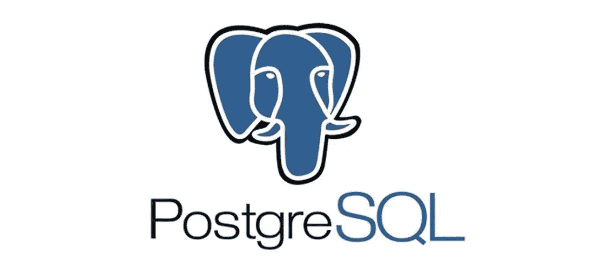
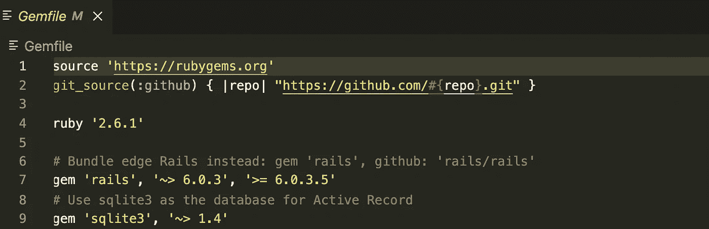
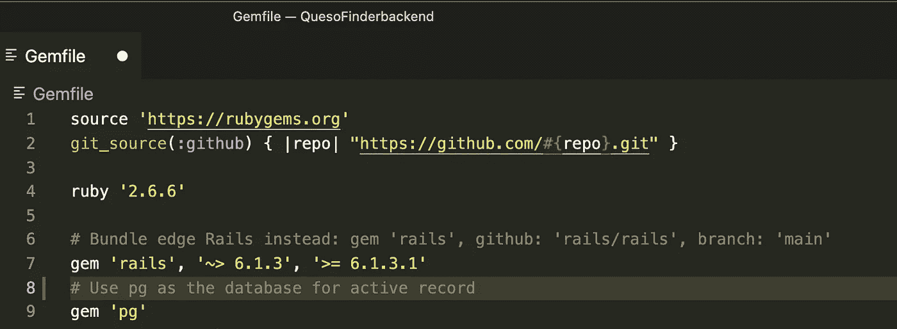
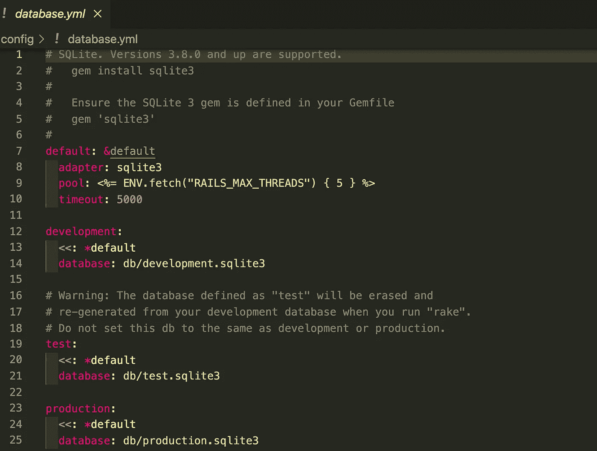
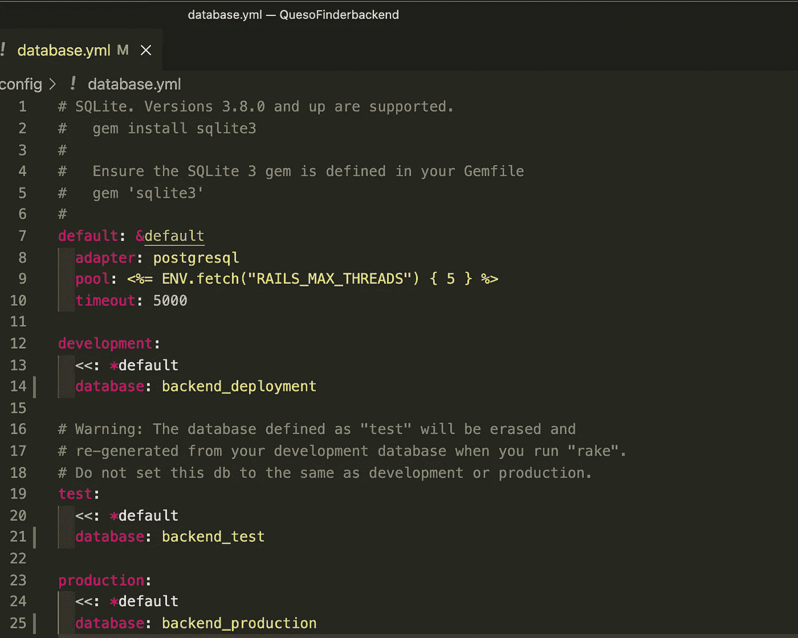

# 3…2...1…我们已经部署好了！

> 原文：<https://medium.com/geekculture/3-2-1-we-have-deployment-f553e73dc76d?source=collection_archive---------25----------------------->

## 初学者指南。一

## *部署全栈应用的简单步骤*


We have lift-off!

起初，在美妙的万维网上部署一些东西让所有人都可以看到的任务看起来似乎是一项艰巨的任务，但只要有一点指导，它实际上可以是小菜一碟。我们今天拥有的技术允许人们快速托管他们自己的全栈网站或应用程序，而且经常是免费的。只需几个简单的步骤，您就可以开始运行，供世界上的每个人体验。

可以说，为了让一个项目成为全栈的，需要有一个后端和一个前端。我们会把前端的东西留给 Pt。系列之二。现在，让我们深入到后端

# 后端

后端是充当数据库的一面，它存储或操作用户不直接访问的数据块。有多种选择，包括:


*   **轨道上的红宝石**
*   **流星**
*   **拉勒维尔**
*   **Express.js**
*   姜戈
*   **烧瓶**
*   **Spring Boot**
*   **凤凰**

为了这篇博客，我将演示如何使用 Ruby on Rails 进行部署。它简单明了。非常适合刚刚起步的程序员。尽管最近它的受欢迎程度有所下降，但仍有许多主要玩家在使用它。

# 一种数据库系统

如果你要从头开始，创建一个全新的 Rails 后端，你可以通过使用 PostgreSQL 数据库而不是默认的 SQLite3 数据库来设置一切，这对你自己是一个巨大的帮助。

这里有一个例子

```
rails new sample_backend --api --database=postgresql
```



部署主机使用 **PostgreSQL** 比使用 **SQLite** 要好得多。

你可以在 postgresapp.com 的[下载。然后，只需将它移动到应用程序文件夹，双击它开始。单击初始化创建新的服务器。在创建新数据库之前让服务器运行。](http://postgresapp.com)

# 从 Sqlite3 更改为 PostgreSQL

假设你已经设置好了你的 Ruby on Rails 数据库。表和关系都整理好了。你已经设置好了路线和控制器。您已经迁移了数据库并植入了所有数据。下面是将数据库转换到 **PostgreSQL** 的一些说明。

## **Gemfile**

您需要将左侧的菜单一直向下滚动到 Gemfile。



在该文件中，您将需要注释掉 sqlite3 gem，并用 gem“pg”替换它。



确保捆绑安装这些新的依赖项！

## 数据库. yml

打开 config 文件夹，向下滚动并打开 **database.yml** 文件。在这里你会发现三种不同的环境。

*   **发展**
*   **测试**
*   **生产**



将适配器的名称改为 **postgresql** ，并重命名这三个环境。它可以是任何东西，只要名称中没有 **sqlite3** 。

我会建议您的后端和具体环境的名称。稍后它会出现在 **PostgreSQL** 应用程序中，你会想知道什么是什么。



现在，在 PostgreSQL 服务器开始使用以下命令时，告诉 Rails 创建数据库:

```
rails db:create
```

您将希望使用以下命令再次迁移和播种它:

```
rails db:migrate
rails db:seed
```

# 赫罗库

我选择的主持人是 [**Heroku**](http://heroku.com) 。它是一个平台即服务( **PaaS** )，支持开发者在网络上构建、运行和托管应用。如果你的应用程序很小，不会产生很多流量，它甚至会免费托管它。如果你想要的东西可以处理更大规模的应用程序，他们当然会提供这样的定价。

继续创建并向他们说明，并为终端安装 Heroku CLI 工具。在终端登录你的 **Heroku** 。

```
heroku login
```

它应该会把你带到浏览器的一个屏幕上，告诉你现在已经登录了。使用下一个命令连接应用程序:

```
heroku create name_of_app
```

使用以下命令将所有内容推送到 **Heroku** :

```
git push heroku master
```

不要忘记迁移和播种到 Heroku 数据库。

```
heroku run rails db:migrateheroku run rails db:seed
```

# 嘣！部署

花些时间检查并确保它正常工作。您可以点击 Heroku 网站上的打开应用按钮进行访问，也可以运行以下命令:

```
heroku open
```

由于这是一个后端，您很可能会向这个地址查询一些数据。仅仅是网站的地址可能不会显示任何数据。确保有你需要的特定路线来提示你正在寻找的数据。因此，如果您正在寻找用户，它看起来应该是这样的:

```
samplebackend.herokuapp.com/users
```

现在您有了原始的 JSON 数据可以在前端使用和操作了！

# 结论

我们将选择在 Pt 上为前端做些什么。系列之二。部署某些东西有时会有点棘手，尤其是如果您以前没有做过的话。我希望这已经对该过程有所启发，并对任何试图部署的编程初学者有所帮助。如果你喜欢这个博客，一定要看看我的其他博客，或者在我的 LinkedIn 上与我联系。干杯！

[](https://www.linkedin.com/in/jamondixon/) [## Jamon Dixon -熨斗学校-德克萨斯州奥斯汀大都会区| LinkedIn

### 全栈式 web 开发人员，对事物的工作原理充满好奇，并具有解决问题的能力。拥有强大的…

www.linkedin.com](https://www.linkedin.com/in/jamondixon/)