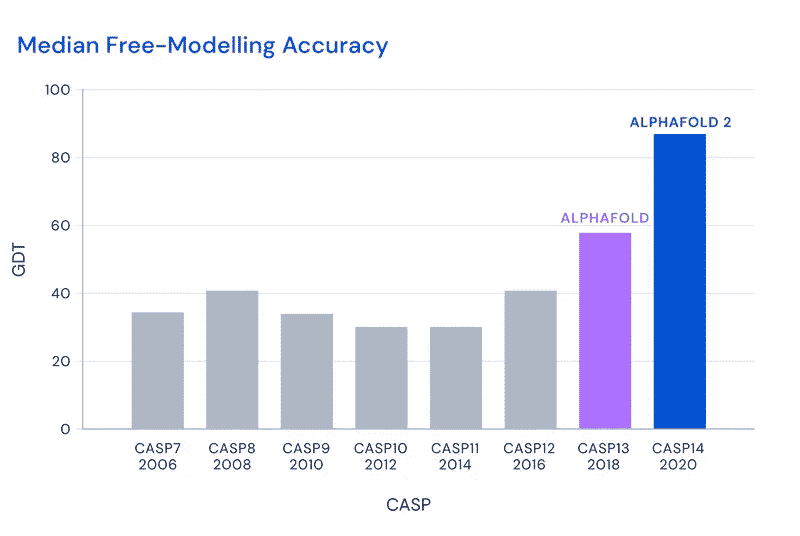
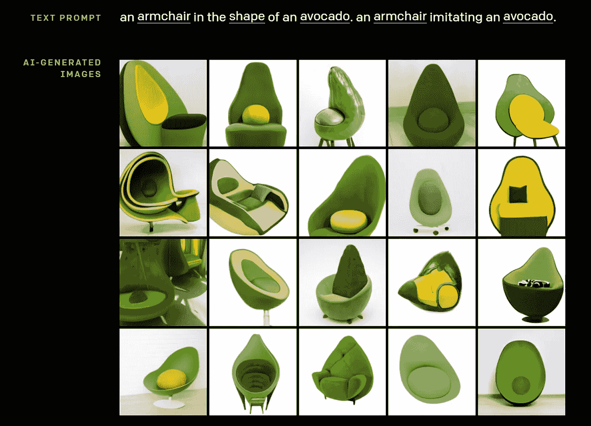

# 2020 年的 3 项人工智能成就会让你大吃一惊

> 原文：<https://medium.com/geekculture/3-artificial-intelligence-achievements-of-2020-that-will-blow-your-mind-d1964fa3f8cf?source=collection_archive---------21----------------------->

Photo by [ThisIsEngineering](https://www.pexels.com/@thisisengineering?utm_content=attributionCopyText&utm_medium=referral&utm_source=pexels) from [Pexels](https://www.pexels.com/photo/code-projected-over-woman-3861969/?utm_content=attributionCopyText&utm_medium=referral&utm_source=pexels)

2020 年，疫情和新冠肺炎疫苗的开发占据了新闻头条。但这并不意味着科学界的其他人都屏住了呼吸。

在人工智能领域，2020 年充满了发现和发明。今天，我们回顾人工智能的三项惊人成就，就在几年前，没有人认为这是可能的:蛋白质折叠问题的解决方案，比任何生物都拥有更多背景知识的语言模型，以及消费汽车中最先进的自动驾驶系统。

# AlphaFold 介绍了一种解决蛋白质折叠问题的方法

半个世纪以来，蛋白质折叠一直是生物学的一大挑战。从字面上看，每一个生物体内的每一个过程都依赖于蛋白质及其特定的功能，这些功能来源于蛋白质的结构。

蛋白质基本上是氨基酸链，可以有不同的长度。到目前为止，我们已经研究了大约 500 种氨基酸，其中 20 种存在于人类基因组中。氨基酸链会自发地折叠成三维形状，很难预测折叠蛋白质的结构。诺贝尔奖获得者 Levinthal 估计大约有 10^300 可能的构象，这个天文数字中只有一个是特定氨基酸序列的自然状态:蛋白质正确执行其功能的状态。发生故障的蛋白质会导致各种病理或影响生物体中的其他蛋白质。

科学家在实验室研究蛋白质，可以以大约 90%的准确度测量折叠蛋白质的三维结构。研究一种蛋白质可能需要大约两年时间。鉴于我们知道有几亿种氨基酸链变异(而且每年都有新的蛋白质被发现)，这幅图并不令人鼓舞。或者至少直到 2020 年 [DeepMind 首次发表](https://deepmind.com/blog/article/alphafold-a-solution-to-a-50-year-old-grand-challenge-in-biology)alpha fold 的成果。

From [DeepMind](https://deepmind.com/blog/article/alphafold-a-solution-to-a-50-year-old-grand-challenge-in-biology)

自 1994 年以来，科学界一直关注国际结构预测批判评估(CASP)，即预测蛋白质结构的软件之间的竞争。机器算法只能以 30%至 40%的准确率预测蛋白质的结构，直到 2018 年 AlphaFold 首次取得突破，跨过 50%的门槛。

两年后的 2020 年，该团队取得了令人难以置信的 92.4%的准确率，这甚至高于使用昂贵耗时的实验方法。

## AlphaFold 是如何工作的，它的成功对世界意味着什么？

AlphaFold 背后的 DeepMind 工程师已经在 17 万个已知氨基酸序列的 3D 形状上训练了他们的神经网络。学习过程花了几个星期，涉及 200 个图形处理器。

在分析了所有可用的信息后，AlphaFold 现在能够在几个小时内预测一个新蛋白质的 3D 结构，而实验室分析需要几年时间。

这是对许多疾病理解的一个进步。例如，新的新型冠状病毒病毒由大约 30 种蛋白质组成，其中 10 种还没有被研究。AlphaFold 能够预测这些蛋白质的结构，使科学家能够更好地研究病毒，而无需等待实验室结果。这种针对蛋白质折叠问题的深度学习解决方案让我们有机会在未来更快、更有效地对新疾病做出反应。

From [DeepMind](https://deepmind.com/blog/article/alphafold-a-solution-to-a-50-year-old-grand-challenge-in-biology)

然而，这项技术也将在医疗行业之外得到应用。例如，了解蛋白质折叠的规律可能有助于找到能够分解工业废物的酶。

在这篇关于 AlphaFold 成功的[博客文章](https://deepmind.com/blog/article/alphafold-a-solution-to-a-50-year-old-grand-challenge-in-biology)中，你可以读到更多关于蛋白质折叠挑战和 DeepMind 解决方案的信息。

# GPT-3 准备接管任何语言任务

OpenAI 是人工智能行业的主要参与者，发布了一个又一个令人印象深刻的解决方案。2020 年 6 月，他们推出了 GPT 3，这是一种具有出色功能的新一代语言模型。它的力量在于它的背景知识:GPT-3 已经“阅读”了互联网上所有可用的文本并从中学习。整个维基百科只占模型知识库的 3%。

这些信息使得 OpenAI 的创作不仅知识丰富，而且能够在考虑上下文的同时表达其知识。

例如，在分析了莎士比亚的全部作品后，GPT-3 可以写出即使对语言学家来说也难以与莎士比亚区分的新剧本。它模仿莎士比亚的写作风格，古老的语言和情节的细微差别。听起来很迷人，不是吗？

## GPT 3 号能做什么？

这种语言模型的可能性令人印象深刻。

*   文本生成
    GPT-3 可以写任何类型的文本，以至于你很难猜测它是否是由机器生成的。《卫报》甚至发表了一篇由 GPT-3 撰写的关于 GPT-3 的文章。看看吧，告诉我们你不喜欢。
*   我们不是在谈论激发迷因的糟糕的机器翻译。GPT-3 可以根据上下文翻译成任何语言，包括稀有语言。
*   软件开发
    看到这里很惊讶？你不应该，因为代码也是一种语言，一个语言模型可以成功地学习它。你可以用简单的英语给 GPT 3 号下达指令，描述一个布局，GPT 3 号将为你设计并编码一个页面。它可以与最流行的编程语言一起工作，但它编写的代码还不能用于生产。你仍然需要一个软件工程师来完善它，但是我们认为 GPT-3 是软件开发自动化的重要一步。

OpenAI 语言模型还可以创作音乐、编写文本摘要、提供客户支持、针对给定的上下文进行内容相关想法的头脑风暴等。你可以在这篇文章中找到更多关于[GPT-3 技术的可能应用。](https://clockwise.software/blog/how-to-integrate-gpt3/)

2021 年 1 月，OpenAI 推出了基于 GPT 3 号的图像生成工具 [DALL E。使用起来相当简单:给它文本指令，神经网络就会生成一组图像。尽管这种工具还没有得到广泛应用，但简单看一下这些图片就可以证明，设计师和插画师可能有理由担心机器会抢走他们的工作。](https://openai.com/blog/dall-e/)

From [OpenAI](https://openai.com/blog/dall-e/) blog

GPT 3 号还不完美。首先，它分析了互联网上所有可用的内容，包括 Twitter 和假新闻网站。GPT-3 生成的文本并不总是事实上正确的，有时它是令人不快的。但该模型仍在学习中，我们希望这项技术很快能够识别并避免不恰当的行为。无论如何，GPT-3 是人工智能的一个突破，已经值得一提。

# 特斯拉展示了测试版的完全自动驾驶——迄今为止最好的 2 级驾驶自动化

2020 年 10 月，少数特斯拉汽车获得了期待已久的完全自动驾驶(FSD)功能。

尽管如此，特斯拉距离制造完全自动驾驶的汽车仍然很远。需要一些解释。

驾驶自动化有五个级别:

*   0 级:系统可以发送警告和通知，但不控制车辆。
*   1 级(动手):系统可以调整车辆速度，辅助停车等。，但司机必须不断地参与驾驶，并保持他们的手在方向盘上。
*   第二级(放手):系统可以控制车辆，但驾驶员必须随时准备重新控制。一些具有 2 级驾驶自动化的车辆控制手与方向盘的接触或监控驾驶员的眼睛，以确保他们正在关注并准备干预。
*   第三级(眼睛关闭):驾驶员可以在系统完全控制车辆的同时发短信或看视频。然而，如果需要，驾驶员必须准备好在有限的时间内返回手动控制。
*   第 4 级(注意力不集中):驾驶员可以离开驾驶座或去睡觉——不需要任何关注。然而，在特殊情况下，这仅在有限的区域内是允许的。当汽车离开这些区域之一或条件发生变化时，如果司机没有重新控制，系统会自动停车。
*   5 级(方向盘可选):全自主系统不需要手动控制。

特斯拉目前处于第 2 级——它仍然需要一名司机来控制道路上的情况，并准备好在系统出现故障时进行干预。尽管如此，这仍然是目前普通消费者可以获得的最先进的技术。

## 特斯拉更新的 FSD 目前能做什么？

特斯拉新的全自动驾驶技术可以检测道路上的其他车辆、行人、树木和其他物体。然而，它在识别一些物体的真实尺寸方面仍然存在问题。例如，有时完全自动驾驶无法区分箱式卡车和半卡车。

尽管如此，完全自动驾驶的车辆可以识别道路标记、交通灯和标志、停放的汽车和移动的车辆、行人和其他物体。该系统还可以在各种交通条件下成功地进行右转和左转。这使得特斯拉 FSD 为住宅街道做好了准备。

## 为什么 FSD 只对有限数量的用户可用？

特斯拉的完全自动驾驶是基于机器学习的，所以系统要学习。Elon Musk [说](https://www.caranddriver.com/news/a34431401/elon-musk-full-self-driving-release-late-2020/)特斯拉将使用数百万辆“提供反馈的汽车，特别是在你甚至无法在模拟中出现的奇怪角落情况下的反馈。”

FSD 在现实世界中使用得越多，它的改进就越多。特斯拉从路上行驶的汽车中收集数据，进行分析，并决定当 FSD 打开时的安全行为。与此同时，该系统将学习在特定条件下的行为，甚至能够在特斯拉从未驾驶过的道路上导航。

一些有机会测试 FSD 的用户声称，这款车的行为很像人类司机。例如，“在转弯之前，车辆缓慢驶进对面的车道以显示自己，”[一位特斯拉用户分享了](https://www.theverge.com/2020/10/22/21528508/tesla-full-self-driving-beta-first-reaction-video)。

[埃隆·马斯克声称](https://twitter.com/elonmusk/status/1318678258339221505)特斯拉将非常谨慎地在街道上测试自动驾驶升级。兼容特斯拉汽车的车主将逐渐收到更新。

尽管获得了疫情奖，但 2020 年对于人工智能来说是成功的，给我们带来了一些我们认为仍需几十年才能实现的发展。我已经很好奇一年后我会写些什么了。

2021 年有哪些 AI 惊喜等着我们？