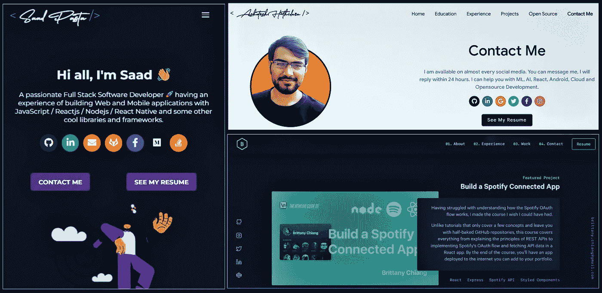
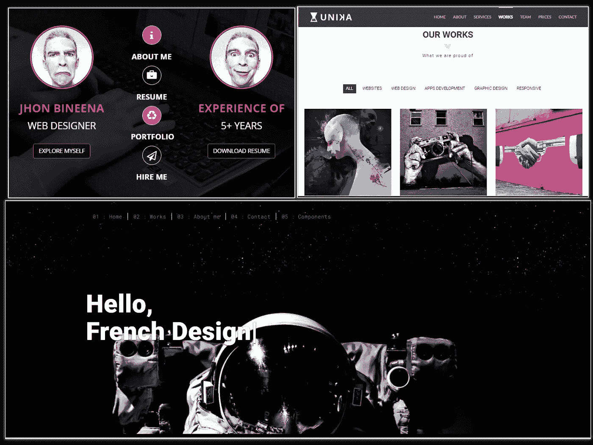
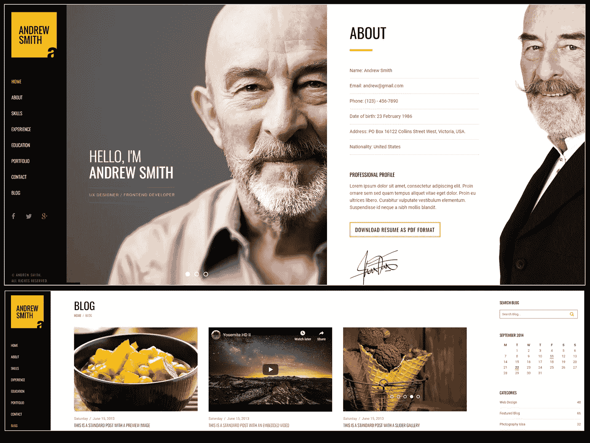

# 为你的作品集寻找专业和免费模板的 3 个最佳网站

> 原文：<https://medium.com/geekculture/3-best-websites-to-find-pro-free-templates-for-your-portfolio-c7745792e60?source=collection_archive---------11----------------------->

你想建立你的第一个网络文件夹，但是你在网上免费找到的模板是静态的，没有吸引力的吗？你想要一个专业的网站，但是**没钱雇人帮你建**吗？

## 不要担心，这里有一些选择，在哪里可以找到专业的模板和最好的部分:**他们是免费的！**

👉🏼你可以根据你的职业和你的目标调整这些模板。

# 1 .Github 开源

许多开发者在 Github 上分享他们的免费模板，这允许他们利用其他开发者的贡献来改进他们的平台，并不断更新版本*(记得克隆最新版本以避免部署过程中的错误)*。

Screen caption of Github templates listed.

*   [**布列塔尼的蒋作品集**](https://github.com/bchiang7/v4) **:** 极简风格，黑暗主题，如果你想突出你的项目中使用的工具，这是你不错的选择。
*   [**DeveloperFolio**](https://github.com/saadpasta/developerFolio)**:**它是最受欢迎的响应性投资组合之一，因为它在不断更新。除了它的许多选项之外，动画 gif 和允许你在黑暗和光明主题之间切换的切换按钮是这个模板最有趣的选项。
*   [**master portfolio**](https://github.com/ashutosh1919/masterPortfolio)**:**如果你想在你的投资组合中突出更多的项目，这个负责任的模板就是为你准备的。它包含多个小部分来写你的职业经历(志愿者，实习，认证等)。

要查看更多开源模板，请访问 Github.com

💡如果你使用这些模板中的任何一个，不要忘记注明作者！这是感谢他们的工作和避免抄袭的一种方式。

# 2 .免费-CSS

这是一个收集免费 HTML 和 CSS 编码模板的网站。这里有一些我最喜欢的，去 Free-CSS.com 找更多的参观[。](https://www.free-css.com/template-categories/portfolio)

Overview of Free-CSS templates.

*   [**有趣的梅拉**](https://www.free-css.com/free-css-templates/page208/mera) **:** 有趣且色彩丰富的设计，如果你只想展示有用的信息，这是理想之选。它包括一个你的客户推荐和你的服务收费选项的部分，所以如果你是一个自由职业者，它会派上用场。
*   [**尤尼卡模板**](https://www.free-css.com/free-css-templates/page270/unika) **:** 优雅的设计为自由职业者或公司提供服务。有了这个模板，你将能够展示你的技能水平，最有趣的是，它允许你按类别过滤你的项目。
*   [**Spaceman 混搭**](https://www.free-css.com/free-css-templates/page270/univers) :时尚的黑白空间设计，想要给人留下好印象，与众不同的话推荐。然而，它为您提供了广泛的选择，例如:在同一平台上为多达 6 个项目编写文档，以及一个包括附加元素*(按钮、图标、输入表单等)的特殊部分。)*定制您的设计。

# 3 .环境元素

这个网站**不是免费的，**但是通过订阅，你拥有 **7 天的试用权限**，可以无限制下载。所以我建议大家先选择自己感兴趣的模板，提前下载。

Mee Template screenshot.

*   [**Kapena minimal**](https://elements.envato.com/es/kapena-responsive-portfolio-html-template-PQD8S2):以图片为中心的模板，如果您想在项目中突出显示图像或图形而不是大量文本，这是理想的选择。此外，它为你的项目提供了多达 6 页的独特设计，并有一个特殊的部分来分享你的博客(对于中等作家来说是一个加号)。
*   [**水平单页 Mee**](https://elements.envato.com/es/mee-responsive-resume-and-portfolio-template-E9L75HT) :看起来像真迹作品集的版面，有水平位移。它有一个专门的部分来宣传你的博客，甚至按类别和发表日期过滤它们。非常适合希望出售个人品牌的媒体作家。

## ❗:再次提醒你，记得在你网站的末尾注明设计者的名字。

# 最后，希望对你有帮助！😄

如果你使用了这些模板，请在下面的评论中告诉我

如果你觉得这很有用，请支持我作为一个作家👏🏻。

 [## Lucero Emperatriz Sovero Rivera -自由职业者，从事数据分析

### 我帮助您做出数据驱动的决策 ↓ Data Analyst & Business Analyst 我通过数据分析您的数据。

www.linkedin.com](https://www.linkedin.com/in/lucero-sovero/)