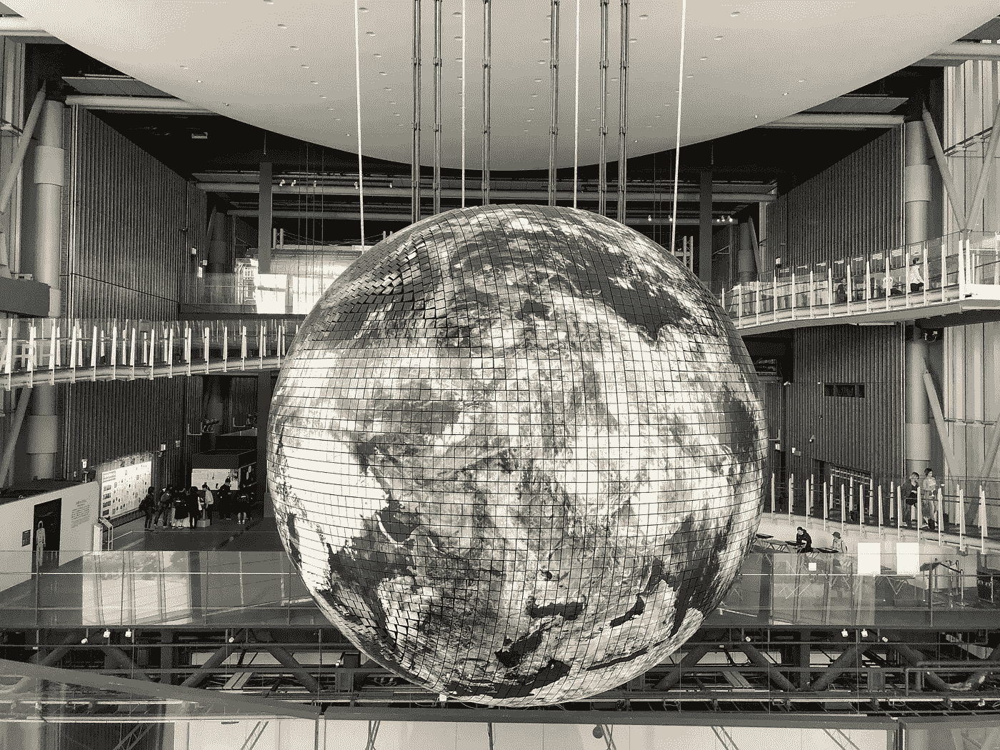

# 关于 Web3 的三大误解

> 原文：<https://medium.com/geekculture/3-big-misconceptions-about-web3-1c77207569ab?source=collection_archive---------7----------------------->

Web3，也被称为 Web 3.0，是互联网上最热门的新趋势之一。似乎每个人都在谈论区块链、加密、NFTs 和元宇宙。然而，虽然这些词很时髦，但它们不是流行语。这些术语有真正的意义。

这篇博文旨在纠正一些关于 Web3 的最大误解。

# 误解 1:“web 3”是…