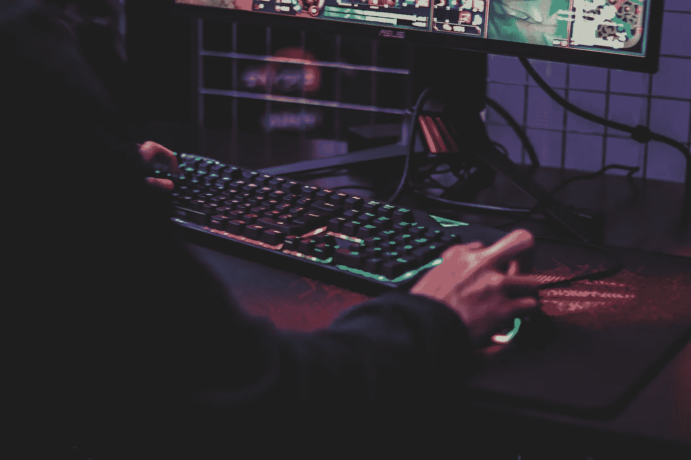

# 2021 年值得一玩的 3 款区块链游戏

> 原文：<https://medium.com/geekculture/3-blockchain-games-worth-playing-in-2021-f06a7ae5399e?source=collection_archive---------24----------------------->

## 免费，好玩，还能给你带来利润

Photo by [Axville](https://unsplash.com/@axville?utm_source=unsplash&utm_medium=referral&utm_content=creditCopyText) on [Unsplash](https://unsplash.com/s/photos/pc-games?utm_source=unsplash&utm_medium=referral&utm_content=creditCopyText)

锁链游戏似乎是游戏的未来，这是毫无疑问的。用区块链技术开发的游戏是创新的，非常有趣，尤其是因为它们还能帮助你盈利。您在这些游戏中拥有的所有东西都可以放在您用来连接和玩游戏的钱包中，这意味着货币、资产或游戏物品。

它们的共同点是都有自己的市场，每个人都可以买卖 NFT 的股票。你实际上可以长期获利，因为你可以将游戏币换成其他加密货币。

这里有三个区块链游戏，我很兴奋，我相信现在值得一玩！

# 分散的土地:第一个由用户拥有的虚拟世界

分散王国是一个三维虚拟世界，有丰富多彩的图形，但你不需要在你的电脑上安装任何东西。它在浏览器中工作，用 F11 键，你可以全屏播放。您可以使用 MetaMask Wallet 登录。

如果您没有元掩码钱包，则需要创建一个。您将使用钱包存储您在游戏中收到的任何数字资产。要开始玩游戏，你只需连接你的钱包，然后你就可以创建你的头像了。 [MetaMask](https://metamask.io/) 钱包是 Chrome 或 Firefox 的浏览器扩展。

Decentraland official promo video

一旦你完成了创建你的角色，你将被带到游戏的中心区域，创世纪广场，在那里你将被介绍基本的游戏功能。[分散地](https://decentraland.org/)使用两种令牌类型:一种可替换(魔法)地和一种不可替换地。

如果你想看到所有可用的键盘控件，只需按 C 键，它们就会出现在屏幕上。在游戏中，你可以玩不同的项目，或者你可以挖掘 NFT 的，这真的很有趣。你去 Wonderzone 地区，那里有一个设备可以帮助你制作工具和可穿戴设备，使用你从坠落在该地区的小行星上开采的材料。

假以时日，你会把你的鹤嘴锄和我的升级得更好。这是游戏变得真正令人上瘾的部分！

# 外星世界:在元宇宙发财

你可以直接在浏览器中玩[外星世界](https://alienworlds.io/)，但是你必须用一个蜡钱包登录。给你一把铲子，你可以用它在你选择的星球上采矿。该游戏也适用于以太坊和币安智能链网络，游戏中的主要资源是 Trillium (TLM)，这是一种融入游戏的令牌，可以在 [Alcor 交易所](https://alcor.exchange/)兑换蜡。

Official Alien Worlds Cinematic Trailer

当你第一次登录时，你会选择你的头像的性别，然后，你会被提示选择某个星球来采矿，或者你可以换一个星球。不同的星球有不同的地形类型。你将选择你想要开采的土地部分，每个部分都有不同的开采率。

一开始，你将使用标准的铲子。一旦你有足够的延龄草，你可以交换蜡，购买更好的采矿工具，如标准的电容器。

在这个游戏中，每个游戏物品都是一个 NFT，可以出售或下注来制造更多的蜡。这些 NFT 中的一些是代表来自不同星球的部分的卡片。每当有人在这些区域采矿时，它们的所有者就可以获得佣金。除了采矿工具和卡片，还有其他的 NFT，比如化身、神器或战斗武器。它们可以在[原子能中心市场](https://wax.atomichub.io/market)出售。

# 六条龙:一款运用区块链技术的奇幻 RPG

《六条龙》是一款梦幻 3D RPG 游戏，它采用了过去几十年中我们在 RPG 游戏中看到的一些最佳功能，并将它们放在区块链上，以发挥其巨大的潜力。这个项目是在金恩区块链的帮助下完成的。

在游戏中，像在任何其他 RPG 游戏中一样，你将探索，与怪物战斗，并进入地下城与老板战斗。你也可以制作物品并出售。这个 RPG 和以前的主要区别是游戏中的道具和掉落都是 NFT 的。它们将在金恩市场上有真实的价值。

Official Pre-Alpha teaser of the game

玩六龙，需要下载游戏。这可能需要一段时间，但你的耐心会得到回报。一旦你下载了游戏，你启动启动器并注册一个帐号。为了玩游戏，你需要创建一个[金恩钱包](https://enjin.io/software/wallet)并将其与你的游戏帐户关联。

通过现在玩这些游戏，当它们还处于早期阶段时，你有机会获得罕见的 NFT 氏症。后来，这些 NFT 的价值可能会变得更大，他们的稀有程度可能会增加。你也许可以在以后出售你现在获得的资产，以获得更多的钱。

**注:**

*我不是金融顾问，但我自己玩过这些游戏，对加密货币和 NFT 的世界相当熟悉。不需要投资这些游戏。你可以免费玩，以后再赚点。如果你想投资，这完全是你的决定和责任。不要投资超过你也准备好了的损失。*