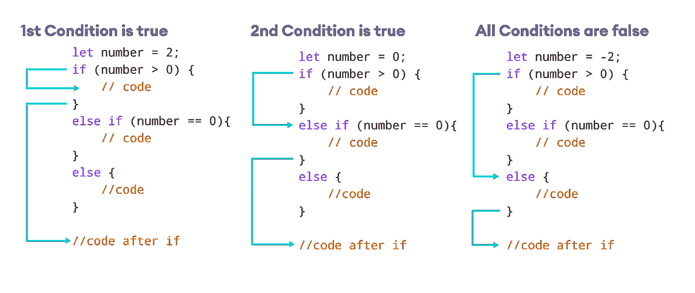
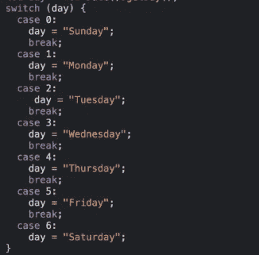
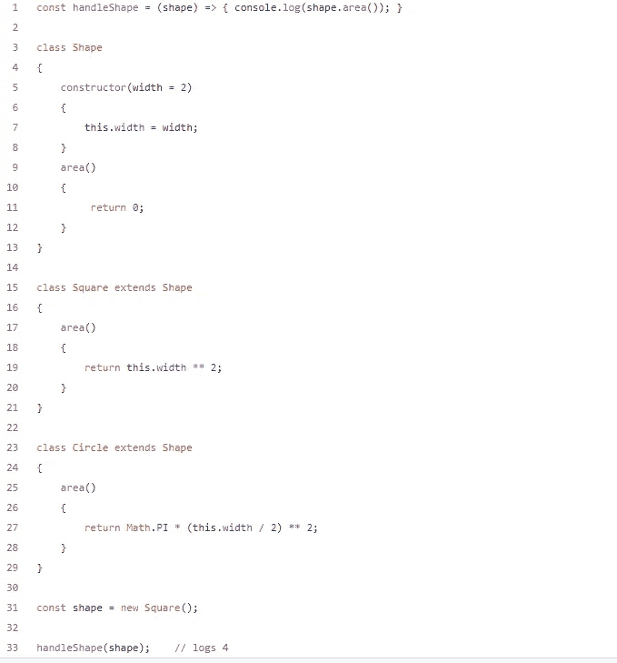
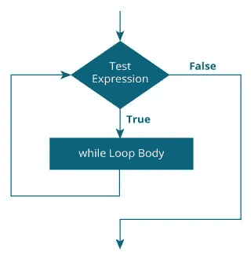

# 3“If”语句的条件分支替代方案

> 原文：<https://medium.com/geekculture/3-conditional-branching-alternatives-to-if-statements-db675e12936a?source=collection_archive---------3----------------------->

创建条件分支的概念和示例



条件分支是依赖于条件的一部分代码的执行或评估，通常使用 if…else 构造来执行。

示例:

```
if (Personishere)
 {
 sayHi()
 }
 else
{

    Donothing();

}
```

如果`Personishere`是`true`，将调用`sayHi()`；否则会调用`Donothing()`。

编程界的一些人认为它应该被视为有害的或代码气味。不管这个论点的真实性如何，可能存在这样的情况，即它不是分支的理想方法，或者应该完全避免分支。

在这篇文章中，我将向你展示六种替代`if...else`的方法

# 1.`Switch`声明



下面是 switch 语句的结构:

break 语句是可选的，将离开 switch 块。

如果不使用 break，将继续执行下面的 case 语句。

对于同质值集合的分支，switch 函数非常方便。

# 2.动态调度

动态分派是利用 if 语句的一种替代方法。这需要根据对象的类型决定要调用的[多态](https://en.wikipedia.org/wiki/Polymorphism_(computer_science))方法。



Image from [Jamie Bullock](https://jamiebullock.medium.com/?source=---three_column_layout_sidebar----------------------------------)

根据提供给 handleShape 方法的对象的种类，遵循单独的代码路径。因为在我们的例子中形状是正方形，所以面积存储为 4。

这种方法会产生更多的代码，但是使用它代替 if…else 语句有一定的优势。当代码已经使用 OOP 时，这种风格通常是合适的；然而，试图构建分支来总是利用多态性似乎有些矫枉过正。

# 3.while 循环

`while`循环的语法是:

```
while (testExpression) {
  // the body of the loop 
}
```



image from [Programiz](https://www.programiz.com)

因此，我们可以用 while 循环或`do…while`循环来改变`if`语句

`do..while`循环类似于 while 循环，但是有一个显著的区别。`do…while`循环的主体至少运行一次。然后才计算测试表达式。

`do...while`循环的语法是:

```
do {
  // the body of the loop
}
while (testExpression);
```

将`if`语句转换为`while`循环的示例:

if 示例:

```
if (cond)
{
    exec1();
}
if (!cond) 
{
    exec2();
}
```

当我们把它改成 while 时:

```
while (cond) 
{
    exec1();
    break;
}
while (!cond) 
{
    exec2();
    break;
}
```

# 结论

条件分支增加了程序的复杂性。

嵌套的`if`和`switch`语句会使代码更难理解，并增加出现问题的可能性。其他类型的分支可能会导致过度工程化的代码库。如果完全避免分支是可行的，这通常是一个合适的起点。