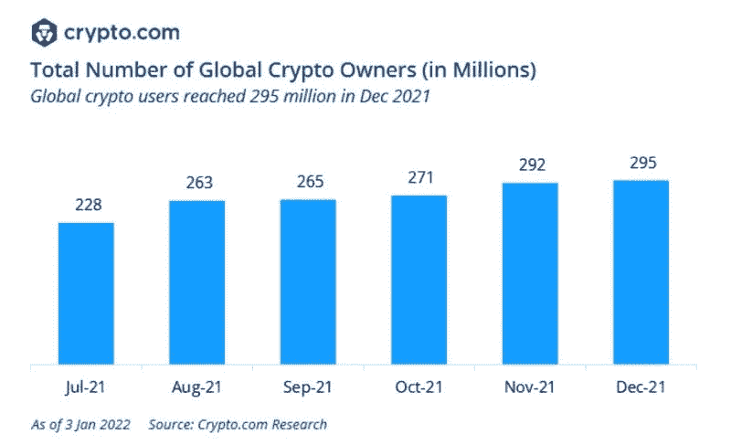
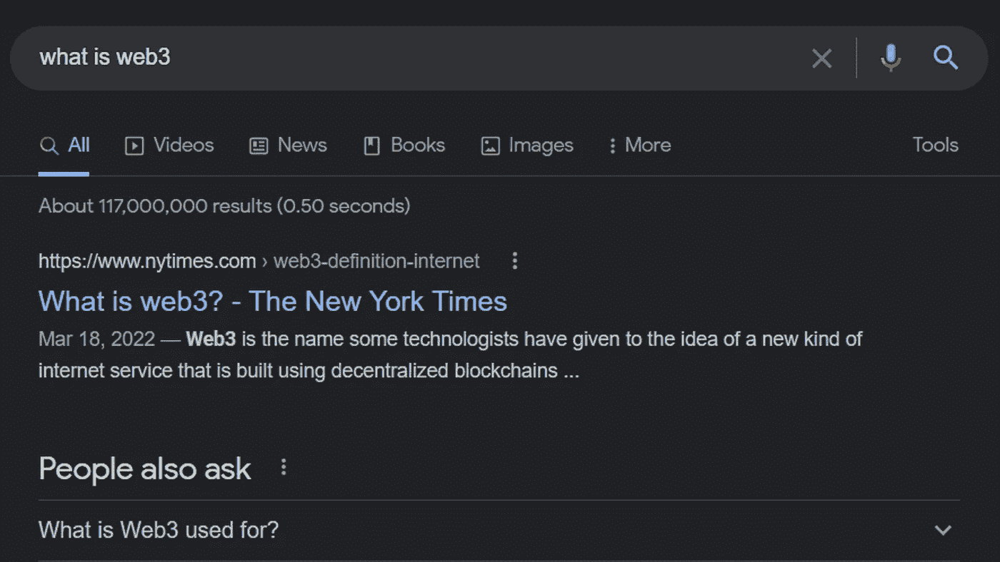
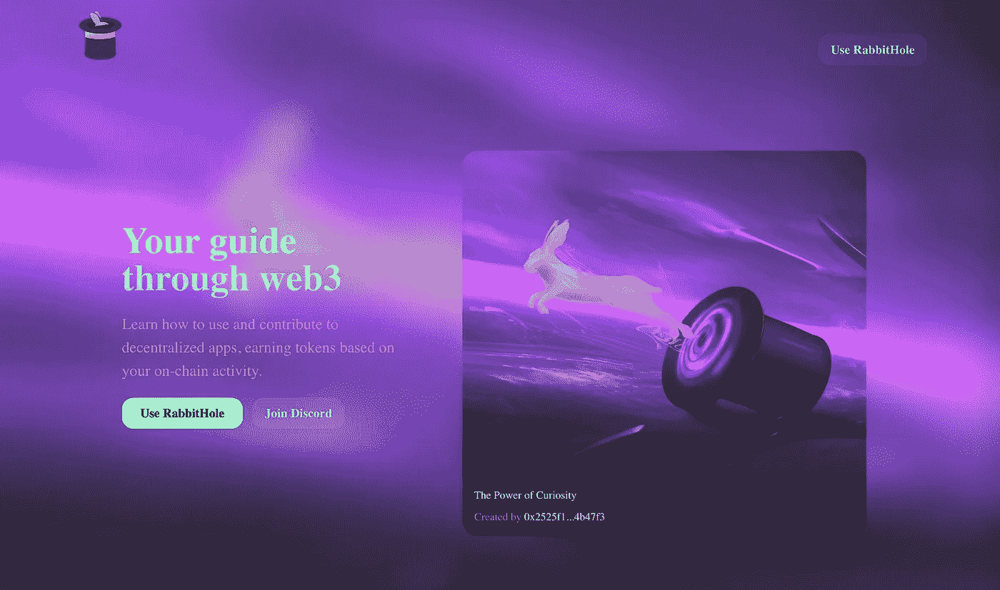
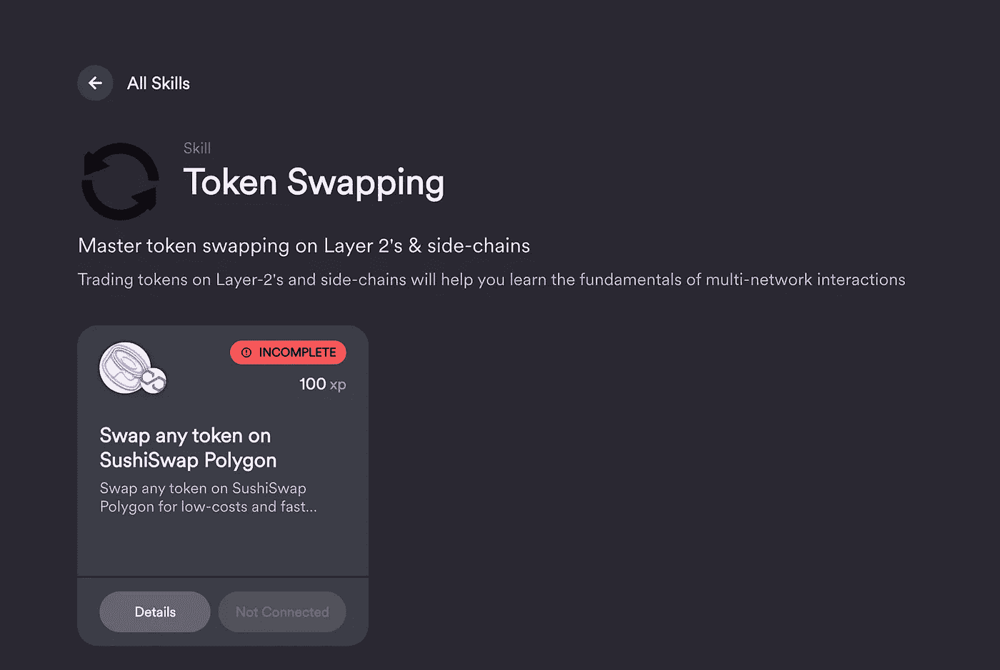
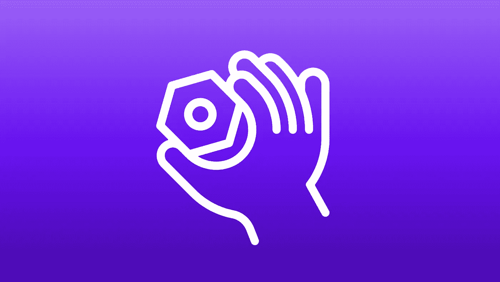

# 3 使用 Web3 区块链技术的客户培训思路

> 原文：<https://medium.com/geekculture/3-customer-training-ideas-using-web3-blockchain-technology-8d91ac11466b?source=collection_archive---------12----------------------->

## 这项创新技术将改变人类的学习方式

如果你正在网上阅读这篇文章，我想你已经听说过 Web3 了。这是 2021 年最热门的流行语之一。

[支持者](https://future.a16z.com/why-web3-matters/)称 Web3 是互联网的下一次进化，将自由和所有权还给个人。[批评家](https://moxie.org/2022/01/07/web3-first-impressions.html)称之为精英科技趋势，与人类行为不一致，表面上被风投资金膨胀。

无论哪种方式，对于本文的目的来说都不重要。

## 我提出这个问题的原因是，Web3 有一个用户采用问题。

新的互联网需要更多的用户。这是每个软件公司都面临的问题。

**2022 年初，Web3 在全球约有** [**3 亿用户**](https://finance.yahoo.com/news/global-crypto-users-reach-1-101646507.html) **。**尽管 2021 年有机用户增长强劲而迅速，但这一趋势不太可能永远持续下去。

大多数早期采用者都是年轻的、技术含量高的人。随着数十亿风险投资资金的涌入，这是一个令人兴奋的创造和创新的地方。

**但是对于普通 ol '用户(比如你我)来说，Web3 是复杂的，令人困惑的，** [**昂贵的**](https://ycharts.com/indicators/ethereum_average_gas_price#:~:text=Basic%20Info,38.67%25%20from%20one%20year%20ago.) **。**对于我们这些非技术人员来说，这是无法抗拒的。

## “我该从哪里开始呢？我如何使用这个东西？我用它做什么？”

Web3 项目现金充裕，但是它的用户群显示出停滞的迹象。

# 拯救客户教育

在软件公司， [**客户教育**](https://customer.education/2020/08/what-is-customer-education-and-why-does-it-matter/) **团队帮助客户学习如何使用软件产品，并从软件产品中寻找价值。**目标？提高产品采用率，减少客户流失。

## 互联网上充斥着“客户教育”资源来推动 Web3 的采用。

在谷歌上快速搜索“ [***什么是 web 3***](https://www.google.com/search?q=what+is+web3&oq=what+is+web3&aqs=chrome.0.69i59j0i433i512j0i512l5j69i60.1264j0j7&sourceid=chrome&ie=UTF-8)***”****，你会找到大约 117，000，000 份深度指南、视频和课程来帮助你学习基础知识。*

**

*这些更“传统”的学习媒介，如文章、指南和视频，是开始学习的好方法。*

*但是现在有更有趣、更有用的方法来学习 Web3。*

## *有一种新的、创新的学习工具运动，提供身临其境的实践体验。*

*通过关注 [*【边做边学】*](https://www.lifehack.org/898427/learning-by-doing) 实践，这些工具帮助用户通过在他们试图学习的应用中执行实际任务来建立技能。*

*仅这项技术就有能力彻底改变人类在互联网上的学习方式。*

*我发现的最有趣、最有活力的 Web3 学习工具叫做 [Rabbithole.gg](https://rabbithole.gg/) 。*

**

# *什么是 Rabbithole.gg？*

*[**rabbit hole . gg**](https://rabbithole.gg/)**是一个帮助你学习如何使用 Web3 的互动培训网站。**该平台专为初学者打造，让您轻松掌握新技术。*

*但这就是不同之处。*

*而不是看*【如何互换代币】* **上的视频或文章，你在*真实应用*** 中完成*真实任务*。你完成的每项任务都会被自动跟踪并记录在区块链上。*

*这是一个重要的区别。忘记**被动学习**，Rabbithole.gg 是关于**主动学习的。**您的知识和技能来自于在每个应用程序中实际执行一系列操作。*

## *这里有一个它如何工作的例子*

*在 Rabbithole.gg 上，你可以学习一个叫做**令牌交换的技能。**为了获得技能，平台会给你一系列的[步骤来执行](https://app.rabbithole.gg/skills/token-swapping)。*

**

*第一步是你必须去另一个名为 [SushiSwap](https://www.sushi.com/) 的应用，执行正确的步骤来成功交换令牌。一旦你完成这项任务，你会收到 XP 点和一个盖章凭证。*

*你获得的每一个证书都记录在区块链上，所以你可以向任何人证明你已经完成了这项技能。*

*相当整洁。*

## *【Rabbithole 背后的核心思想是，人们通过实践学习得更好。*

*如果你想了解 Web3，不要去上课。做动作。得到一个加密钱包，买一些溶胶，并购买 NFT。*

*就像如果你想学习 Photoshop，你必须真正地*使用*这个工具。下载该应用程序，创建一个新项目，并尝试使用这些功能。*

*培养任何人类技能都需要*积极*的参与。Rabbithole 是 Web3 在创新学习解决方案方面的早期尝试，但这项技术可能会彻底改变教育的未来。不仅仅是对软件团队，而是对所有人的学习，无论在哪里。*

# *面向未来的软件团队的客户培训理念*

*Rabbithole 的新实验技术为教育的未来提供了一些有趣的想法。下面是一些未来可能对软件公司有益的想法。*

*👉 ***注意，现在这些只是有趣的、未来的想法。这项技术仍然是新的，采用率很低。****

## *1.前所未有的可扩展实践学习体验*

**

*大多数自定进度的培训解决方案依赖于传统的数字媒体:文章、视频、课程。这些都是有帮助的，但是都缺少人类学习最重要的属性:**动手活动。***

## ***人类在现实世界**中 [**执行动作**](https://www.wgu.edu/blog/adult-learning-theories-principles2004.html) **时学得最好。***

*当然，实验室和模拟有所帮助，但是没有什么比在实际工具中执行任务更有效的了。*

*想象一下，如果你试图学习一种新的设计工具，比如图玛。您可以观看一些循序渐进的视频来学习基础知识。*

*或者，您可以直接进入工具，边走边开始学习。学习任务可以在产品中填充。你完成的每一项任务都可以被追踪。你的速度、点击次数和准确度。*

*你将能够看到你的学习活动的仪表板——你已经完成了什么和改进的建议。每项学习活动都会被记录和跟踪，以记录您迄今为止已经完成的内容。*

*这种复杂程度的数据收集提供了最终的实践培训，可以增加培训时间并提供更广泛的技能差距意识。*

## *2.技能和成就可以自动验证*

**

*Rabbithole 的价值主张之一是，你可以**“获得证明你掌握核心技能和协议的链上证书。”***

*我称之为“技能验证”你掌握了一项技能。并且该技能可以用链上凭证来验证。*

***这也许是区块链在客户教育(和人类学习)方面最有用的应用。***

*随着在线学习和 MOOCs 的激增，出现了“认证超载”。你使用的每一个学习内容都附有某种可共享的“徽章”或“结业证书”。*

*学习者可以收集这些徽章，将其添加到他们的 LinkedIn 个人资料中，并向他们的下一位雇主展示他们的技能。*

***问题？任何人都可以在个人资料中添加徽章，即使他们没有参加课程或没有通过评估。***

*没有办法验证凭证的准确性。没有人真的费心去检查。*

*Rabbithole 的技术旨在通过提供链上凭证来解决这一问题。这意味着，每个凭据都将永久记录在区块链中，并且可以立即得到验证。*

*现在，通过完成工具中的实际任务即可获得证书。它不再是在一个松散连接的选择题上获得 70%的分数。你在特定的时间内完成一系列的任务，你就获得了一个可验证的证书。*

*用户可以在网上任何地方随身携带这份官方证明。这使得用户在申请新工作时更容易验证技能。这也让雇主更容易在做出重大招聘决定之前，充分了解候选人的技能组合。*

## *3.区块链提供了产品采用方面可靠数据*

**

***在当今世界，我们如何*确定*学习解决方案对产品采用有影响？***

*简而言之，我们通常不会。跟踪客户从“完成课程”到“6 个月后仍在使用产品”是复杂、昂贵且具有挑战性的。*

*区块链帮助解决这个问题。随着技术的成熟和成本的下降，区块链可以提供关于用户和使用情况的极其详细的数据。*

*想象一下上面描述的想法。用户有产品内任务和学习仪表板来跟踪他们的技能获取。由于这些都发生在产品内部，数据收集现在变得简单了。*

*完成特定任务并获得凭据的用户已经在产品中记录了这些数据。软件公司可以很容易地看到学习体验如何与产品采用相关联，并可以做出调整来优化体验。*

# *最后的想法*

*Web3 和区块链技术仍处于采用的最早期阶段。在这个领域，有无数的创意和项目涌现出来。*

*虽然今天的软件公司的客户教育团队可能不能马上采纳这些想法，但我们已经开始为客户培训的未来考虑很多了。*

*你怎么想呢?你对未来的客户培训团队有什么想法吗？*

# *个人简历*

*我是 [**安德鲁·德贝尔**](https://andrewdebell.com/) ，我制作有助于销售产品和教育客户的内容。我的大部分工作是在内容营销，视频创作，写作，学习设计。*

*👉在 [Linkedin](https://www.linkedin.com/in/andrewdebell/) 和 [Medium](/@debell) 上关注我，了解最新消息。*

**