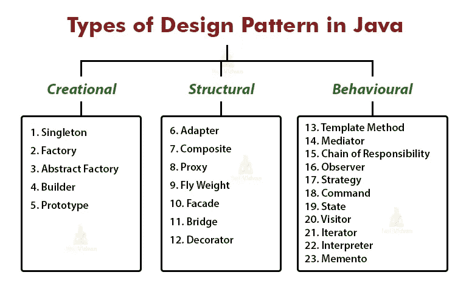
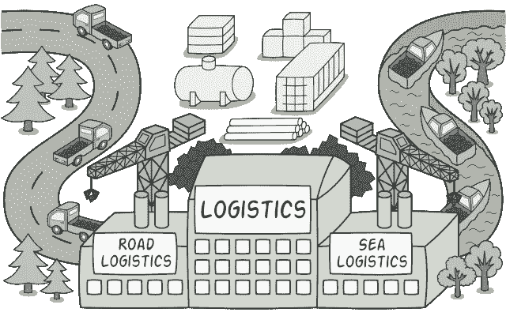
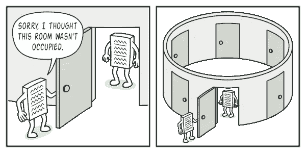

# 我在一个小时内在 Java 代码中应用了 3 种设计模式

> 原文：<https://medium.com/geekculture/3-design-patterns-i-applied-in-my-java-code-in-one-hour-59bf6fe46673?source=collection_archive---------1----------------------->



[https://techvidvan.com/tutorials/java-design-patterns/](https://techvidvan.com/tutorials/java-design-patterns/)

设计模式对于编写高质量的代码至关重要。尤其是在 Java 和 Python 等面向对象的语言中，恰当地应用设计模式可以提高可伸缩性、安全性和可读性。昨天，当我开发一个数据缓存服务应用程序时，有 3 个设计模式被用来为未来的开发起草一个初始框架。

# 工厂模式



[https://refactoring.guru/design-patterns/factory-method](https://refactoring.guru/design-patterns/factory-method)

在我的例子中，数据缓存服务应该能够接受不同的缓存客户端，比如 Jedis(Redis 的 Java 客户端)或 GemFire 客户端。通过创建工厂，根据配置，我们将创建所需的缓存客户端:

```
public class ClientCacheFactory {
    private final CacheOrderService cacheOrderService;

    public static CacheOrderService create(CacheClientConfig config){
        // If config is Redis-related
        // return new RedisCacheOrderService();
        // If config is GemFire-related
        // return new GemFireCacheOrderService();
    }
}
```

上面的代码将客户端缓存服务的实例化交给工厂类，而不是在主线程中调用每一个。注意，返回的 CacheOrderService 实际上是 RedisCacheOrderService.java 和 GemFireCacheOrderService.java 实现的接口类。

```
//InstantiationCacheClientConfig config = new CacheClientConfig();
ClientCacheFactory.create(config)
```

由于它很好地封装了类的创建，这提高了代码的可伸缩性，因此如果要添加更多的缓存客户端，只需要更改工厂类。

# 单一模式



[https://refactoring.guru/design-patterns/singleton](https://refactoring.guru/design-patterns/singleton)

我们希望我们的应用程序在任何时候都只运行一个缓存客户端副本。这就是单例模式派上用场的地方。

```
public class ClientCacheFactory {
    private static CacheOrderService cacheOrderService;

    public static CacheOrderService create(CacheClientConfig config){
        if (cacheOrderSerive != null) {
            return this.cacheOrderService;
        }
        // create a new cacheOrderService and assign it
    }
}
```

注意，我们将 CacheOrderService 类声明为第一条语句。这有助于我们确定是否创建了该对象的任何实例。每当工厂想要创建 cacheOrderService 时，它将检查工厂类中的 CacheOrderService 是否已经被赋值。如果为空，它将根据我们的条件创建一个新的。如果没有，它将返回现有的 cacheOrderService。static 关键字确保该实例在工厂类的所有实例中也是持续的。但是首先，我们可以将 ClientCacheFactory 作为一个静态类来避免它的实例。

# 构建器模式


[https://refactoring.guru/design-patterns/builder](https://refactoring.guru/design-patterns/builder)

生成器模式提供了对对象构造的更好控制。在我的项目中有一个名为 OrderDetails 的数据传输对象，它由几个字段组成，如 orderId、creationTime 和 payload(为了演示而简化)。

```
public class OrderDetails {

    private final String orderId;
    private final String creationTime;
    private final Object payload;

    public OrderDetails(){};

    public static class Builder {
        private final String orderId;
        private String creationTime;
        private Object payload;

        public Builder (String orderId) {
            this.orderId = orderId;
        }
        public Builder atCreationTime(String creationTime){
            this.creationTime = creationTime;
            return this;
        }
        public Builder withPayload(String payload){
            this.payload = payload;
        }

        public OrderDetails build(){
            final OrderDetails orderDetails = new OrderDetails();
            orderDetails.orderId = this.orderId;
            orderDetails.creationTime = this.creationTime;
            orderDetails.payload = this.payload;
            return orderDetails;
        }
    }
}
```

在这个 OrderDetails 类中，我们首先有私有字段和一个构造函数。然后我们有一个名为 Builder 的内部类，这样我们将使用这个 Builder 类来构造所有的参数。下面的代码显示了我们如何使用构建器来构建这个对象。

```
final OrderDetails orderDetails = new OrderDetails.Builder(12345)
       .atCreationTime('20211128')
       .withPayload('abcd')
       .build()
```

这增加了代码的可读性，因此您不必以传统方式添加所有的 set 语句。此外，在没有 setters 的情况下，这确保了所创建对象的不变性。

如果你想探索更多的设计模式，上面图片下面的链接非常有用，因为它以一种更容易理解的方式展示了常见的设计模式。

# 灵感

当我们谈论编程时，我们许多人只是直接跳到在键盘上打字。仅仅在键盘上输入 busy 不是编程。这是编码。编程就是拥有一种思维模式，或者解决问题的框架或架构，并将这些应用到编码中。这导致了一个双赢的局面，你自己作为一个程序员不会对你自己的代码感到失落和困惑，而你的客户能够在未来根据你的应用进行缩放、扩展或抽取。

希望这篇文章对你有用。如果你像我一样渴望学习一些与技术相关的东西，或者定期反思工作和生活，请关注我的频道，了解我在日常工作和生活中的小灵感和总结。