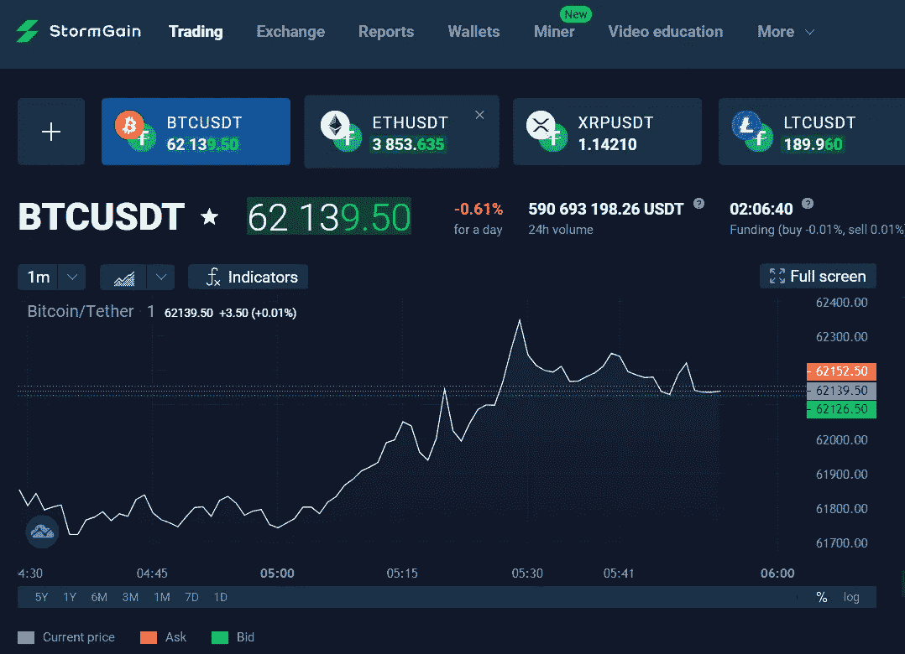

# 用 StormGain 赚钱的 3 个简单方法

> 原文：<https://medium.com/geekculture/3-easy-ways-to-make-money-with-stormgain-92f53e490db2?source=collection_archive---------1----------------------->

## 赚而不投

The image is a screenshot taken by the author from the StormGain website

S[tormagin](https://stormgain.com/)是一个面向加密货币交易者的大型交易平台，也是你能找到的最值得信赖的此类平台之一。它允许你用高达 300 的杠杆交易，这可以帮助你赚很多钱，但如果你不是很有灵感，也会损失更多。最好的部分是，开始赚钱不需要投资。

你也可以通过手机应用程序访问该平台，该应用程序以友好的方式提供所有功能，就像网站一样。

以下是使用 StormGain 赚钱的三种主要方式:

# 1.神秘矿工

## 每 4 小时开采一次，在 10 USDT 撤回

StormGain 最酷的一点，也是吸引我使用这个平台的一点是集成的 Crypto Miner。采矿选项允许你制造你的第一个 10 USDT(相当于 10 美元),并在没有任何投资的情况下使用它们进行交易。

从主菜单中，你必须选择矿工。然后，您可以单击“激活”按钮来激活挖掘过程。你将每四个小时这样做一次，但请记住，你开采的余额可能会随着比特币的价格波动，因为你开采比特币，你看到的是它在 USDT 的等价物。

## 如何用你的奖金赚钱

有一个障碍:如果你想把你的 10 USDT 奖金换成真钱，你只能在你用奖金进行交易后提取你获得的利润。

举个例子，假设你已经开采了 10 个或更多的 USDT，现在你可以把这些钱放进你的 USDT 奖金钱包里。你点击取款，你现在可以用这笔钱交易一对货币，如 BTC/USDT。

利润可以立即进入你的 USDT 钱包，并可以兑换成其他加密货币。

记住，你可以保留所有的利润而不投资，你不能在低于 10 USDT 或者矿工活跃的时候撤资！

# 2.转诊制度

## 3 USDT 来的引荐

我从我的一个朋友那里知道了 StormGain，他告诉我这个平台，并让我加入他的麾下，因为我即将收到 3 USDT 作为他的推荐，这是一次性的奖金。我喜欢这样的想法，即被推荐人也收到了一些东西，这将鼓励人们使用这个平台。

我确实收到了奖金，我继续采矿，直到 3 USDT 的数量增长到 10 USDT，然后我退出。

## 推荐退出的 15%

根据你可以在 Cryptominer 页面上找到的一份声明，他将获得我从 Cryptominer 提取的所有东西的 15%。

我的朋友证实，当我提取我的收入时，他得到了 15%。你邀请的人越多，你能赚的钱就越多。

# 3.交易选择权

## 利用率高达 300 倍

在 StormGain 上，你可以像在任何其他交易平台上一样交易，你也可以有机会使用杠杆。选择高达 300 的杠杆意味着，即使理论上你只有 1 美元可以交易，你也会用 300 美元交易并获得收益，就像你用 300 美元而不是 1 美元交易一样。

另一方面，如果交易失败，你会损失更多。杠杆就像是你从平台上借的钱，然后和它交易。

## 如何通过交易赚钱

如果你小心谨慎，并且只在知道一种加密货币即将推出时交易，你就可以获得巨额利润。使用的策略主要是在价格低的时候买入，价格高的时候平仓。

你可以使用平台的密码挖掘选项来使用通过挖掘赚来的钱。这样，即使你输了，你输的也不是你口袋里的钱，而是你从 StormGain 得到的奖金。

记住，如果你想交易更多，你也可以从你的口袋里投资！这也将解锁一些功能。在这样做之前，请记住，不要投入超过你输不起的钱。

## 你能用你赚的利润做什么？

从主菜单中，您可以选择交换而不是交易，并看到可以在各种加密货币之间进行交换的页面。一旦你输入了金额，你还会看到你将收到的金额作为第二种货币，以及平台收取的费用。这些费用相当少。每种加密货币都有钱包，就像其他任何交易平台一样。