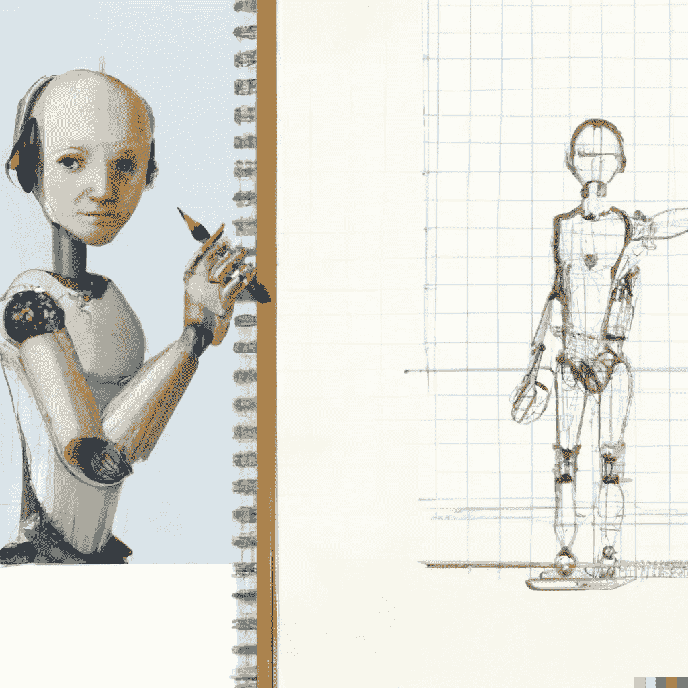

# 计算机视觉编程的 3 个基本 Python 库

> 原文：<https://medium.com/geekculture/3-essential-python-libraries-for-computer-vision-programming-d10ce1b843a4?source=collection_archive---------6----------------------->

他们的最佳实践和优势(他们如何闪耀)

Created by [the Author](https://aniltilbe.medium.com)

构建能够识别数字图像或视频中的某些特征或对象的算法是计算机视觉的主要目标。像人脸识别、物体识别和场景解释这样的任务都在这些算法的能力范围之内。